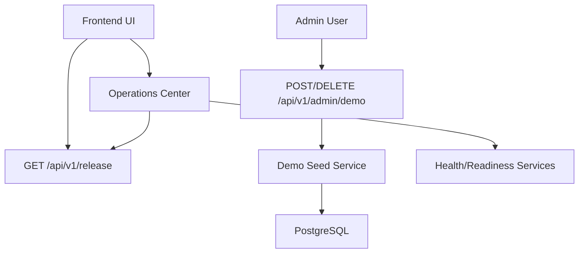

# Architecture Overview

RavenTech OSINT is a modular monolith with a FastAPI backend, React/Vite
frontend, PostgreSQL persistence, Redis-backed coordination, and Celery worker
foundation.

## Major Components

- **Frontend:** React, TypeScript, Tailwind CSS, React Router, and TanStack
  Query.
- **API:** FastAPI route modules under `backend/app/api/v1`.
- **Services:** Business logic under `backend/app/services`.
- **Persistence:** SQLAlchemy async application sessions with Alembic
  migrations.
- **Workers:** Celery foundation with safe background task patterns.
- **Knowledge:** Local-only defensive knowledge ingestion, indexing, and
  retrieval.
- **Reports:** HTML/Markdown rendering plus PDF/DOCX export generation.

## Frontend Runtime

The Vite application is contained in `frontend/`. Run frontend commands from
that directory:

```powershell
cd frontend
npm run dev
npm run build
```

React Router uses a route-level error fallback so malformed or degraded page
data does not expose raw crash screens during normal use.

## Request Flow

1. A React page calls the typed API client.
2. The API route authenticates and checks RBAC.
3. The route delegates business behavior to a service.
4. Services query models/repositories and emit audit or timeline records.
5. Responses return structured schemas suitable for UI rendering.

Routes should stay thin. Business logic belongs in services.

## Data Boundaries

- Investigations are the primary authorization boundary.
- Platform administrators can access all investigations.
- Investigation owners and members receive scoped permissions.
- Non-members should receive hidden-resource behavior where project convention
  expects `404`.
- Viewer access remains read-only.

## Defensive Safety Boundaries

The platform supports passive recon, local knowledge, deterministic findings,
IOC correlation, report generation, governance, and analyst workflows. It does
not implement active scanning, exploitation, autonomous offensive workflows, or
internet-wide crawling.

## Release Candidate Stability Boundaries

- Backend routes remain thin and delegate workflow behavior to services.
- Frontend pages must tolerate partial, null, or degraded API payloads and show
  empty/degraded states instead of raw React crashes.
- CI enforces backend linting, typing, tests, dependency consistency, migration
  drift checks, frontend linting, and frontend build.
- Regression tests must not require live AI keys, live internet access, or
  external provider availability.
- Report export, case review, approval, validation, archive, purge, audit, and
  timeline workflows are release-candidate regression surfaces.

## Release Candidate Packaging

Phase 5G adds release metadata and demo packaging without changing the core
architecture.



Release metadata includes app name, version, release channel, build date, git
commit when available, migration version, and environment. Values are safe to
display and never include secrets.

Synthetic demo data is deterministic and idempotent. The seed service uses fixed
UUIDs, reserved domains/IP ranges, and defensive wording. It creates a labeled
demo investigation with passive recon-style entities, relationships, findings,
evidence, notes, remediation tasks, playbook runs, IOC examples, threat
workspace examples, knowledge references, and a sample report.

## Enterprise Subsystems

- **Report export engine:** HTML, Markdown, PDF, and DOCX from stored
  investigation data and safe templates.
- **Evidence intelligence:** recurring stored evidence, IOCs, and internal
  correlations.
- **Threat intelligence:** analyst-created indicators, campaigns, groups, and
  ATT&CK mappings without unsupported attribution.
- **Governance and audit:** feature flags, export controls, retention posture,
  audit events, and admin-only settings.
- **AI analysis:** optional provider integration with deterministic fallback and
  evidence citations when the provider is missing or unavailable.

## Operational Dependencies

- PostgreSQL for application data.
- Redis for rate limiting, cache coordination, and worker foundations.
- Local filesystem volumes for reports, knowledge, and export artifacts.
- Optional external provider API keys for already implemented passive
  reputation integrations.

## Production Notes

- Keep `SECRET_KEY`, provider keys, and database credentials out of Git.
- Use strict CORS origins outside development.
- Run Alembic migrations before backend rollout.
- Check `/health`, `/health/live`, and `/health/ready` after deployment.
- Review feature flags and export controls before demonstrations.
