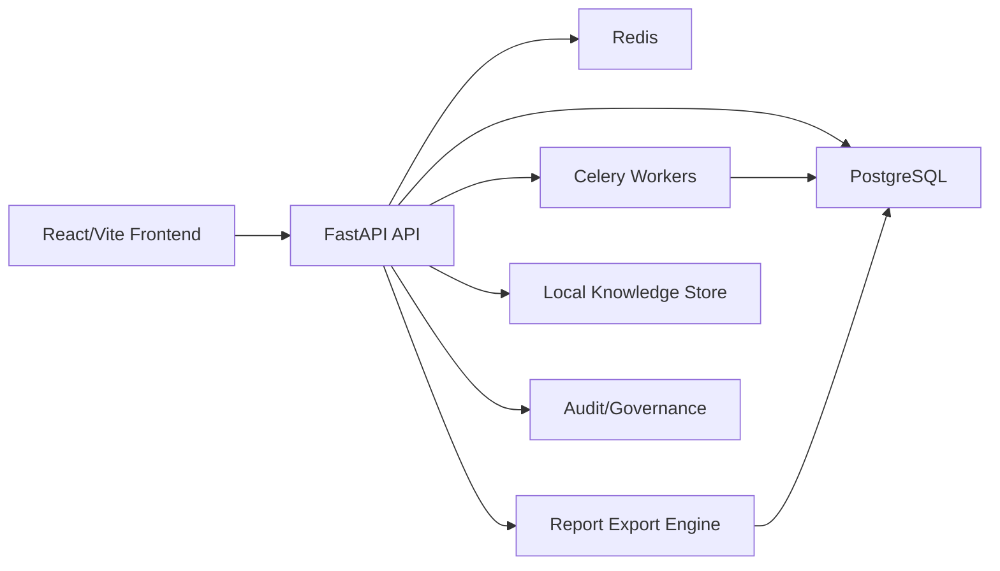

# RavenTech OSINT

RavenTech OSINT is a defensive intelligence and investigation workspace for
authorized security assessments. It helps analysts collect passive evidence,
normalize findings, manage remediation workflows, review cases, and generate
stakeholder-ready reports without active scanning or offensive automation.

## What Problem It Solves

Security teams often need a repeatable way to turn authorized external exposure
data into evidence-backed findings, remediation tasks, audit trails, and reports.
RavenTech OSINT packages that workflow into one local-first platform:

- define authorized investigation scope
- add domains, URLs, and IPs
- run passive recon and enrichment
- generate deterministic defensive findings
- correlate recurring evidence and IOCs internally
- manage review, remediation, approval, and closure
- export executive and technical reports
- preserve audit and governance context

## Key Features

- FastAPI backend with async SQLAlchemy, Alembic, PostgreSQL, Redis, and Celery
- React/Vite/TypeScript frontend with a RavenTech dark analyst workspace
- JWT authentication, RBAC, investigation membership, and admin controls
- Config-gated user registration, approval workflow, and admin user governance
- Engagement records with client metadata, authorization status, approved scope,
  and advisory out-of-scope target warnings
- Case closure workflow with final review checklist, deliverable tracking,
  evidence package manifest, and residual-risk handoff summary
- Internal Notification Center and Activity Inbox for approvals, assignments,
  closure blockers, scope warnings, report readiness, and governance alerts
- Passive recon for DNS, RDAP, certificates, HTTP/TLS metadata, ASN/IP metadata
- Deterministic findings, risk, readiness, executive posture, and prioritization
- Evidence intelligence, IOC correlation, and threat intelligence workspace
- Playbooks, remediation workflow, case review, report approval, and audit trail
- HTML, Markdown, PDF, and DOCX report exports
- Optional AI analysis with deterministic fallback when the provider is unavailable
- Operations Center with health, diagnostics, backups, restore dry-run validation
- Release candidate metadata endpoint and synthetic defensive demo dataset tooling

## Defensive-Only Scope

RavenTech OSINT is intentionally defensive. It does not implement active scanning,
Nmap, exploitation, payload generation, malware handling, autonomous agents,
internet-wide crawling, or offensive tradecraft. Demo data is synthetic and uses
reserved identifiers.

## Architecture Overview



The backend owns authorization, persistence, report generation, workflow logic,
and deterministic intelligence services. The frontend consumes existing API
contracts and presents analyst, executive, governance, and operations views.

## Tech Stack

- Backend: FastAPI, SQLAlchemy async, Pydantic v2, Alembic
- Storage: PostgreSQL, Redis, local Chroma/knowledge metadata foundation
- Workers: Celery foundation
- Frontend: React, Vite, TypeScript, Tailwind CSS, TanStack Query
- Reports: Jinja2 templates, Markdown, ReportLab/PDF, DOCX export support
- CI: ruff, mypy, pytest, pip check, alembic check, frontend build

## Local Setup

Backend services:

```powershell
docker compose up -d
docker compose logs backend -f
docker compose exec backend alembic upgrade head
curl http://localhost:8000/health
curl http://localhost:8000/api/v1/release
```

Frontend:

```powershell
cd frontend
npm install
npm run dev
```

`npm run dev` must be run from the `frontend/` directory.

Public registration is disabled by default. To enable it in a local or staging
environment, review `PUBLIC_REGISTRATION_ENABLED`,
`REGISTRATION_REQUIRES_APPROVAL`, `REGISTRATION_INVITE_CODE`, and
`DEFAULT_REGISTERED_USER_ROLE` in `.env.example`. Public registration never
creates admin users; continue using the admin bootstrap workflow for platform
administrators.

Platform administrators can review registered users in Admin → Users, approve
pending accounts, reject registrations, disable or reactivate users, and change
safe platform roles. The backend prevents disabling or demoting the last active
administrator.

## Engagement Scope Governance

Engagements document client or organization context, authorization status,
approved scope items, and authorization evidence metadata. Investigations can
optionally link to an engagement. Linked cases surface scope review status in
the workspace, warn analysts when a target is not clearly in scope, and include
safe scope/authorization context in generated reports.

This is a lightweight governance layer, not multi-tenant SaaS, billing, hosting,
or a client portal. Unknown scope is treated conservatively as pending review.
No DNS lookup, active probing, crawling, or external enrichment is performed by
scope matching.

## Case Closure And Deliverables

Case Closure helps analysts prepare a defensible final handoff. Each
investigation can generate a deterministic closure checklist, record final risk,
track client-ready deliverables, and create an evidence package manifest. The
manifest references stored reports, findings, evidence summaries, scope status,
and warnings; it does not create external storage or a client portal.

Closure is analyst-driven. Required blockers prevent normal closure unless an
owner or administrator records an override reason. Closure, deliverable, and
package actions are audit logged and included in generated reports.

## Notification Center

The Activity Inbox surfaces internal workflow alerts for pending user approvals,
assigned work, report approvals, case closure review, deliverable readiness,
scope warnings, and governance reminders. Notifications are stored in the
application database, scoped to authorized users, and audit logged when created,
read, dismissed, or rebuilt.

No email, SMS, browser push, Slack, Discord, Teams, or third-party delivery is
included in this release candidate.

## Validation Commands

```powershell
docker compose run --rm backend python -m ruff check app workers tests
docker compose run --rm backend python -m mypy app workers
docker compose run --rm backend python -m pytest tests/ -q
docker compose run --rm backend python -m pip check
docker compose exec backend alembic check

cd frontend
npm run build
```

## Demo Data

Demo mode is disabled by default for production-safe behavior. When enabled by an
admin feature flag, seed synthetic defensive data:

```powershell
docker compose exec backend python scripts/seed_demo_data.py
docker compose exec backend python scripts/seed_demo_data.py --clear
```

The same workflow is available to admins through:

- `POST /api/v1/admin/demo/seed`
- `DELETE /api/v1/admin/demo/clear`

The seeded case is labeled `[DEMO]`, uses reserved identifiers, performs no live
requests, and makes no compromise claims.

## Demo Flow

See [PORTFOLIO_DEMO_FLOW.md](PORTFOLIO_DEMO_FLOW.md) for a 10-minute portfolio
presentation script and [SCREENSHOTS_CHECKLIST.md](SCREENSHOTS_CHECKLIST.md) for
recommended screenshots.

For release packaging, see [RELEASE_NOTES_RC1.md](RELEASE_NOTES_RC1.md) and
[RELEASE_CANDIDATE_CHECKLIST.md](RELEASE_CANDIDATE_CHECKLIST.md).

For production-style readiness, Supabase PostgreSQL guidance, domain/CORS
planning, and registration controls, see
[DEPLOYMENT_PREFLIGHT.md](DEPLOYMENT_PREFLIGHT.md).

## Screenshot Placeholders

Recommended portfolio screenshots:

- Login and health indicator
- Dashboard and executive posture
- Investigation overview and passive recon evidence
- Findings, correlations, IOC intelligence, and threat intelligence
- AI fallback with citations
- Reports and export actions
- Activity Inbox, review board, governance settings, audit log, and operations
  center

## Known Limitations

- Passive recon only; no active scanning or exploitation
- AI is optional and degrades to deterministic fallback when unavailable
- No cloud deployment implementation, billing, SSO, or external ticketing
- Internal notifications only; no email, SMS, push, or chat integrations
- Engagement governance is metadata and advisory by default; operators must
  still validate written authorization and scope policy
- No external paid threat feed requirement
- Demo data is synthetic and should not be interpreted as real compromise data

See [KNOWN_LIMITATIONS.md](KNOWN_LIMITATIONS.md) for the full list.

## Roadmap

The current repository is packaged as a release-candidate portfolio build. Future
work can focus on deployment automation, enterprise SSO, external ticketing,
production observability, and additional governed integrations while preserving
the defensive-only boundary.
