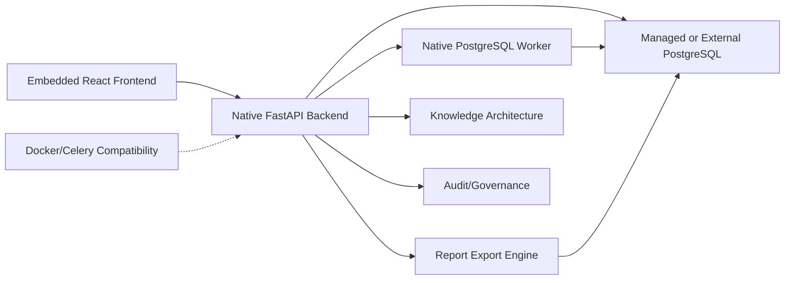

# RavenTech OSINT

RavenTech OSINT is a defensive intelligence and investigation workspace for
authorized security assessments. It helps analysts collect passive evidence,
normalize findings, manage remediation workflows, review cases, and generate
stakeholder-ready reports without intrusive scanning or offensive automation.

Current release candidate: `5.0.0-rc6`. The packaged Windows and Linux desktop
uses an embedded frontend, native backend and worker, managed local PostgreSQL,
and native host monitoring. The installed Windows runtime has passed isolated
packaged acceptance. Linux x86_64 package and native runtime core have been
validated on Debian 13 WSL; Linux visual GUI and independent clean-install
acceptance remain untested. Docker Compose remains available for development
and compatibility. PostgreSQL is required; Redis and Celery are not required by
the native desktop runtime. See [NATIVE_DESKTOP_ACCEPTANCE.md](NATIVE_DESKTOP_ACCEPTANCE.md),
[DESKTOP_NATIVE_RUNTIME.md](DESKTOP_NATIVE_RUNTIME.md), and
[MANAGED_POSTGRESQL_RUNTIME.md](MANAGED_POSTGRESQL_RUNTIME.md).

Production hosting, public distribution, and cloud deployment are not part of
this local-first application.
## What Problem It Solves

Security teams often need a repeatable way to turn authorized external exposure
data into evidence-backed findings, remediation tasks, audit trails, and reports.
RavenTech OSINT packages that workflow into one local-first platform:

- define authorized investigation scope
- add domains, URLs, and IPs
- run passive recon and enrichment
- generate deterministic defensive findings
- correlate recurring evidence and IOCs internally
- manage review, remediation, approval, and closure
- export executive and technical reports
- preserve audit and governance context

## Key Features

- FastAPI backend with async SQLAlchemy, Alembic, and PostgreSQL-backed native background jobs; Redis/Celery remain available for Docker compatibility
- React/Vite/TypeScript frontend with a RavenTech dark analyst workspace
- English/Spanish UI with persisted language preference and English fallback
- JWT authentication, RBAC, investigation membership, and admin controls
- Config-gated user registration, approval workflow, and admin user governance
- Engagement records with client metadata, authorization status, approved scope,
  and advisory out-of-scope target warnings
- Case closure workflow with final review checklist, deliverable tracking,
  evidence package manifest, and residual-risk handoff summary
- Internal Notification Center and Activity Inbox for approvals, assignments,
  closure blockers, scope warnings, report readiness, and governance alerts
- Internal global search, private saved views, pinned view shortcuts, and
  quick-access navigation for analyst productivity
- Passive recon for DNS, RDAP, certificates, HTTP/TLS metadata, ASN/IP metadata
- Deterministic findings, risk, readiness, executive posture, and prioritization
- Evidence intelligence, IOC correlation, and threat intelligence workspace
- Playbooks, remediation workflow, case review, report approval, and audit trail
- HTML, Markdown, PDF, and DOCX report exports
- Local Knowledge library for operator-selected Obsidian vault files and reference documents, with source provenance, trust/review metadata, bounded incremental indexing, keyword search, and optional local vector retrieval
- Optional in-app AI Console connected to a loopback OpenCode server or detected
  local Ollama/LM Studio endpoints; provider/model availability is discovered
  dynamically, current RavenTech evidence is available through a bounded,
  read-only tool gateway, and core workflows remain usable without AI
- Knowledge ingestion, indexing, filtering, and citation work without an external AI service. Imported content remains local and is added to reports only when the operator explicitly selects references.
- Operations Center with health, diagnostics, backups, restore dry-run validation
- Local Monitoring Center with service telemetry, RBAC-aware investigation
  watch, private-range LAN discovery, agentless neighbor and bounded TCP
  visibility, optional endpoint telemetry, deduplicated internal alerts, and
  native host observations in the desktop runtime
- Deterministic vulnerability baseline with asset criticality, non-intrusive
  risk indicators, remediation ownership, due dates, and status tracking
- Endpoint Security Posture with agent-aware firewall, antivirus, patch, reboot,
  resource, coverage, and service risk indicators plus manual remediation guidance
- Responsive route-level loading, friendly retry states, guarded internal links,
  and defensive formatting for partial API responses
- Release candidate metadata endpoint and synthetic defensive demo dataset tooling

## Defensive-Only Scope

RavenTech OSINT is intentionally defensive. It does not implement generalized
active or vulnerability scanning, Nmap, exploitation, payload generation,
malware handling, autonomous agents, internet-wide crawling, or offensive
tradecraft. LAN monitoring is limited to explicitly authorized RFC1918 ranges,
route-aware native neighbor observations, and separately enabled, bounded
TCP-connect checks on configured ports. Newly observed agentless assets remain
reviewable; endpoint agents are optional and provide deeper telemetry. The
physical Ethernet or Wi-Fi medium remains unknown unless trusted evidence
identifies it. Demo data is synthetic and uses reserved identifiers.

The vulnerability baseline evaluates stored local observations only. It does
not perform vulnerability scanning or exploit validation. See
[VULNERABILITY_BASELINE.md](VULNERABILITY_BASELINE.md).

## Architecture Overview



The backend owns authorization, persistence, report generation, workflow logic,
and deterministic intelligence services. The frontend consumes existing API
contracts and presents analyst, executive, governance, and operations views.
Packaged desktop startup is supervised by Tauri. Source development can use Docker Compose, Vite, and the Celery compatibility profile.

The optional AI Console uses the local OpenCode HTTP server for configured
providers and can discover local Ollama or LM Studio models. Provider credentials
remain in their owning provider/OpenCode configuration. The selector distinguishes
local and remote execution and applies the selected cost/privacy mode. Knowledge
excerpts are retrieved locally and sent only when an analyst explicitly selects
them; remote execution displays the destination before a request. RavenTech AI is
chat and analysis only: tool execution, file changes, shell commands, and remote
administration are disabled. See
[AI_MODEL_INTEGRATION.md](docs/AI_MODEL_INTEGRATION.md) for setup and data handling.

Obsidian vaults are selected locally and retained as private, read-only source
locations for operator-triggered incremental sync. Individual document uploads
are copied into RavenTech-managed storage. Search results retain source,
relative document name, section/page where available, content hash, trust level,
and verification state. Import does not imply verification, and source URLs
are descriptive metadata; RavenTech does not fetch them automatically.
Removing a source removes its RavenTech index and any managed upload snapshot,
never the selected original files. See
[LOCAL_KNOWLEDGE.md](LOCAL_KNOWLEDGE.md) for source management and privacy details.

## Tech Stack

- Backend: FastAPI, SQLAlchemy async, Pydantic v2, Alembic
- Storage: PostgreSQL; optional Redis compatibility for Docker workflows
- Workers: native PostgreSQL queue for desktop; Celery compatibility for Docker
- Frontend: React, Vite, TypeScript, Tailwind CSS, TanStack Query
- Reports: Jinja2 templates, Markdown, ReportLab/PDF, DOCX export support
- CI: ruff, mypy, pytest, pip check, alembic check, frontend build

## Development and Docker Setup

Backend services:

```powershell
docker compose up -d
docker compose logs backend -f
docker compose exec backend alembic upgrade head
curl http://localhost:8000/health
curl http://localhost:8000/health/ready
curl http://localhost:8000/api/v1/release
```

Frontend:

```powershell
cd frontend
npm ci
npm run dev
```

`npm run dev` must be run from the `frontend/` directory.

Optional desktop development shell, after the backend is running (Vite is an
optional development override):

```powershell
cd desktop
npm run check
npm run build
npm run tauri:check
npm run tauri:dev
```

This command builds the embedded React assets and runs the source prototype
through Cargo. It does not create an installer or start Docker automatically.

To build the Windows portable local-test folder after dependencies are already
available locally:

```powershell
cd desktop
npm run portable:build
```

The output is
`desktop/dist-portable/RavenTech-OSINT-Desktop-5.0.0-rc6/`. Read
[desktop/PORTABLE_BUILD_README.md](desktop/PORTABLE_BUILD_README.md) before
running the unsigned executable. The packaged application starts its native runtime when opened. `npm run dev` is needed only for browser or source-development mode.

To build the unsigned current-user installer after local dependencies are
available:

```powershell
cd desktop
npm ci --offline
npm run installer:build
npm run installer:validate -- --require-artifact
```

Output is collected under
`desktop/dist-installer/RavenTech-OSINT-Desktop-5.0.0-rc6/`. Read
[desktop/INSTALLER_BUILD_README.md](desktop/INSTALLER_BUILD_README.md) and use
[DESKTOP_DISTRIBUTION_CHECKLIST.md](DESKTOP_DISTRIBUTION_CHECKLIST.md) for local
QA. The installer is unsigned and may trigger Windows SmartScreen. It does not install an operating-system service or an autostart entry; the application supervises its own runtime while it is open.

After both local artifacts are built, validate the combined distribution:

```powershell
cd desktop
npm run smoke -- --require-artifacts
```

The desktop window is branded **RavenTech OSINT Desktop — Local Workspace**.
The desktop uses the repository shield/radar icon for its local workspace. Signing and automatic updates are not part of the current desktop distribution.

After portable and installer artifacts validate, create the ignored private
aggregate package from `desktop/` with:

```powershell
npm run local-release:package
npm run local-release:validate -- --require-artifact
```

The output is
`desktop/dist-local-release/RavenTech-OSINT-Desktop-5.0.0-rc6/` and contains
only the two binaries, local instructions, known limitations, checksums, and a
provenance manifest. See [desktop/LOCAL_RELEASE_README.md](desktop/LOCAL_RELEASE_README.md).

The desktop status screen reports database, backend, worker, embedded frontend, and host-monitoring state with safe recovery guidance. After sign-in and backend readiness, the embedded UI loads the Monitoring Center summary and refreshes it every 30 seconds by default. This read-only polling does not start LAN discovery, TCP checks, or other host services.

Desktop monitoring startup is controlled by
`DESKTOP_AUTO_MONITORING_ENABLED=true`,
`MONITORING_AUTO_REFRESH_ENABLED=true`, and
`MONITORING_AUTO_REFRESH_SECONDS=30`. Active LAN work remains separately opt-in:
`LAN_AUTO_DISCOVERY_ON_START=false` and
`LAN_AUTO_SERVICE_CHECK_ON_START=false` by default, with minimum scheduled
intervals of 300 and 600 seconds. When LAN monitoring is disabled, the UI reports
that monitoring is ready and discovery is disabled by configuration; it does not
degrade platform health. Installed and portable builds use embedded assets and
do not require Vite/port 5173. Docker, Redis, and Celery are not required in native desktop mode.

For Docker-based development, these scripts provide startup and health checks:

```powershell
./scripts/local/start_local.ps1
./scripts/local/check_local_health.ps1
```

Public registration is disabled by default. To enable it in a local or staging
environment, review `PUBLIC_REGISTRATION_ENABLED`,
`REGISTRATION_REQUIRES_APPROVAL`, `REGISTRATION_INVITE_CODE`, and
`DEFAULT_REGISTERED_USER_ROLE` in `.env.example`. Public registration never
creates admin users; continue using the admin bootstrap workflow for platform
administrators.

Platform administrators can review registered users in Admin → Users, approve
pending accounts, reject registrations, disable or reactivate users, and change
safe platform roles. The backend prevents disabling or demoting the last active
administrator.

## Engagement Scope Governance

Engagements document client or organization context, authorization status,
approved scope items, and authorization evidence metadata. Investigations can
optionally link to an engagement. Linked cases surface scope review status in
the workspace, warn analysts when a target is not clearly in scope, and include
safe scope/authorization context in generated reports.

This is a lightweight governance layer, not multi-tenant SaaS, billing, hosting,
or a client portal. Unknown scope is treated conservatively as pending review.
No DNS lookup, active probing, crawling, or external enrichment is performed by
scope matching.

## Case Closure And Deliverables

Case Closure helps analysts prepare a defensible final handoff. Each
investigation can generate a deterministic closure checklist, record final risk,
track client-ready deliverables, and create an evidence package manifest. The
manifest references stored reports, findings, evidence summaries, scope status,
and warnings; it does not create external storage or a client portal.

Closure is analyst-driven. Required blockers prevent normal closure unless an
owner or administrator records an override reason. Closure, deliverable, and
package actions are audit logged and included in generated reports.

## Notification Center

The Activity Inbox surfaces internal workflow alerts for pending user approvals,
assigned work, report approvals, case closure review, deliverable readiness,
scope warnings, and governance reminders. Notifications are stored in the
application database, scoped to authorized users, and audit logged when created,
read, dismissed, or rebuilt.

No email, SMS, browser push, Slack, Discord, Teams, or third-party delivery is
included in this release candidate.

## Global Search And Saved Views

Global Search helps authenticated analysts find accessible investigations,
engagements, findings, reports, deliverables, notifications, scope records,
closure data, IOCs, and threat intelligence objects. Search is internal-only,
RBAC-aware, and backed by existing PostgreSQL data. It does not crawl the web,
query external search providers, or perform enrichment.

Saved Views let analysts preserve frequently used filters for investigations,
findings, reports, notifications, and engagements. Views are user-specific by
default, can be pinned for Quick Access, and never store credentials, tokens,
API keys, invite codes, or database URLs.

## Data Quality And Safe Maintenance

The admin-only Data Quality Center runs bounded, deterministic consistency
checks across investigations, engagements, findings, reports, closures,
notifications, saved views, users, demo records, and system configuration.
Issues retain severity and workflow status so administrators can acknowledge,
ignore, or resolve them with an audit trail.

Scans recommend manual corrections. They never delete user data, change roles,
close cases, alter scope authorization, or rewrite evidence. The optional stale
notification action only soft-archives old read or dismissed notifications.

## Validation Commands

```powershell
docker compose run --rm backend python -m ruff check app workers tests
docker compose run --rm backend python -m mypy app workers
docker compose run --rm backend python -m pytest tests/ -q
docker compose run --rm backend python -m pip check
docker compose exec backend alembic check

cd frontend
npm run build
```

## Demo Data

Demo mode is disabled by default for production-safe behavior. When enabled by an
admin feature flag, seed synthetic defensive data:

```powershell
docker compose exec backend python -m scripts.seed_demo_data
./scripts/local/reset_demo.ps1 -Confirmation RESET-DEMO
```

The same workflow is available to admins through:

- `POST /api/v1/admin/demo/seed`
- `DELETE /api/v1/admin/demo/clear`

The seeded case is labeled `[DEMO]`, uses reserved identifiers, performs no live
requests, and makes no compromise claims. Reset creates a local database safety
backup by default and targets fixed synthetic records only. Demo presentation
is not shown in normal navigation; administrator-only **QA Tools** retain the
optional seed/reset workflow.

## Local Operations

The repeatable local operator workflow is available through Windows-friendly
launcher scripts. They use Docker Compose, apply migrations without deleting
data, and check health, readiness, and release metadata without printing
secrets:

```powershell
./scripts/local/start_platform.ps1 -OpenFrontend
./scripts/local/check_platform.ps1
./scripts/local/restart_platform.ps1 -OpenFrontend
./scripts/local/stop_platform.ps1
./scripts/local/open_platform.ps1 -Target frontend
```

After signing in, **Operations → Local Operator Console** shows the same
read-only status, local URLs, LAN flags, agent coverage, and copy-ready
commands. The browser never executes host commands. See
`LOCAL_DEMO_BUNDLE.md` for seed/reset, backup/restore, and agent steps.

Create a timestamped PostgreSQL backup without copying `.env` or secrets:

```powershell
./scripts/local/backup_db.ps1
./scripts/local/backup_db.ps1 -IncludeReports
```

Restore validation is non-destructive by default: the restore tool refuses the
live `raventech` database and creates a new database name.

```powershell
./scripts/local/restore_db.ps1 -BackupPath ./backups/local/raventech-<timestamp>.dump
```

See [LOCAL_BACKUP_RESTORE.md](LOCAL_BACKUP_RESTORE.md) for safeguards and
[LOCAL_HEALTH_REPAIR.md](LOCAL_HEALTH_REPAIR.md) for practical recovery steps.

For local service telemetry and investigation watch status, open **Monitoring**
after signing in. See [LOCAL_MONITORING.md](LOCAL_MONITORING.md) for endpoint,
RBAC, polling, alert-deduplication, and optional Windows host-agent details.
Authorized private-LAN monitoring is disabled by default; its bounded setup and
security boundary are documented in [LAN_MONITORING.md](LAN_MONITORING.md).

## Demo Flow

Start with [LOCAL_DEMO_BUNDLE.md](LOCAL_DEMO_BUNDLE.md) for the complete local
setup, seed/reset, health, report, validation, screenshot, and artifact workflow.

See [PORTFOLIO_DEMO_FLOW.md](PORTFOLIO_DEMO_FLOW.md) for a 10-minute portfolio
presentation script and [SCREENSHOTS_CHECKLIST.md](SCREENSHOTS_CHECKLIST.md) for
recommended screenshots.

The complete presentation handoff is in
[PORTFOLIO_PACKAGE.md](PORTFOLIO_PACKAGE.md), and the frozen platform boundary is
recorded in [FINAL_PLATFORM_FREEZE.md](FINAL_PLATFORM_FREEZE.md).

For desktop setup and acceptance procedures, see [DESKTOP_LOCAL_ACCEPTANCE.md](DESKTOP_LOCAL_ACCEPTANCE.md) and [FINAL_QA_CHECKLIST.md](FINAL_QA_CHECKLIST.md).

Operator guidance is available in [OPERATOR_MANUAL.md](OPERATOR_MANUAL.md),
[DESKTOP_PRIVATE_HANDOFF.md](DESKTOP_PRIVATE_HANDOFF.md), and
[DESKTOP_OPERATOR_ACCEPTANCE_CHECKLIST.md](DESKTOP_OPERATOR_ACCEPTANCE_CHECKLIST.md).
These documents cover local operation and validation.
For a clean checkout, follow [FRESH_SETUP_CHECKLIST.md](FRESH_SETUP_CHECKLIST.md)
in order before using the operator acceptance checklist.
For a separately transferred Windows host, continue with
[EXTERNAL_MACHINE_TEST_CHECKLIST.md](EXTERNAL_MACHINE_TEST_CHECKLIST.md).

For production-style readiness, Supabase PostgreSQL guidance, domain/CORS
planning, and registration controls, see
[DEPLOYMENT_PREFLIGHT.md](DEPLOYMENT_PREFLIGHT.md).

## Product Specification

The Spanish software requirements specification for the current product is
available at
[RavenTech OSINT SRS (PDF)](docs/deliverables/RavenTech_OSINT_SRS_v1.0_ES.pdf).
Its editable source is
[RavenTech OSINT SRS (Markdown)](docs/srs/RavenTech_OSINT_SRS_ES.md).

## Known Limitations

- Passive OSINT recon only; optional LAN monitoring is bounded connectivity
  observation, never vulnerability scanning or exploitation
- AI is optional and degrades to deterministic fallback when unavailable
- The desktop candidate requires local or external PostgreSQL; clean-machine acceptance is tracked separately from development and package validation
- Production/free-tier hosting and the Supabase production database migration are deferred
- No cloud deployment implementation, billing, SSO, or external ticketing
- Internal notifications only; no email, SMS, push, or chat integrations
- Internal search only; no external search provider, crawling, or internet-wide
  discovery
- Engagement governance is metadata and advisory by default; operators must
  still validate written authorization and scope policy
- No external paid threat feed requirement
- Demo data is synthetic and should not be interpreted as real compromise data
- Data quality checks are bounded heuristics; administrators must review every
  recommendation before correcting source records

See [KNOWN_LIMITATIONS.md](KNOWN_LIMITATIONS.md) for the full list.

## Roadmap

The current release candidate focuses on dependable local Windows and Linux
desktop use. Product roadmap areas include clean-machine installation
validation, continued cross-platform runtime parity, and carefully scoped
local knowledge workflows. No cloud deployment or public distribution is
implied by these plans.

## Monitoring and Security Posture

The Monitoring Center combines native host metrics, Windows/Linux service and
process visibility, endpoint-agent telemetry, authorized LAN asset observations,
observed service changes, advisory alerts, and a change timeline. Service health
uses configured expectations and operational evidence; an open port alone is
not treated as a vulnerability. Security Posture recommendations explain the
evidence and remain advisory for an operator to review.

## Authorized LAN Visibility

LAN inventory is limited to explicitly authorized private ranges. Endpoint
agents report local telemetry and do not accept remote commands. Optional
service observations use bounded TCP connectivity checks for configured ports;
there is no public scanning, router automation, credential testing, or
exploitation. Device OS/type classification includes confidence and supporting
evidence so passive inference is not presented as certainty.

## Native Desktop Runtime

The packaged desktop uses a Tauri supervisor to start its native backend,
PostgreSQL-backed worker, and managed PostgreSQL when selected. The production
React frontend is embedded in the desktop package. PostgreSQL remains required;
Docker, Redis, and Celery remain supported for development and compatibility,
but are not required by the native desktop profile. See the runtime guides for
data locations, startup behavior, and troubleshooting.

## Clean-Install Validation

Windows and Linux clean-machine acceptance is tracked separately from package
build validation and development testing. Refer to
[NATIVE_DESKTOP_ACCEPTANCE.md](NATIVE_DESKTOP_ACCEPTANCE.md) for the current
acceptance record and procedures for future clean installations.
