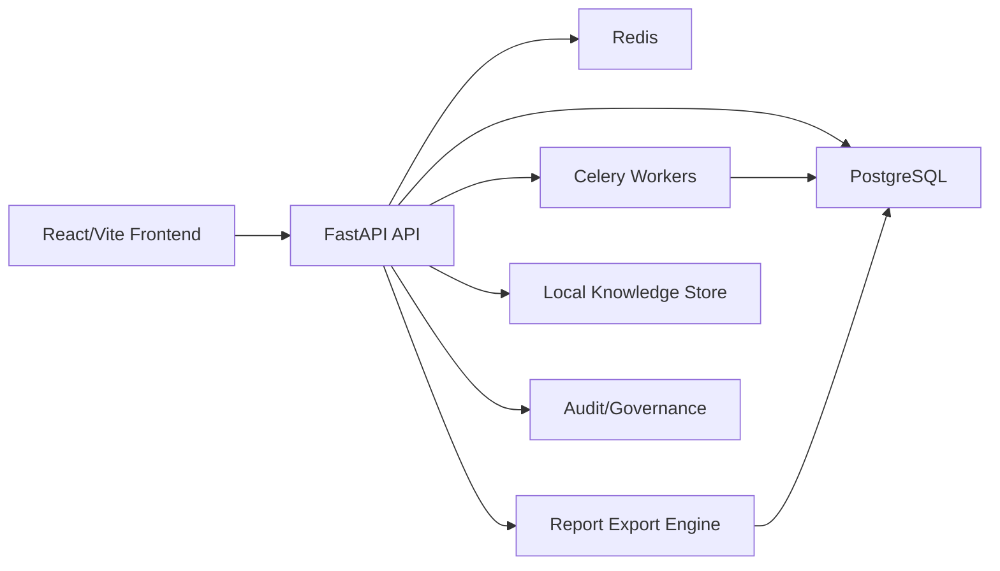

# RavenTech OSINT

## Phase 5AA monitoring controls

Monitoring Center includes safe policy tuning and maintenance windows for existing local, LAN, endpoint-agent, and vulnerability-baseline signals. Administrators manage thresholds, severity overrides, cooldowns, dedupe keys, daily caps, and audited suppression; analysts can review configuration under existing RBAC. Maintenance never deletes alerts or pauses collection.

This phase adds no hosting, deployment, DNS, or Supabase changes and no active scanning, exploitation, brute force, or intrusive vulnerability testing.

RavenTech OSINT is a defensive intelligence and investigation workspace for
authorized security assessments. It helps analysts collect passive evidence,
normalize findings, manage remediation workflows, review cases, and generate
stakeholder-ready reports without intrusive scanning or offensive automation.

Current release candidate: `5.0.0-rc2`. The validated runtime is local Docker
Compose; production and free-tier hosting remain deferred.

Local mode requires development-only values from `.env.example`; it does not
require production secrets, hosted services, DNS, or Supabase.

## What Problem It Solves

Security teams often need a repeatable way to turn authorized external exposure
data into evidence-backed findings, remediation tasks, audit trails, and reports.
RavenTech OSINT packages that workflow into one local-first platform:

- define authorized investigation scope
- add domains, URLs, and IPs
- run passive recon and enrichment
- generate deterministic defensive findings
- correlate recurring evidence and IOCs internally
- manage review, remediation, approval, and closure
- export executive and technical reports
- preserve audit and governance context

## Key Features

- FastAPI backend with async SQLAlchemy, Alembic, PostgreSQL, Redis, and Celery
- React/Vite/TypeScript frontend with a RavenTech dark analyst workspace
- JWT authentication, RBAC, investigation membership, and admin controls
- Config-gated user registration, approval workflow, and admin user governance
- Engagement records with client metadata, authorization status, approved scope,
  and advisory out-of-scope target warnings
- Case closure workflow with final review checklist, deliverable tracking,
  evidence package manifest, and residual-risk handoff summary
- Internal Notification Center and Activity Inbox for approvals, assignments,
  closure blockers, scope warnings, report readiness, and governance alerts
- Internal global search, private saved views, pinned view shortcuts, and
  quick-access navigation for analyst productivity
- Passive recon for DNS, RDAP, certificates, HTTP/TLS metadata, ASN/IP metadata
- Deterministic findings, risk, readiness, executive posture, and prioritization
- Evidence intelligence, IOC correlation, and threat intelligence workspace
- Playbooks, remediation workflow, case review, report approval, and audit trail
- HTML, Markdown, PDF, and DOCX report exports
- Optional AI analysis with deterministic fallback when the provider is unavailable
- Operations Center with health, diagnostics, backups, restore dry-run validation
- Local Monitoring Center with service telemetry, RBAC-aware investigation
  watch, disabled-by-default authorized LAN inventory, endpoint telemetry,
  deduplicated internal alerts, and an optional manual host agent
- Deterministic vulnerability baseline with asset criticality, non-intrusive
  risk indicators, remediation ownership, due dates, and status tracking
- Responsive route-level loading, friendly retry states, guarded internal links,
  and defensive formatting for partial API responses
- Release candidate metadata endpoint and synthetic defensive demo dataset tooling

## Defensive-Only Scope

RavenTech OSINT is intentionally defensive. It does not implement generalized
active or vulnerability scanning, Nmap, exploitation, payload generation,
malware handling, autonomous agents, internet-wide crawling, or offensive
tradecraft. Optional LAN monitoring is limited to explicitly authorized private
ranges and separately enabled ICMP/TCP connectivity observations. Demo data is
synthetic and uses reserved identifiers.

The vulnerability baseline evaluates stored local observations only. It does
not perform vulnerability scanning or exploit validation. See
[VULNERABILITY_BASELINE.md](VULNERABILITY_BASELINE.md).

## Architecture Overview



The backend owns authorization, persistence, report generation, workflow logic,
and deterministic intelligence services. The frontend consumes existing API
contracts and presents analyst, executive, governance, and operations views.

## Tech Stack

- Backend: FastAPI, SQLAlchemy async, Pydantic v2, Alembic
- Storage: PostgreSQL, Redis, local Chroma/knowledge metadata foundation
- Workers: Celery foundation
- Frontend: React, Vite, TypeScript, Tailwind CSS, TanStack Query
- Reports: Jinja2 templates, Markdown, ReportLab/PDF, DOCX export support
- CI: ruff, mypy, pytest, pip check, alembic check, frontend build

## Local Setup

Backend services:

```powershell
docker compose up -d
docker compose logs backend -f
docker compose exec backend alembic upgrade head
curl http://localhost:8000/health
curl http://localhost:8000/health/ready
curl http://localhost:8000/api/v1/release
```

Frontend:

```powershell
cd frontend
npm ci
npm run dev
```

`npm run dev` must be run from the `frontend/` directory.

For a guided startup and health check:

```powershell
./scripts/local/start_local.ps1
./scripts/local/check_local_health.ps1
```

Public registration is disabled by default. To enable it in a local or staging
environment, review `PUBLIC_REGISTRATION_ENABLED`,
`REGISTRATION_REQUIRES_APPROVAL`, `REGISTRATION_INVITE_CODE`, and
`DEFAULT_REGISTERED_USER_ROLE` in `.env.example`. Public registration never
creates admin users; continue using the admin bootstrap workflow for platform
administrators.

Platform administrators can review registered users in Admin → Users, approve
pending accounts, reject registrations, disable or reactivate users, and change
safe platform roles. The backend prevents disabling or demoting the last active
administrator.

## Engagement Scope Governance

Engagements document client or organization context, authorization status,
approved scope items, and authorization evidence metadata. Investigations can
optionally link to an engagement. Linked cases surface scope review status in
the workspace, warn analysts when a target is not clearly in scope, and include
safe scope/authorization context in generated reports.

This is a lightweight governance layer, not multi-tenant SaaS, billing, hosting,
or a client portal. Unknown scope is treated conservatively as pending review.
No DNS lookup, active probing, crawling, or external enrichment is performed by
scope matching.

## Case Closure And Deliverables

Case Closure helps analysts prepare a defensible final handoff. Each
investigation can generate a deterministic closure checklist, record final risk,
track client-ready deliverables, and create an evidence package manifest. The
manifest references stored reports, findings, evidence summaries, scope status,
and warnings; it does not create external storage or a client portal.

Closure is analyst-driven. Required blockers prevent normal closure unless an
owner or administrator records an override reason. Closure, deliverable, and
package actions are audit logged and included in generated reports.

## Notification Center

The Activity Inbox surfaces internal workflow alerts for pending user approvals,
assigned work, report approvals, case closure review, deliverable readiness,
scope warnings, and governance reminders. Notifications are stored in the
application database, scoped to authorized users, and audit logged when created,
read, dismissed, or rebuilt.

No email, SMS, browser push, Slack, Discord, Teams, or third-party delivery is
included in this release candidate.

## Global Search And Saved Views

Global Search helps authenticated analysts find accessible investigations,
engagements, findings, reports, deliverables, notifications, scope records,
closure data, IOCs, and threat intelligence objects. Search is internal-only,
RBAC-aware, and backed by existing PostgreSQL data. It does not crawl the web,
query external search providers, or perform enrichment.

Saved Views let analysts preserve frequently used filters for investigations,
findings, reports, notifications, and engagements. Views are user-specific by
default, can be pinned for Quick Access, and never store credentials, tokens,
API keys, invite codes, or database URLs.

## Data Quality And Safe Maintenance

The admin-only Data Quality Center runs bounded, deterministic consistency
checks across investigations, engagements, findings, reports, closures,
notifications, saved views, users, demo records, and system configuration.
Issues retain severity and workflow status so administrators can acknowledge,
ignore, or resolve them with an audit trail.

Scans recommend manual corrections. They never delete user data, change roles,
close cases, alter scope authorization, or rewrite evidence. The optional stale
notification action only soft-archives old read or dismissed notifications.

## Validation Commands

```powershell
docker compose run --rm backend python -m ruff check app workers tests
docker compose run --rm backend python -m mypy app workers
docker compose run --rm backend python -m pytest tests/ -q
docker compose run --rm backend python -m pip check
docker compose exec backend alembic check

cd frontend
npm run build
```

## Demo Data

Demo mode is disabled by default for production-safe behavior. When enabled by an
admin feature flag, seed synthetic defensive data:

```powershell
docker compose exec backend python -m scripts.seed_demo_data
./scripts/local/reset_demo.ps1 -Confirmation RESET-DEMO
```

The same workflow is available to admins through:

- `POST /api/v1/admin/demo/seed`
- `DELETE /api/v1/admin/demo/clear`

The seeded case is labeled `[DEMO]`, uses reserved identifiers, performs no live
requests, and makes no compromise claims. Reset creates a local database safety
backup by default and targets fixed synthetic records only. Demo presentation
is not shown in normal navigation; administrator-only **QA Tools** retain the
optional seed/reset workflow.

## Local Operations

Create a timestamped PostgreSQL backup without copying `.env` or secrets:

```powershell
./scripts/local/backup_db.ps1
./scripts/local/backup_db.ps1 -IncludeReports
```

Restore validation is non-destructive by default: the restore tool refuses the
live `raventech` database and creates a new database name.

```powershell
./scripts/local/restore_db.ps1 -BackupPath ./backups/local/raventech-<timestamp>.dump
```

See [LOCAL_BACKUP_RESTORE.md](LOCAL_BACKUP_RESTORE.md) for safeguards and
[LOCAL_HEALTH_REPAIR.md](LOCAL_HEALTH_REPAIR.md) for practical recovery steps.

For local service telemetry and investigation watch status, open **Monitoring**
after signing in. See [LOCAL_MONITORING.md](LOCAL_MONITORING.md) for endpoint,
RBAC, polling, alert-deduplication, and optional Windows host-agent details.
Authorized private-LAN monitoring is disabled by default; its bounded setup and
security boundary are documented in [LAN_MONITORING.md](LAN_MONITORING.md).

## Demo Flow

Start with [LOCAL_DEMO_BUNDLE.md](LOCAL_DEMO_BUNDLE.md) for the complete local
setup, seed/reset, health, report, validation, screenshot, and artifact workflow.

See [PORTFOLIO_DEMO_FLOW.md](PORTFOLIO_DEMO_FLOW.md) for a 10-minute portfolio
presentation script and [SCREENSHOTS_CHECKLIST.md](SCREENSHOTS_CHECKLIST.md) for
recommended screenshots.

The complete presentation handoff is in
[PORTFOLIO_PACKAGE.md](PORTFOLIO_PACKAGE.md), and the frozen platform boundary is
recorded in [FINAL_PLATFORM_FREEZE.md](FINAL_PLATFORM_FREEZE.md).

For the current release freeze, see [RELEASE_NOTES_RC2.md](RELEASE_NOTES_RC2.md),
[MANUAL_QA_RC2.md](MANUAL_QA_RC2.md), and
[FINAL_QA_CHECKLIST.md](FINAL_QA_CHECKLIST.md). RC1 notes remain available as
historical release context.

The reviewed GitHub release copy is in
[GITHUB_RELEASE_DRAFT.md](GITHUB_RELEASE_DRAFT.md). It is documentation only; no
GitHub release or hosted environment is created by the repository.

For production-style readiness, Supabase PostgreSQL guidance, domain/CORS
planning, and registration controls, see
[DEPLOYMENT_PREFLIGHT.md](DEPLOYMENT_PREFLIGHT.md).

Provider comparisons for a future, separately authorized phase are documented
in [FREE_TIER_HOSTING_OPTIONS.md](FREE_TIER_HOSTING_OPTIONS.md). These are
planning notes only; no hosting, DNS, or database migration has been performed.

## Screenshot Placeholders

Recommended portfolio screenshots:

- Login and health indicator
- Dashboard and executive posture
- Investigation overview and passive recon evidence
- Findings, correlations, IOC intelligence, and threat intelligence
- AI fallback with citations
- Reports and export actions
- Activity Inbox, review board, governance settings, audit log, and operations
  center
- Global Search, saved views, and dashboard Quick Access
- Admin Data Quality Center with non-destructive maintenance recommendations

## Known Limitations

- Passive OSINT recon only; optional LAN monitoring is bounded connectivity
  observation, never vulnerability scanning or exploitation
- AI is optional and degrades to deterministic fallback when unavailable
- Current tested operation is local Docker Compose; production/free-tier hosting
  and the Supabase production database migration are deferred
- No cloud deployment implementation, billing, SSO, or external ticketing
- Internal notifications only; no email, SMS, push, or chat integrations
- Internal search only; no external search provider, crawling, or internet-wide
  discovery
- Engagement governance is metadata and advisory by default; operators must
  still validate written authorization and scope policy
- No external paid threat feed requirement
- Demo data is synthetic and should not be interpreted as real compromise data
- Data quality checks are bounded heuristics; administrators must review every
  recommendation before correcting source records

See [KNOWN_LIMITATIONS.md](KNOWN_LIMITATIONS.md) for the full list.

## Roadmap

The current repository is packaged as the `5.0.0-rc2` release-candidate
portfolio and local demo build. Final manual QA, local operations, backup/restore,
and security hygiene are complete. The `v5.0.0-rc2` tag identifies the validated
local package; hosting, DNS, and Supabase production database work remain
deferred to a separately authorized phase.

## Phase 5AB monitoring reliability

Monitoring now distinguishes required platform dependency health from optional
host-agent telemetry, retires recovered local alerts, and presents provider
timeouts/HTTP/parse failures as clean warnings while retaining valid recon
entities. The Monitoring Center includes bounded open-port observations,
service confidence, and standard/non-standard SSH indicators.

Authorized port discovery remains off by default. When explicitly enabled by
an administrator, it performs rate-limited TCP connects only to configured
ports on approved private LAN assets. It never authenticates, tests
credentials, brute forces, sends exploit payloads, or scans public networks.
Docker LAN limitations are informational and can be supplemented with the
optional endpoint agent or static/router observations. This phase changes no
hosting, deployment, DNS, or Supabase configuration and keeps version
`5.0.0-rc2`.

## Phase 5AC LAN monitoring history

The Monitoring Center now includes a filterable **Change Timeline** and
per-asset service, telemetry, and change history. Meaningful local transitions
include asset availability, identity observations, port/service state, SSH on
approved non-standard ports, endpoint-agent reporting, resource-policy
thresholds, and baseline indicator lifecycle. Entries are acknowledgeable but
never deleted by acknowledgement.

History is derived only from configured local observations and authorized TCP
checks. It stores no raw sensitive banners or credentials and introduces no
public scanning, exploitation, brute force, hosting, deployment, DNS, or
Supabase work. Version remains `5.0.0-rc2`.

## Phase 5AD alert triage

Monitoring alerts now have a lightweight, user-scoped incident queue with
new, triaged, investigating, muted, resolved, and false-positive states. It
supports ownership, safe notes, resolution summaries, filters, related-record
links, and audited actions while preserving Activity Inbox notifications and
dedupe behavior. Cooldowns, suppressions, and maintenance windows still apply.

The Activity Inbox is now a viewport overlay with bounded scrolling,
responsive placement, outside-click dismissal, and Escape handling. This phase
adds no public scanning, exploitation, brute force, credential testing,
hosting, deployment, DNS, or Supabase changes. Version remains `5.0.0-rc2`.

## Phase 5AE endpoint coverage

The Endpoint Agents view now provides hashed, one-time-reveal enrollment
credentials; agent inventory and freshness; simple asset groups; group coverage
summaries; and expected/allowed service baselines. Manual Windows PowerShell
and Linux Python helpers collect only basic resource, uptime, and OS telemetry.
There is no remote shell, command execution, persistence, or autostart.

Baseline results are defensive risk indicators derived from stored authorized
observations. Phase 5AE adds no public scanning, exploitation, brute force,
credential testing, hosting, deployment, DNS, or Supabase changes. Version
remains `5.0.0-rc2`.
