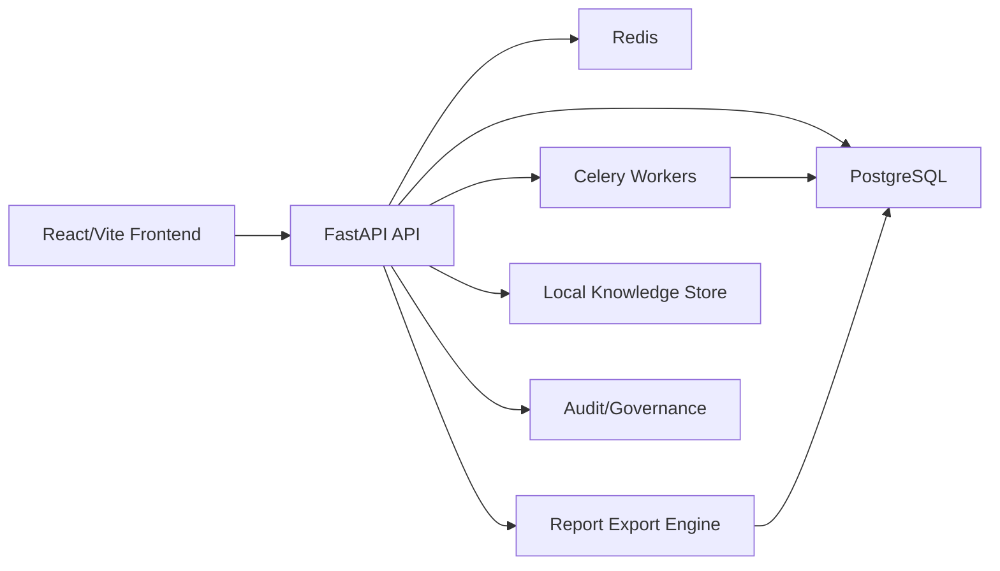

# RavenTech OSINT

## Phase 5AA monitoring controls

Monitoring Center includes safe policy tuning and maintenance windows for existing local, LAN, endpoint-agent, and vulnerability-baseline signals. Administrators manage thresholds, severity overrides, cooldowns, dedupe keys, daily caps, and audited suppression; analysts can review configuration under existing RBAC. Maintenance never deletes alerts or pauses collection.

This phase adds no hosting, deployment, DNS, or Supabase changes and no active scanning, exploitation, brute force, or intrusive vulnerability testing.

RavenTech OSINT is a defensive intelligence and investigation workspace for
authorized security assessments. It helps analysts collect passive evidence,
normalize findings, manage remediation workflows, review cases, and generate
stakeholder-ready reports without intrusive scanning or offensive automation.

Current release candidate: `5.0.0-rc6`. The validated runtime is local Docker
Compose; production and free-tier hosting remain deferred.

Phase 5AL adds an optional Tauri v2 desktop shell prototype in `desktop/`. It
wraps the unchanged local Vite frontend, reports fixed localhost health and
release status, and displays copy-only operator guidance. Browser mode remains
fully supported. See [DESKTOP_TAURI_PROTOTYPE.md](DESKTOP_TAURI_PROTOTYPE.md).
There is no signed or production desktop package yet.

Phase 5AM refines the shell for local operator QA with distinct reachability,
readiness, and degraded states; English/Spanish recovery guidance; seven
copy-only commands; and constrained local-frame navigation. It changes no
backend, frontend, Docker, database, hosting, or deployment architecture.

Phase 5AN adds an unsigned Windows portable local-test workflow. It creates no
installer and bundles no backend, PostgreSQL, Redis, Docker, `.env`, backups,
or reports. Generated output is ignored under `desktop/dist-portable/`.

Phase 5AO adds an unsigned NSIS installer workflow for local Windows testing.
It installs only the desktop shell, keeps the portable build available, and
bundles no backend, database, Docker runtime, secrets, backups, reports, or
logs. The ignored installer output is not a public release.

Phase 5AP aligns local distribution branding and adds read-only smoke validation
for portable and installer manifests, checksums, exclusions, local URLs, and
restricted permissions. See
[DESKTOP_LOCAL_DISTRIBUTION.md](DESKTOP_LOCAL_DISTRIBUTION.md).

Phase 5AQ adds a controlled desktop launcher for exactly five existing local
scripts. Start, stop, and restart require confirmation; check and open-frontend
remain explicit button actions. Installed builds that cannot locate repository
ancestry use the copy-only fallback. No arbitrary command, script path, or
command argument is accepted.

Phase 5AR adds a lightweight first-run screen and safe project-path binding. The
operator manually enters the repository root; Rust canonicalizes it and requires
the compose, Python, desktop, frontend, backend, and all five approved-script
markers plus exact build-pinned script contents before storing the path in the
current user's app-config directory.
Resolution uses the saved path first, then matching current-directory ancestry,
then development executable ancestry, and finally copy-only fallback. No folder
browser, filesystem plugin, arbitrary command argument, `.env` read, or automatic
install was added. The bilingual checklist reports Docker detection, ports
8000/5173, backend/frontend health, RC6 release match, and migrations.

Phase 5AU turns that status screen into a three-stage English/Spanish setup
wizard covering the project, prerequisites, and local services. It adds clearer
empty/invalid-path feedback, portable/installed guidance, copy-failure recovery,
and loopback-only Windows firewall guidance without installing or changing anything.

Phase 5AV completes the private operator handoff for RC6 without changing the
runtime. Start with [OPERATOR_MANUAL.md](OPERATOR_MANUAL.md), transfer and verify
artifacts with [DESKTOP_PRIVATE_HANDOFF.md](DESKTOP_PRIVATE_HANDOFF.md), and
record local Windows acceptance with
[DESKTOP_OPERATOR_ACCEPTANCE_CHECKLIST.md](DESKTOP_OPERATOR_ACCEPTANCE_CHECKLIST.md).

Phase 5AW locks the same RC6 private candidate after a clean-repository and
artifact-regeneration dry run. A new operator should begin with
[FRESH_SETUP_CHECKLIST.md](FRESH_SETUP_CHECKLIST.md); it connects clone,
configuration, Docker, migrations, frontend, authentication, synthetic demo,
desktop binding, artifact builds, and acceptance without adding a feature,
version, or tag.

Phase 5AX adds the receiving-machine checklist for private transfer QA and
manual recovery. Use
[EXTERNAL_MACHINE_TEST_CHECKLIST.md](EXTERNAL_MACHINE_TEST_CHECKLIST.md) to
verify prerequisites, package checksums, repository setup, portable/installed
behavior, and non-destructive recovery on a second Windows machine.

The Phase 5AX runtime correction packages the existing React production build
inside Tauri. Portable and installed builds render that embedded UI and do not
require Vite or port 5173. `http://localhost:5173/` remains an optional browser
and desktop-development endpoint; its health probe accepts any HTTP 2xx
`text/html` response. Docker and the backend on `http://localhost:8000` remain
required.

Phase 5AY automatically loads the authenticated local Monitoring Center summary
after backend readiness and safely refreshes it every 30 seconds by default.
Optional LAN discovery and TCP service checks remain separately disabled until
explicitly configured, and their disabled state is informational rather than a
platform failure.

Local mode requires development-only values from `.env.example`; it does not
require production secrets, hosted services, DNS, or Supabase.

## What Problem It Solves

Security teams often need a repeatable way to turn authorized external exposure
data into evidence-backed findings, remediation tasks, audit trails, and reports.
RavenTech OSINT packages that workflow into one local-first platform:

- define authorized investigation scope
- add domains, URLs, and IPs
- run passive recon and enrichment
- generate deterministic defensive findings
- correlate recurring evidence and IOCs internally
- manage review, remediation, approval, and closure
- export executive and technical reports
- preserve audit and governance context

## Key Features

- FastAPI backend with async SQLAlchemy, Alembic, PostgreSQL, Redis, and Celery
- React/Vite/TypeScript frontend with a RavenTech dark analyst workspace
- English/Spanish UI with persisted language preference and English fallback
- JWT authentication, RBAC, investigation membership, and admin controls
- Config-gated user registration, approval workflow, and admin user governance
- Engagement records with client metadata, authorization status, approved scope,
  and advisory out-of-scope target warnings
- Case closure workflow with final review checklist, deliverable tracking,
  evidence package manifest, and residual-risk handoff summary
- Internal Notification Center and Activity Inbox for approvals, assignments,
  closure blockers, scope warnings, report readiness, and governance alerts
- Internal global search, private saved views, pinned view shortcuts, and
  quick-access navigation for analyst productivity
- Passive recon for DNS, RDAP, certificates, HTTP/TLS metadata, ASN/IP metadata
- Deterministic findings, risk, readiness, executive posture, and prioritization
- Evidence intelligence, IOC correlation, and threat intelligence workspace
- Playbooks, remediation workflow, case review, report approval, and audit trail
- HTML, Markdown, PDF, and DOCX report exports
- Optional AI analysis with deterministic fallback when the provider is unavailable
- Operations Center with health, diagnostics, backups, restore dry-run validation
- Local Monitoring Center with service telemetry, RBAC-aware investigation
  watch, disabled-by-default authorized LAN inventory, endpoint telemetry,
  deduplicated internal alerts, and an optional manual host agent
- Deterministic vulnerability baseline with asset criticality, non-intrusive
  risk indicators, remediation ownership, due dates, and status tracking
- Endpoint Security Posture with agent-aware firewall, antivirus, patch, reboot,
  resource, coverage, and service risk indicators plus manual remediation guidance
- Responsive route-level loading, friendly retry states, guarded internal links,
  and defensive formatting for partial API responses
- Release candidate metadata endpoint and synthetic defensive demo dataset tooling

## Defensive-Only Scope

RavenTech OSINT is intentionally defensive. It does not implement generalized
active or vulnerability scanning, Nmap, exploitation, payload generation,
malware handling, autonomous agents, internet-wide crawling, or offensive
tradecraft. Optional LAN monitoring is limited to explicitly authorized private
ranges and separately enabled ICMP/TCP connectivity observations. Demo data is
synthetic and uses reserved identifiers.

The vulnerability baseline evaluates stored local observations only. It does
not perform vulnerability scanning or exploit validation. See
[VULNERABILITY_BASELINE.md](VULNERABILITY_BASELINE.md).

## Architecture Overview



The backend owns authorization, persistence, report generation, workflow logic,
and deterministic intelligence services. The frontend consumes existing API
contracts and presents analyst, executive, governance, and operations views.

## Tech Stack

- Backend: FastAPI, SQLAlchemy async, Pydantic v2, Alembic
- Storage: PostgreSQL, Redis, local Chroma/knowledge metadata foundation
- Workers: Celery foundation
- Frontend: React, Vite, TypeScript, Tailwind CSS, TanStack Query
- Reports: Jinja2 templates, Markdown, ReportLab/PDF, DOCX export support
- CI: ruff, mypy, pytest, pip check, alembic check, frontend build

## Local Setup

Backend services:

```powershell
docker compose up -d
docker compose logs backend -f
docker compose exec backend alembic upgrade head
curl http://localhost:8000/health
curl http://localhost:8000/health/ready
curl http://localhost:8000/api/v1/release
```

Frontend:

```powershell
cd frontend
npm ci
npm run dev
```

`npm run dev` must be run from the `frontend/` directory.

Optional desktop development shell, after the backend is running (Vite is an
optional development override):

```powershell
cd desktop
npm run check
npm run build
npm run tauri:check
npm run tauri:dev
```

This command builds the embedded React assets and runs the source prototype
through Cargo. It does not create an installer or start Docker automatically.

To build the Windows portable local-test folder after dependencies are already
available locally:

```powershell
cd desktop
npm run portable:build
```

The output is
`desktop/dist-portable/RavenTech-OSINT-Desktop-5.0.0-rc6/`. Read
[desktop/PORTABLE_BUILD_README.md](desktop/PORTABLE_BUILD_README.md) before
running the unsigned executable. Docker/backend services must still be started
manually; `npm run dev` is needed only for browser or desktop-development mode.

To build the unsigned current-user installer after local dependencies are
available:

```powershell
cd desktop
npm ci --offline
npm run installer:build
npm run installer:validate -- --require-artifact
```

Output is collected under
`desktop/dist-installer/RavenTech-OSINT-Desktop-5.0.0-rc6/`. Read
[desktop/INSTALLER_BUILD_README.md](desktop/INSTALLER_BUILD_README.md) and use
[DESKTOP_DISTRIBUTION_CHECKLIST.md](DESKTOP_DISTRIBUTION_CHECKLIST.md) for local
QA. The installer is unsigned, may trigger SmartScreen, never starts services
automatically, and must not be published.

After both local artifacts are built, validate the combined distribution:

```powershell
cd desktop
npm run smoke -- --require-artifacts
```

The desktop window is branded **RavenTech OSINT Desktop — Local Workspace**.
Phase 5AT adds an original repository-owned shield/radar icon for the local
candidate. Signing, public brand approval, auto-update, and public release remain deferred.

After portable and installer artifacts validate, create the ignored private
aggregate package from `desktop/` with:

```powershell
npm run local-release:package
npm run local-release:validate -- --require-artifact
```

The output is
`desktop/dist-local-release/RavenTech-OSINT-Desktop-5.0.0-rc6/` and contains
only the two binaries, local instructions, known limitations, checksums, and a
provenance manifest. See [desktop/LOCAL_RELEASE_README.md](desktop/LOCAL_RELEASE_README.md).

The desktop status screen also shows Docker dependency state and the latest
approved launcher result. Launcher output is capped and sanitized. Direct Vite
and Docker commands remain copy-only. After sign-in and backend readiness, the
embedded UI automatically loads the Monitoring Center summary and refreshes it
every 30 seconds by default; this read-only polling does not start Docker, LAN
discovery, TCP checks, or any other host service.

Desktop monitoring startup is controlled by
`DESKTOP_AUTO_MONITORING_ENABLED=true`,
`MONITORING_AUTO_REFRESH_ENABLED=true`, and
`MONITORING_AUTO_REFRESH_SECONDS=30`. Active LAN work remains separately opt-in:
`LAN_AUTO_DISCOVERY_ON_START=false` and
`LAN_AUTO_SERVICE_CHECK_ON_START=false` by default, with minimum scheduled
intervals of 300 and 600 seconds. When LAN monitoring is disabled, the UI reports
that monitoring is ready and discovery is disabled by configuration; it does not
degrade platform health. Installed and portable builds use embedded assets and
do not require Vite/port 5173. Docker and the backend on port 8000 remain required.

For a guided startup and health check:

```powershell
./scripts/local/start_local.ps1
./scripts/local/check_local_health.ps1
```

Public registration is disabled by default. To enable it in a local or staging
environment, review `PUBLIC_REGISTRATION_ENABLED`,
`REGISTRATION_REQUIRES_APPROVAL`, `REGISTRATION_INVITE_CODE`, and
`DEFAULT_REGISTERED_USER_ROLE` in `.env.example`. Public registration never
creates admin users; continue using the admin bootstrap workflow for platform
administrators.

Platform administrators can review registered users in Admin → Users, approve
pending accounts, reject registrations, disable or reactivate users, and change
safe platform roles. The backend prevents disabling or demoting the last active
administrator.

## Engagement Scope Governance

Engagements document client or organization context, authorization status,
approved scope items, and authorization evidence metadata. Investigations can
optionally link to an engagement. Linked cases surface scope review status in
the workspace, warn analysts when a target is not clearly in scope, and include
safe scope/authorization context in generated reports.

This is a lightweight governance layer, not multi-tenant SaaS, billing, hosting,
or a client portal. Unknown scope is treated conservatively as pending review.
No DNS lookup, active probing, crawling, or external enrichment is performed by
scope matching.

## Case Closure And Deliverables

Case Closure helps analysts prepare a defensible final handoff. Each
investigation can generate a deterministic closure checklist, record final risk,
track client-ready deliverables, and create an evidence package manifest. The
manifest references stored reports, findings, evidence summaries, scope status,
and warnings; it does not create external storage or a client portal.

Closure is analyst-driven. Required blockers prevent normal closure unless an
owner or administrator records an override reason. Closure, deliverable, and
package actions are audit logged and included in generated reports.

## Notification Center

The Activity Inbox surfaces internal workflow alerts for pending user approvals,
assigned work, report approvals, case closure review, deliverable readiness,
scope warnings, and governance reminders. Notifications are stored in the
application database, scoped to authorized users, and audit logged when created,
read, dismissed, or rebuilt.

No email, SMS, browser push, Slack, Discord, Teams, or third-party delivery is
included in this release candidate.

## Global Search And Saved Views

Global Search helps authenticated analysts find accessible investigations,
engagements, findings, reports, deliverables, notifications, scope records,
closure data, IOCs, and threat intelligence objects. Search is internal-only,
RBAC-aware, and backed by existing PostgreSQL data. It does not crawl the web,
query external search providers, or perform enrichment.

Saved Views let analysts preserve frequently used filters for investigations,
findings, reports, notifications, and engagements. Views are user-specific by
default, can be pinned for Quick Access, and never store credentials, tokens,
API keys, invite codes, or database URLs.

## Data Quality And Safe Maintenance

The admin-only Data Quality Center runs bounded, deterministic consistency
checks across investigations, engagements, findings, reports, closures,
notifications, saved views, users, demo records, and system configuration.
Issues retain severity and workflow status so administrators can acknowledge,
ignore, or resolve them with an audit trail.

Scans recommend manual corrections. They never delete user data, change roles,
close cases, alter scope authorization, or rewrite evidence. The optional stale
notification action only soft-archives old read or dismissed notifications.

## Validation Commands

```powershell
docker compose run --rm backend python -m ruff check app workers tests
docker compose run --rm backend python -m mypy app workers
docker compose run --rm backend python -m pytest tests/ -q
docker compose run --rm backend python -m pip check
docker compose exec backend alembic check

cd frontend
npm run build
```

## Demo Data

Demo mode is disabled by default for production-safe behavior. When enabled by an
admin feature flag, seed synthetic defensive data:

```powershell
docker compose exec backend python -m scripts.seed_demo_data
./scripts/local/reset_demo.ps1 -Confirmation RESET-DEMO
```

The same workflow is available to admins through:

- `POST /api/v1/admin/demo/seed`
- `DELETE /api/v1/admin/demo/clear`

The seeded case is labeled `[DEMO]`, uses reserved identifiers, performs no live
requests, and makes no compromise claims. Reset creates a local database safety
backup by default and targets fixed synthetic records only. Demo presentation
is not shown in normal navigation; administrator-only **QA Tools** retain the
optional seed/reset workflow.

## Local Operations

The repeatable local operator workflow is available through Windows-friendly
launcher scripts. They use Docker Compose, apply migrations without deleting
data, and check health, readiness, and release metadata without printing
secrets:

```powershell
./scripts/local/start_platform.ps1 -OpenFrontend
./scripts/local/check_platform.ps1
./scripts/local/restart_platform.ps1 -OpenFrontend
./scripts/local/stop_platform.ps1
./scripts/local/open_platform.ps1 -Target frontend
```

After signing in, **Operations → Local Operator Console** shows the same
read-only status, local URLs, LAN flags, agent coverage, and copy-ready
commands. The browser never executes host commands. See
`LOCAL_DEMO_BUNDLE.md` for seed/reset, backup/restore, and agent steps.

Create a timestamped PostgreSQL backup without copying `.env` or secrets:

```powershell
./scripts/local/backup_db.ps1
./scripts/local/backup_db.ps1 -IncludeReports
```

Restore validation is non-destructive by default: the restore tool refuses the
live `raventech` database and creates a new database name.

```powershell
./scripts/local/restore_db.ps1 -BackupPath ./backups/local/raventech-<timestamp>.dump
```

See [LOCAL_BACKUP_RESTORE.md](LOCAL_BACKUP_RESTORE.md) for safeguards and
[LOCAL_HEALTH_REPAIR.md](LOCAL_HEALTH_REPAIR.md) for practical recovery steps.

For local service telemetry and investigation watch status, open **Monitoring**
after signing in. See [LOCAL_MONITORING.md](LOCAL_MONITORING.md) for endpoint,
RBAC, polling, alert-deduplication, and optional Windows host-agent details.
Authorized private-LAN monitoring is disabled by default; its bounded setup and
security boundary are documented in [LAN_MONITORING.md](LAN_MONITORING.md).

## Demo Flow

Start with [LOCAL_DEMO_BUNDLE.md](LOCAL_DEMO_BUNDLE.md) for the complete local
setup, seed/reset, health, report, validation, screenshot, and artifact workflow.

See [PORTFOLIO_DEMO_FLOW.md](PORTFOLIO_DEMO_FLOW.md) for a 10-minute portfolio
presentation script and [SCREENSHOTS_CHECKLIST.md](SCREENSHOTS_CHECKLIST.md) for
recommended screenshots.

The complete presentation handoff is in
[PORTFOLIO_PACKAGE.md](PORTFOLIO_PACKAGE.md), and the frozen platform boundary is
recorded in [FINAL_PLATFORM_FREEZE.md](FINAL_PLATFORM_FREEZE.md).

For the current desktop-local release freeze, see [RELEASE_NOTES_RC6.md](RELEASE_NOTES_RC6.md),
[DESKTOP_LOCAL_ACCEPTANCE.md](DESKTOP_LOCAL_ACCEPTANCE.md), and
[FINAL_QA_CHECKLIST.md](FINAL_QA_CHECKLIST.md). RC4 and earlier notes remain
available as historical release context.

The final private RC6 operator materials are
[OPERATOR_MANUAL.md](OPERATOR_MANUAL.md),
[DESKTOP_PRIVATE_HANDOFF.md](DESKTOP_PRIVATE_HANDOFF.md), and
[DESKTOP_OPERATOR_ACCEPTANCE_CHECKLIST.md](DESKTOP_OPERATOR_ACCEPTANCE_CHECKLIST.md).
They describe local use and QA only; they are not public-release approval.
For a clean checkout, follow [FRESH_SETUP_CHECKLIST.md](FRESH_SETUP_CHECKLIST.md)
in order before using the operator acceptance checklist.
For a separately transferred Windows host, continue with
[EXTERNAL_MACHINE_TEST_CHECKLIST.md](EXTERNAL_MACHINE_TEST_CHECKLIST.md).

The reviewed GitHub release copy is in
[GITHUB_RELEASE_DRAFT.md](GITHUB_RELEASE_DRAFT.md). It is documentation only; no
GitHub release or hosted environment is created by the repository.

For production-style readiness, Supabase PostgreSQL guidance, domain/CORS
planning, and registration controls, see
[DEPLOYMENT_PREFLIGHT.md](DEPLOYMENT_PREFLIGHT.md).

Provider comparisons for a future, separately authorized phase are documented
in [FREE_TIER_HOSTING_OPTIONS.md](FREE_TIER_HOSTING_OPTIONS.md). These are
planning notes only; no hosting, DNS, or database migration has been performed.

## Screenshot Placeholders

Recommended portfolio screenshots:

- Login and health indicator
- Dashboard and executive posture
- Investigation overview and passive recon evidence
- Findings, correlations, IOC intelligence, and threat intelligence
- AI fallback with citations
- Reports and export actions
- Activity Inbox, review board, governance settings, audit log, and operations
  center
- Global Search, saved views, and dashboard Quick Access
- Admin Data Quality Center with non-destructive maintenance recommendations

## Known Limitations

- Passive OSINT recon only; optional LAN monitoring is bounded connectivity
  observation, never vulnerability scanning or exploitation
- AI is optional and degrades to deterministic fallback when unavailable
- Current tested operation is local Docker Compose; production/free-tier hosting
  and the Supabase production database migration are deferred
- No cloud deployment implementation, billing, SSO, or external ticketing
- Internal notifications only; no email, SMS, push, or chat integrations
- Internal search only; no external search provider, crawling, or internet-wide
  discovery
- Engagement governance is metadata and advisory by default; operators must
  still validate written authorization and scope policy
- No external paid threat feed requirement
- Demo data is synthetic and should not be interpreted as real compromise data
- Data quality checks are bounded heuristics; administrators must review every
  recommendation before correcting source records

See [KNOWN_LIMITATIONS.md](KNOWN_LIMITATIONS.md) for the full list.

## Roadmap

The current release identity is the `5.0.0-rc6` desktop-local candidate. Web,
local Docker, portable, unsigned installer, setup wizard, first-run binding, and
controlled launcher checks are covered by the RC6 acceptance gate. The
`v5.0.0-rc6` tag identifies this validated local candidate only; signing, public distribution,
production packaging, hosting, DNS, and Supabase work remain deferred.

## Phase 5AB monitoring reliability

Monitoring now distinguishes required platform dependency health from optional
host-agent telemetry, retires recovered local alerts, and presents provider
timeouts/HTTP/parse failures as clean warnings while retaining valid recon
entities. The Monitoring Center includes bounded open-port observations,
service confidence, and standard/non-standard SSH indicators.

Authorized port discovery remains off by default. When explicitly enabled by
an administrator, it performs rate-limited TCP connects only to configured
ports on approved private LAN assets. It never authenticates, tests
credentials, brute forces, sends exploit payloads, or scans public networks.
Docker LAN limitations are informational and can be supplemented with the
optional endpoint agent or static/router observations. This work is included
in the `5.0.0-rc4` freeze and changed no hosting, deployment, DNS, or Supabase
configuration.

## Phase 5AC LAN monitoring history

The Monitoring Center now includes a filterable **Change Timeline** and
per-asset service, telemetry, and change history. Meaningful local transitions
include asset availability, identity observations, port/service state, SSH on
approved non-standard ports, endpoint-agent reporting, resource-policy
thresholds, and baseline indicator lifecycle. Entries are acknowledgeable but
never deleted by acknowledgement.

History is derived only from configured local observations and authorized TCP
checks. It stores no raw sensitive banners or credentials and introduces no
public scanning, exploitation, brute force, hosting, deployment, DNS, or
Supabase work. These capabilities are included in the `5.0.0-rc4` freeze.

## Phase 5AD alert triage

Monitoring alerts now have a lightweight, user-scoped incident queue with
new, triaged, investigating, muted, resolved, and false-positive states. It
supports ownership, safe notes, resolution summaries, filters, related-record
links, and audited actions while preserving Activity Inbox notifications and
dedupe behavior. Cooldowns, suppressions, and maintenance windows still apply.

The Activity Inbox is now a viewport overlay with bounded scrolling,
responsive placement, outside-click dismissal, and Escape handling. This phase
adds no public scanning, exploitation, brute force, credential testing,
hosting, deployment, DNS, or Supabase changes. These capabilities are included
in the `5.0.0-rc4` freeze.

## Phase 5AE endpoint coverage

The Endpoint Agents view now provides hashed, one-time-reveal enrollment
credentials; agent inventory and freshness; simple asset groups; group coverage
summaries; and expected/allowed service baselines. Manual Windows PowerShell
and Linux Python helpers collect only basic resource, uptime, and OS telemetry.
There is no remote shell, command execution, persistence, or autostart.

Baseline results are defensive risk indicators derived from stored authorized
observations. Phase 5AE adds no public scanning, exploitation, brute force,
credential testing, hosting, deployment, DNS, or Supabase changes. These
capabilities are included in the `5.0.0-rc4` freeze.

## Phase 5AF monitoring activation

The Monitoring Center now includes a read-only local activation guide for LAN
monitoring and authorized TCP service checks, plus a safe Windows/Linux agent
command builder. Target cards show whether they exactly match an authorized
private LAN asset and display port observations separately from URL recon
service entities. Partial recon enrichment now groups provider warnings and
keeps stored results prominent with safe retry guidance.

Activation requires an explicit local `.env` edit and Docker restart. No public
scanning, DNS expansion, exploitation, brute force, credential collection,
remote commands, hosting, deployment, or Supabase changes were added. These
capabilities are included in the `5.0.0-rc4` freeze.

## RC4 bilingual local acceptance freeze

The local web application is feature-frozen at `5.0.0-rc4`. Phase 5AG completed
cross-workflow QA for monitoring, target/recon, reports, notifications, search,
data quality, and governance. Phase 5AH changes release identity and acceptance
documentation only, except for regression fixes required by the validation gate.

Phase 5AJ adds English/Spanish UI and report localization with a browser-local
preference and English fallback. See
[FINAL_LOCAL_ACCEPTANCE.md](FINAL_LOCAL_ACCEPTANCE.md) for the manual acceptance
flow and [RELEASE_NOTES_RC4.md](RELEASE_NOTES_RC4.md) for the release summary.
Desktop packaging, installers, hosting, deployment, DNS, and Supabase migration
remain explicitly deferred.

## Phase 5AI endpoint security posture

Monitoring now includes an administrator-restricted **Security Posture** tab.
Explicit assessments correlate stored authorized LAN observations with optional
agent telemetry, calculate an advisory posture score, and create deduplicated
manual recommendations for protection gaps, patch awareness, stale coverage,
resource pressure, risky services, and service-baseline differences.

Windows and Linux helpers collect only normalized local system status and port
numbers when safely available. They do not collect files, passwords, browser
history, private documents, keystrokes, or credentials and provide no remote
shell or command channel. Block/isolation guidance is a manual checklist only;
the platform never connects to or changes a router. See
[ENDPOINT_SECURITY_POSTURE.md](ENDPOINT_SECURITY_POSTURE.md).

Matching assessed assets can contribute an optional advisory posture summary to
investigation reports without exposing unrelated LAN inventory. This phase adds
no desktop packaging, hosting, deployment, DNS, Supabase migration, public
scanning, exploitation, brute force, credential testing, or router automation.

## Phase 5AZ authorized LAN bootstrap

Monitoring → Activation includes a bilingual, administrator-only **Authorized
LAN Bootstrap**. Entering `192.168.50.1/24` is normalized to the network boundary
`192.168.50.0/24`; the host address is retained as gateway hint `192.168.50.1`.
**Verify LAN setup** refreshes stored summaries without running discovery or TCP
checks. It supplies copy-only `.env` guidance, one-time endpoint enrollment
instructions, and a manual router/static observation form. Docker/backend remain
required; installed and portable clients continue to use embedded assets.

### Phase 5BA host metric precedence

The desktop Monitoring Center now prefers read-only native Windows host metrics,
then a fresh manual `ServerHost` agent, then a backend-host agent, and finally a
clearly labeled **Docker container fallback**. Container CPU, memory, disk, and
uptime are not presented as full host visibility. Run the main-host helper with
`.\scripts\local\local_monitor_agent.ps1 -Mode ServerHost -BackendUrl http://localhost:8000 -IntervalSeconds 30`.
Other authorized PCs use `-Mode LanEndpoint -BackendUrl http://192.168.50.201:8000 -IntervalSeconds 30` only after confirming that private server address.
Agents are manual and non-persistent; no autostart, remote commands, or public scanning is installed.

### Phase 5BB real-LAN acceptance

Monitoring Center now presents one operator-readable RC6 acceptance summary for
`192.168.50.0/24`: gateway hint, enablement flags, latest discovery/service-check
times, next refresh, asset/import counts, agent coverage, host-metric source, and
posture/recommendation counts. Disabled optional LAN features are informational.
Use manual router/static import when Docker cannot see host neighbors, and run
TCP-connect checks only for authorized assets after explicit configuration.
