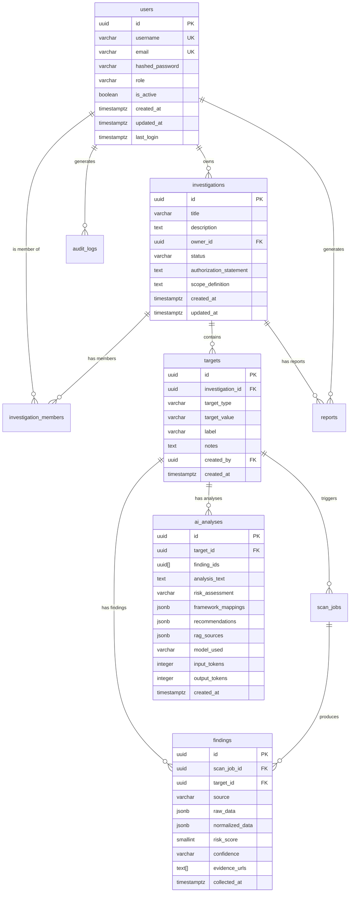

# RavenTech OSINT Platform — Database Schema

> **Version:** 1.0
> **Database:** PostgreSQL 16
> **ORM:** SQLAlchemy 2.0 (async)
> **Migrations:** Alembic

---

## Entity Relationship Diagram



---

## Full SQL Schema

```sql
-- ============================================================
-- EXTENSIONS
-- ============================================================
CREATE EXTENSION IF NOT EXISTS "pgcrypto";   -- gen_random_uuid()
CREATE EXTENSION IF NOT EXISTS "pg_trgm";    -- fuzzy text search on target values

-- ============================================================
-- USERS
-- Role: 'admin' | 'analyst'
-- ============================================================
CREATE TABLE users (
    id               UUID         PRIMARY KEY DEFAULT gen_random_uuid(),
    username         VARCHAR(50)  UNIQUE NOT NULL,
    email            VARCHAR(255) UNIQUE NOT NULL,
    hashed_password  VARCHAR(255) NOT NULL,
    role             VARCHAR(20)  NOT NULL DEFAULT 'analyst'
                                  CHECK (role IN ('admin', 'analyst')),
    is_active        BOOLEAN      NOT NULL DEFAULT TRUE,
    created_at       TIMESTAMPTZ  NOT NULL DEFAULT NOW(),
    updated_at       TIMESTAMPTZ  NOT NULL DEFAULT NOW(),
    last_login       TIMESTAMPTZ
);

-- ============================================================
-- INVESTIGATIONS (cases)
-- Authorization statement is REQUIRED — cannot be null or empty.
-- This enforces the ethical requirement to document legal basis.
-- Status lifecycle: draft → active → completed → archived
-- ============================================================
CREATE TABLE investigations (
    id                      UUID         PRIMARY KEY DEFAULT gen_random_uuid(),
    title                   VARCHAR(255) NOT NULL,
    description             TEXT,
    owner_id                UUID         NOT NULL REFERENCES users(id) ON DELETE RESTRICT,
    status                  VARCHAR(20)  NOT NULL DEFAULT 'active'
                                          CHECK (status IN ('draft', 'active', 'completed', 'archived')),
    authorization_statement TEXT         NOT NULL CHECK (length(trim(authorization_statement)) >= 100),
    scope_definition        TEXT,        -- What is explicitly in scope vs. out of scope
    created_at              TIMESTAMPTZ  NOT NULL DEFAULT NOW(),
    updated_at              TIMESTAMPTZ  NOT NULL DEFAULT NOW()
);

-- ============================================================
-- INVESTIGATION MEMBERS (shared team access)
-- Roles within investigation: 'owner' | 'collaborator'
-- owner: created the investigation, can manage members, archive
-- collaborator: can add targets, run scans, view all findings
-- (v1.1 will add 'viewer' read-only role if needed)
-- ============================================================
CREATE TABLE investigation_members (
    investigation_id  UUID        NOT NULL REFERENCES investigations(id) ON DELETE CASCADE,
    user_id           UUID        NOT NULL REFERENCES users(id) ON DELETE CASCADE,
    role              VARCHAR(20) NOT NULL DEFAULT 'collaborator'
                                   CHECK (role IN ('owner', 'collaborator')),
    added_at          TIMESTAMPTZ NOT NULL DEFAULT NOW(),
    PRIMARY KEY (investigation_id, user_id)
);

-- ============================================================
-- TARGETS
-- What we are investigating.
-- target_type: 'domain' | 'ip' | 'email' | 'username' | 'org' | 'url'
-- ============================================================
CREATE TABLE targets (
    id               UUID         PRIMARY KEY DEFAULT gen_random_uuid(),
    investigation_id UUID         NOT NULL REFERENCES investigations(id) ON DELETE CASCADE,
    target_type      VARCHAR(20)  NOT NULL
                                   CHECK (target_type IN ('domain', 'ip', 'email', 'username', 'org', 'url')),
    target_value     VARCHAR(500) NOT NULL,
    label            VARCHAR(255),   -- Human-readable label, e.g. "Main corporate domain"
    notes            TEXT,
    created_by       UUID         REFERENCES users(id) ON DELETE SET NULL,
    created_at       TIMESTAMPTZ  NOT NULL DEFAULT NOW(),
    UNIQUE (investigation_id, target_type, target_value)
);

-- ============================================================
-- SCAN JOBS
-- One job per scan request. Tracks which adapters ran.
-- status: 'queued' | 'running' | 'completed' | 'partial' | 'failed'
-- ============================================================
CREATE TABLE scan_jobs (
    id                  UUID         PRIMARY KEY DEFAULT gen_random_uuid(),
    target_id           UUID         NOT NULL REFERENCES targets(id) ON DELETE CASCADE,
    initiated_by        UUID         REFERENCES users(id) ON DELETE SET NULL,
    status              VARCHAR(20)  NOT NULL DEFAULT 'queued'
                                      CHECK (status IN ('queued', 'running', 'completed', 'partial', 'failed')),
    adapters_requested  JSONB,       -- ["shodan", "virustotal", "whois_rdap"]
    adapters_completed  JSONB,       -- ["whois_rdap", "virustotal"]  (shodan failed = partial)
    adapters_failed     JSONB,       -- {"shodan": "API rate limit exceeded"}
    celery_task_id      VARCHAR(255),
    started_at          TIMESTAMPTZ,
    completed_at        TIMESTAMPTZ,
    created_at          TIMESTAMPTZ  NOT NULL DEFAULT NOW()
);

-- ============================================================
-- FINDINGS
-- Raw + normalized data from one OSINT adapter for one target.
-- raw_data: exactly what the API returned (never modified)
-- normalized_data: standard schema (see ARCHITECTURE.md §5)
-- risk_score: 0 (clean) — 100 (critical risk)
-- confidence: 'low' | 'medium' | 'high'
-- ============================================================
CREATE TABLE findings (
    id               UUID         PRIMARY KEY DEFAULT gen_random_uuid(),
    scan_job_id      UUID         REFERENCES scan_jobs(id) ON DELETE CASCADE,
    target_id        UUID         NOT NULL REFERENCES targets(id) ON DELETE CASCADE,
    source           VARCHAR(50)  NOT NULL,  -- 'shodan' | 'virustotal' | 'whois_rdap' | etc.
    raw_data         JSONB        NOT NULL,
    normalized_data  JSONB        NOT NULL,
    risk_score       SMALLINT     NOT NULL DEFAULT 0
                                   CHECK (risk_score BETWEEN 0 AND 100),
    confidence       VARCHAR(10)  NOT NULL DEFAULT 'medium'
                                   CHECK (confidence IN ('low', 'medium', 'high')),
    evidence_urls    TEXT[]       DEFAULT '{}',
    collected_at     TIMESTAMPTZ  NOT NULL DEFAULT NOW()
);

-- ============================================================
-- AI ANALYSES
-- Claude analysis result for a set of findings on one target.
-- risk_assessment: 'none' | 'low' | 'medium' | 'high' | 'critical'
-- framework_mappings: {
--   "mitre": [{"id": "T1190", "name": "...", "relevance": "..."}],
--   "owasp":  [{"id": "A05:2025", "name": "...", "relevance": "..."}],
--   "nist":   [{"function": "ID.AM", "description": "..."}],
--   "iso":    [{"control": "8.8", "description": "..."}]
-- }
-- recommendations: [{"priority": "critical", "action": "...", "framework_ref": "T1190"}]
-- rag_sources: ["mitre-T1190", "owasp-A05:2025"]
-- ============================================================
CREATE TABLE ai_analyses (
    id                 UUID         PRIMARY KEY DEFAULT gen_random_uuid(),
    target_id          UUID         NOT NULL REFERENCES targets(id) ON DELETE CASCADE,
    finding_ids        UUID[]       NOT NULL DEFAULT '{}',
    analysis_text      TEXT         NOT NULL,
    risk_assessment    VARCHAR(20)  NOT NULL DEFAULT 'none'
                                     CHECK (risk_assessment IN ('none', 'low', 'medium', 'high', 'critical')),
    framework_mappings JSONB        NOT NULL DEFAULT '{}',
    recommendations    JSONB        NOT NULL DEFAULT '[]',
    rag_sources        JSONB        NOT NULL DEFAULT '[]',
    model_used         VARCHAR(100),
    input_tokens       INTEGER,
    output_tokens      INTEGER,
    created_at         TIMESTAMPTZ  NOT NULL DEFAULT NOW()
);

-- ============================================================
-- REPORTS
-- Generated report documents (PDF or HTML).
-- status: 'pending' | 'generating' | 'ready' | 'failed'
-- ============================================================
CREATE TABLE reports (
    id               UUID         PRIMARY KEY DEFAULT gen_random_uuid(),
    investigation_id UUID         NOT NULL REFERENCES investigations(id) ON DELETE CASCADE,
    generated_by     UUID         REFERENCES users(id) ON DELETE SET NULL,
    title            VARCHAR(255),
    report_format    VARCHAR(10)  NOT NULL DEFAULT 'pdf'
                                   CHECK (report_format IN ('pdf', 'html', 'json')),
    status           VARCHAR(20)  NOT NULL DEFAULT 'pending'
                                   CHECK (status IN ('pending', 'generating', 'ready', 'failed')),
    file_path        VARCHAR(500),   -- Relative path inside reports volume
    file_size_bytes  INTEGER,
    -- config JSONB removed from v1.0 — full report always generated. Add in v1.1.
    error_message    TEXT,
    created_at       TIMESTAMPTZ  NOT NULL DEFAULT NOW()
);

-- ============================================================
-- AUDIT LOGS (append-only)
-- NEVER UPDATE these rows. Write once, read many.
-- Uses BIGSERIAL (not UUID) for high-volume sequential writes.
-- Retained indefinitely (legal/compliance requirement).
-- ============================================================
CREATE TABLE audit_logs (
    id             BIGSERIAL    PRIMARY KEY,
    user_id        UUID         REFERENCES users(id) ON DELETE SET NULL,
    action         VARCHAR(100) NOT NULL,   -- 'auth.login' | 'investigation.created' | etc.
    resource_type  VARCHAR(50),             -- 'investigation' | 'target' | 'finding' | etc.
    resource_id    UUID,
    ip_address     INET,
    user_agent     TEXT,
    details        JSONB        DEFAULT '{}',
    timestamp      TIMESTAMPTZ  NOT NULL DEFAULT NOW()
);

-- ============================================================
-- API KEYS — DEFERRED TO v1.1
-- Full API key management system (scoped keys, rotation, revocation) is
-- not part of v1.0 MVP. Long-lived JWTs serve as programmatic access tokens.
-- Table definition preserved here for reference; do NOT create in v1.0 migration.
-- ============================================================
-- CREATE TABLE api_keys (
--     id           UUID         PRIMARY KEY DEFAULT gen_random_uuid(),
--     user_id      UUID         NOT NULL REFERENCES users(id) ON DELETE CASCADE,
--     name         VARCHAR(100) NOT NULL,
--     key_prefix   VARCHAR(8)   NOT NULL,
--     key_hash     VARCHAR(64)  NOT NULL,
--     scopes       TEXT[]       DEFAULT '{}',
--     is_active    BOOLEAN      NOT NULL DEFAULT TRUE,
--     expires_at   TIMESTAMPTZ,
--     last_used_at TIMESTAMPTZ,
--     created_at   TIMESTAMPTZ  NOT NULL DEFAULT NOW()
-- );

-- ============================================================
-- INDEXES
-- ============================================================

-- findings: most common query — "all findings for target X"
CREATE INDEX idx_findings_target_id     ON findings(target_id);
CREATE INDEX idx_findings_source        ON findings(source);
CREATE INDEX idx_findings_risk_score    ON findings(risk_score DESC);

-- scan_jobs: poll by status
CREATE INDEX idx_scan_jobs_target_id   ON scan_jobs(target_id);
CREATE INDEX idx_scan_jobs_status      ON scan_jobs(status);

-- ai_analyses: by target
CREATE INDEX idx_ai_analyses_target_id ON ai_analyses(target_id);

-- audit_logs: admin queries — by user, by action, by time
CREATE INDEX idx_audit_logs_timestamp  ON audit_logs(timestamp DESC);
CREATE INDEX idx_audit_logs_user_id    ON audit_logs(user_id);
CREATE INDEX idx_audit_logs_action     ON audit_logs(action);

-- targets: fuzzy search on target_value (e.g. find "example.com" across all investigations)
CREATE INDEX idx_targets_value_trgm    ON targets USING GIN (target_value gin_trgm_ops);
CREATE INDEX idx_targets_investigation ON targets(investigation_id);

-- investigations: by owner
CREATE INDEX idx_investigations_owner  ON investigations(owner_id);
CREATE INDEX idx_investigations_status ON investigations(status);

-- api_keys index: deferred to v1.1 with the table itself
-- CREATE INDEX idx_api_keys_key_hash ON api_keys(key_hash) WHERE is_active = TRUE;
```

---

## Audit Action Taxonomy

```
auth.login               auth.logout              auth.failed_login
auth.password_changed    auth.token_refreshed

user.created             user.updated             user.deleted
user.role_changed        user.deactivated

investigation.created    investigation.updated    investigation.deleted
investigation.archived   investigation.member_added  investigation.member_removed

target.added             target.removed

osint.scan_started       osint.scan_completed     osint.scan_failed
osint.scan_partial

finding.viewed           finding.flagged          finding.deleted

ai.analysis_requested    ai.analysis_completed    ai.analysis_failed

report.generated         report.downloaded        report.deleted

-- apikey.created / apikey.revoked: deferred to v1.1 with the api_keys table

admin.user_impersonated  admin.settings_changed
```

---

## Data Retention Policy

| Data type | Retention | Notes |
|-----------|-----------|-------|
| Audit logs | Permanent | Legal requirement — never delete |
| Findings (raw_data) | 90 days default | Configurable via admin settings |
| AI analyses | 90 days default | Same as findings |
| Reports (files) | Until explicitly deleted | User-controlled |
| Scan job records | 30 days | Summary retained, raw data follows finding policy |
| Refresh token records | 7 days (auto-expire) | Redis TTL handles expiry automatically — no scheduled task needed |
