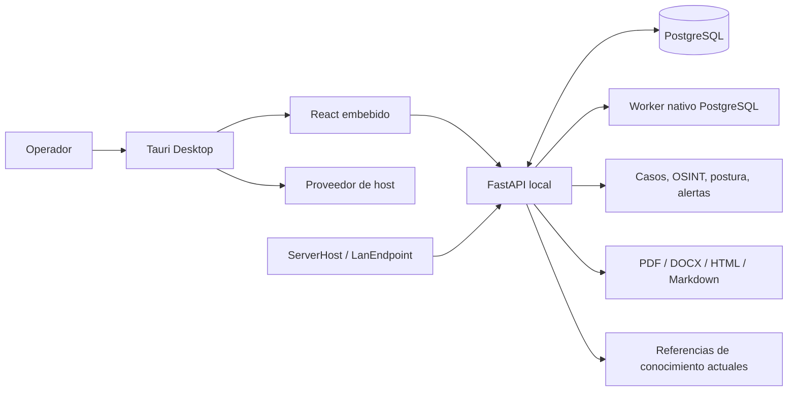

# Especificación de requisitos de software (SRS)
## RavenTech OSINT

- Identificador: RavenTech-OSINT-SRS-ES
- Versión del documento: 1.0
- Versión del producto: 5.0.0-rc6
- Estado: Especificación para candidato de lanzamiento
- Fecha: 2026-09-24
- Idioma: español

> Especificación basada en las capacidades actuales del candidato de producto. Los elementos futuros se identifican explícitamente como no implementados.

## Control de cambios
| Versión | Fecha | Cambio | Estado |
|---|---|---|---|
| 1.0 | 2026-09-24 | Actualización de requisitos verificables de descubrimiento LAN y visibilidad de activos | Candidato de lanzamiento |

## Contenido
- 1. Propósito y alcance
- 2. Convenciones, definiciones y prioridad
- 3. Contexto del producto
- 4. Arquitectura de alto nivel
- 5. Diagrama de arquitectura
- 6. Actores y clases de usuario
- 7. Entorno operativo y plataformas
- 8. Interfaces de usuario
- 9. Interfaces externas
- 10. Modelo de datos y retención
- 11. Requisitos funcionales
- 12. Autenticación y autorización
- 13. Investigaciones y gobernanza
- 14. Recon pasivo y fuentes
- 15. Evidencia, hallazgos, cronología y correlación
- 16. Informes
- 17. Monitoring Center y telemetría
- 18. LAN Assets y agentes
- 19. Salud y postura de seguridad
- 20. Alertas, notificaciones y ventanas
- 21. Operations Center y trabajos nativos
- 22. Runtime nativo y gestión de PostgreSQL
- 23. Auditoría, administración y respaldos
- 24. Conocimiento: capacidad actual y límites
- 25. Requisitos no funcionales
- 26. Seguridad, privacidad y límites de red
- 27. Disponibilidad, rendimiento y recuperación
- 28. Portabilidad, compatibilidad y despliegue
- 29. Aceptación del producto y estado de validación
- 30. Criterios de aceptación
- 31. Trazabilidad de requisitos
- 32. Límites conocidos y evolución
- 33. Glosario
- 34. Referencias y control documental

## 1. Propósito y alcance

Este documento especifica los requisitos verificables de RavenTech OSINT para la versión de producto 5.0.0-rc6. Describe el producto tal como existe y separa capacidades implementadas, capacidades parciales y capacidades futuras.
El sistema está destinado al análisis OSINT autorizado y a la supervisión defensiva local. El uso requiere autorización documentada, alcance definido y revisión humana de hallazgos y recomendaciones.
La especificación cubre cliente de escritorio Windows/Linux, frontend React embebido, backend FastAPI, PostgreSQL administrado o externo, worker PostgreSQL nativo, telemetría local/de endpoints, operaciones y exportaciones. No especifica hosting multi-tenant, SaaS, producto móvil ni ejecución ofensiva.

## 2. Convenciones, definiciones y prioridad

Cada requisito tiene identificador estable, plataforma, estado de implementación, método de verificación, área de prueba y criterio de aceptación. Implementado significa que existe comportamiento de producto; el criterio individual aún debe poder repetirse en la matriz de verificación.
Los términos deberá/debe expresan un requisito obligatorio; debería expresa recomendación de diseño; puede describe capacidad permitida. Alta, media y baja expresan prioridad del requisito, no riesgo de seguridad del activo.
Los estados funcionales son Implementado, Parcial, Planificado y Limitado por plataforma. Especificado identifica un requisito no funcional con criterio documentado cuya satisfacción se evalúa mediante su verificación. El estado de aceptación describe evidencia del producto y no certificación externa.

## 3. Contexto del producto

RavenTech OSINT es una aplicación local-first. La interfaz web embebida consume APIs autenticadas del backend. PostgreSQL conserva usuarios, casos, evidencia, telemetría, auditoría e información de trabajos. El worker nativo ejecuta handlers registrados desde código de aplicación.
El perfil de escritorio supervisa el runtime en el mismo equipo. PostgreSQL puede ser administrado y empaquetado o una instancia externa configurada. Docker, Redis y Celery se conservan para desarrollo/compatibilidad, no son prerrequisitos del modo escritorio nativo.
Integraciones externas OSINT, cuando están habilitadas, son proveedores de consulta con credenciales configuradas por el operador; los resultados son datos sujetos a validación, alcance y políticas del proveedor.

## 4. Arquitectura de alto nivel

Tauri es la carcasa nativa, supervisor y proveedor de telemetría del host. El frontend embebido presenta las vistas. FastAPI aplica autenticación, autorización, validación, reglas, persistencia, informes y APIs. PostgreSQL es la dependencia persistente requerida. El worker nativo toma trabajos mediante locking PostgreSQL y ejecuta únicamente handlers allowlist.
El gateway AI opcional conecta el backend con un servidor OpenCode loopback o proveedores locales soportados. El backend conserva preferencias y sesiones de mensajes visibles; las credenciales quedan en el proveedor. La consola analiza en modo chat con herramientas denegadas y contexto Knowledge explícitamente seleccionado.
El gateway AI opcional conecta el backend con un servidor OpenCode loopback o proveedores locales soportados. El backend conserva preferencias y sesiones de mensajes visibles; las credenciales quedan en el proveedor. La consola analiza en modo chat con herramientas denegadas y contexto Knowledge explícitamente seleccionado.
Los agentes ServerHost/LanEndpoint son fuentes de telemetría. No exponen ejecución remota. Observaciones LAN se restringen a segmentos privados autorizados y a checks acotados.

## 5. Diagrama de arquitectura

La figura representa límites de confianza e intercambios principales. La UI no ejecuta acciones del sistema operativo por sí misma; las llamadas administrativas locales pasan por controles de autorización/confirmación del backend o del supervisor nativo.



## 6. Actores y clases de usuario

Administrador: gestiona usuarios, configuración operativa y acciones administrativas locales autorizadas. Analista: trabaja investigaciones accesibles, evidencia, hallazgos, reportes y monitoreo permitido. Operador de host: usuario local que inicia/cierra el desktop y revisa salud. Agente: proceso de telemetría autenticado, no interactivo y sin canal de comandos.
Los permisos globales se separan de la membresía de investigación. La interfaz debe mostrar estados de acceso denegado sin revelar existencia o contenido que el usuario no esté autorizado a consultar.

## 7. Entorno operativo y plataformas

Windows: Tauri, artefactos nativos de backend/worker, PostgreSQL 16 administrado, métricas de host, inventario de procesos, SCM, sockets y vecinos. El instalador actual es unsigned y requiere WebView2 disponible en el sistema según el manifiesto.
Linux x86_64: Tauri, backend/worker nativos, PostgreSQL administrado y rutas XDG. El proveedor usa interfaces locales como /proc, /sys, netlink y systemd/D-Bus cuando está disponible. Debian 13 x86_64 en WSL2 validó el paquete Linux actual, el inicio del proceso Tauri empaquetado, PostgreSQL administrado, backend/worker, migraciones y flujos API autenticados. Tras un reinicio controlado de procesos de prueba, el mismo perfil XDG reutilizó el clúster; el marcador, la versión mayor de PostgreSQL, el esquema y cinco usuarios sintéticos persistieron. Esto no valida el cierre normal de la GUI ni es aceptación de instalación limpia; la inspección visual de GUI Linux tampoco se ejecutó.
La aceptación limpia Windows/Linux en VM independiente queda separada de las pruebas en host o WSL. Al corte documental, Windows clean-machine y Linux clean-machine no se ejecutaron; la inspección visual e interacción de Linux GUI tampoco.

## 8. Interfaces de usuario

Vistas principales: tablero, investigaciones, recon pasivo, hallazgos/evidencia, informes, Monitoring Center, LAN Assets, Endpoint Security Posture, Change Timeline, Notifications e Operations Center. El desktop aporta estado de runtime, primer inicio, diagnóstico y configuración local.
RavenTech AI es una consola opcional para seleccionar proveedor/modelo, revisar ubicación local/remota, previsualizar contexto Knowledge y chatear/cancelar. Copiar un prompt OpenCode no ejecuta una terminal ni una acción.
RavenTech AI es una consola opcional para seleccionar proveedor/modelo, revisar ubicación local/remota, previsualizar contexto Knowledge y chatear/cancelar. Copiar un prompt OpenCode no ejecuta una terminal ni una acción.
Los componentes operativos muestran texto y/o icono además del color. Los errores se presentan en lenguaje de usuario con un siguiente paso seguro y sin stack trace, secretos o comandos arbitrarios.

## 9. Interfaces externas

La API HTTP local enlaza al loopback según perfil. Proveedores de OSINT se comunican únicamente cuando el operador activa la función, configura el proveedor y existe base legal/alcance. No se presupone disponibilidad de proveedor ni se ocultan fallos parciales.
El runtime administrado usa binarios PostgreSQL empaquetados; el runtime externo respeta configuración explícita existente. La compatibilidad Docker conserva los nombres de servicio internos y las dependencias del perfil Docker.

## 10. Modelo de datos y retención

Las entidades de alto nivel incluyen usuario, investigación, membresía, objetivo, trabajo, hallazgo, evidencia, informe, notificación, telemetría, alerta, activo y evento de auditoría. Los identificadores y relaciones se almacenan en PostgreSQL; el esquema se administra mediante Alembic.
Las preferencias, sesiones y mensajes visibles de AI se relacionan con el usuario autenticado. La base guarda proveedor/modelo y contexto/citas explícitos, no secretos de proveedor ni razonamiento oculto. Los límites de sesiones y mensajes acotan retención operativa.
Las preferencias, sesiones y mensajes visibles de AI se relacionan con el usuario autenticado. La base guarda proveedor/modelo y contexto/citas explícitos, no secretos de proveedor ni razonamiento oculto. Los límites de sesiones y mensajes acotan retención operativa.
Los secretos de autenticación se almacenan como hashes o material protegido según el subsistema. Los archivos de informe y respaldos se tratan como datos del operador, no como recursos de paquete. La política de retención depende de configuración y operación disponible; el producto no debe prometer borrado automático no implementado.

## 11. Requisitos funcionales

Las subsecciones siguientes son requisitos verificables. Las funciones indicadas como parciales requieren configuración, permisos o ambiente compatible. Las funciones marcadas no implementadas no deben presentarse como activas en la UI o la documentación.

### FR-AUTH-001 — Inicio de sesión

Subsistema: Autenticación.

Requisito: El sistema deberá ofrecer o aplicar inicio de sesión. Criterio de aceptación: Credenciales válidas abren sesión y las inválidas se rechazan sin revelar secretos.

Plataforma: Windows/Linux. Estado: Implementado. Verificación: Prueba automatizada/API e inspección. Caso de prueba: AUTH-01.

### FR-AUTH-002 — Perfil autenticado

Subsistema: Autenticación.

Requisito: El sistema deberá ofrecer o aplicar perfil autenticado. Criterio de aceptación: El perfil devuelve el usuario activo y su rol sin exponer credenciales.

Plataforma: Windows/Linux. Estado: Implementado. Verificación: Prueba automatizada/API e inspección. Caso de prueba: AUTH-02.

### FR-AUTH-003 — Rotación de refresh

Subsistema: Autenticación.

Requisito: El sistema deberá ofrecer o aplicar rotación de refresh. Criterio de aceptación: La renovación rota el token y el token anterior deja de ser aceptado.

Plataforma: Windows/Linux. Estado: Implementado. Verificación: Prueba automatizada/API e inspección. Caso de prueba: AUTH-03.

### FR-AUTH-004 — Revocación de sesión

Subsistema: Autenticación.

Requisito: El sistema deberá ofrecer o aplicar revocación de sesión. Criterio de aceptación: Cerrar sesión invalida el refresh asociado y limpia la cookie según el contrato.

Plataforma: Windows/Linux. Estado: Implementado. Verificación: Prueba automatizada/API e inspección. Caso de prueba: AUTH-04.

### FR-AUTH-005 — Invalidación administrativa

Subsistema: Autenticación.

Requisito: El sistema deberá ofrecer o aplicar invalidación administrativa. Criterio de aceptación: Un usuario deshabilitado pierde acceso en solicitudes posteriores.

Plataforma: Windows/Linux. Estado: Implementado. Verificación: Prueba de integración. Caso de prueba: AUTH-05.

### FR-AUTH-006 — Limitación de intentos

Subsistema: Autenticación.

Requisito: El sistema deberá ofrecer o aplicar limitación de intentos. Criterio de aceptación: Los fallos se limitan y el estado nativo no exige Redis.

Plataforma: Windows/Linux. Estado: Implementado. Verificación: Prueba de integración y configuración. Caso de prueba: AUTH-06.

### FR-AUTH-007 — Política de registro

Subsistema: Autenticación.

Requisito: El sistema deberá ofrecer o aplicar política de registro. Criterio de aceptación: El registro público sigue la configuración y nunca concede rol administrador.

Plataforma: Windows/Linux. Estado: Implementado. Verificación: Prueba automatizada/API e inspección. Caso de prueba: AUTH-07.

### FR-RBAC-001 — Control por rol

Subsistema: Autorización.

Requisito: El sistema deberá ofrecer o aplicar control por rol. Criterio de aceptación: Cada ruta protegida permite solo los roles declarados.

Plataforma: Windows/Linux. Estado: Implementado. Verificación: Prueba automatizada/API e inspección. Caso de prueba: RBAC-01.

### FR-RBAC-002 — Membresía de caso

Subsistema: Autorización.

Requisito: El sistema deberá ofrecer o aplicar membresía de caso. Criterio de aceptación: Un analista no accede a casos sin membresía; el administrador sigue la política definida.

Plataforma: Windows/Linux. Estado: Implementado. Verificación: Prueba API. Caso de prueba: RBAC-02.

### FR-RBAC-003 — Gestión de usuarios

Subsistema: Administración.

Requisito: El sistema deberá ofrecer o aplicar gestión de usuarios. Criterio de aceptación: Solo administradores pueden listar y modificar usuarios.

Plataforma: Windows/Linux. Estado: Implementado. Verificación: Prueba automatizada/API e inspección. Caso de prueba: RBAC-03.

### FR-RBAC-004 — Protección del último administrador

Subsistema: Administración.

Requisito: El sistema deberá ofrecer o aplicar protección del último administrador. Criterio de aceptación: La plataforma rechaza deshabilitar o degradar al último administrador activo.

Plataforma: Windows/Linux. Estado: Implementado. Verificación: Prueba de integración. Caso de prueba: RBAC-04.

### FR-RBAC-005 — Rechazo de acceso insuficiente

Subsistema: Autorización.

Requisito: El sistema deberá ofrecer o aplicar rechazo de acceso insuficiente. Criterio de aceptación: La solicitud no autorizada recibe una respuesta 401/403 sin filtrar datos.

Plataforma: Windows/Linux. Estado: Implementado. Verificación: Prueba automatizada/API e inspección. Caso de prueba: RBAC-05.

### FR-CASE-001 — Crear investigación

Subsistema: Investigaciones.

Requisito: El sistema deberá ofrecer o aplicar crear investigación. Criterio de aceptación: Un usuario autorizado crea un caso con base de autorización y alcance documentados.

Plataforma: Windows/Linux. Estado: Implementado. Verificación: Prueba automatizada/API e inspección. Caso de prueba: CASE-01.

### FR-CASE-002 — Editar metadatos

Subsistema: Investigaciones.

Requisito: El sistema deberá ofrecer o aplicar editar metadatos. Criterio de aceptación: Solo miembros autorizados modifican los campos permitidos.

Plataforma: Windows/Linux. Estado: Implementado. Verificación: Prueba API. Caso de prueba: CASE-02.

### FR-CASE-003 — Estados del caso

Subsistema: Investigaciones.

Requisito: El sistema deberá ofrecer o aplicar estados del caso. Criterio de aceptación: El ciclo de revisión conserva estados y transiciones válidas.

Plataforma: Windows/Linux. Estado: Implementado. Verificación: Prueba de flujo. Caso de prueba: CASE-03.

### FR-CASE-004 — Compartir caso

Subsistema: Membresía.

Requisito: El sistema deberá ofrecer o aplicar compartir caso. Criterio de aceptación: El propietario administra colaboradores y la API aplica el rol interno.

Plataforma: Windows/Linux. Estado: Implementado. Verificación: Prueba automatizada/API e inspección. Caso de prueba: CASE-04.

### FR-CASE-005 — Notas y tareas

Subsistema: Gestión de casos.

Requisito: El sistema deberá ofrecer o aplicar notas y tareas. Criterio de aceptación: Notas y tareas quedan asociadas al caso y respetan autorización.

Plataforma: Windows/Linux. Estado: Implementado. Verificación: Prueba API. Caso de prueba: CASE-05.

### FR-CASE-006 — Advertencia de alcance

Subsistema: Gobernanza.

Requisito: El sistema deberá ofrecer o aplicar advertencia de alcance. Criterio de aceptación: Destinos sin alcance claro muestran aviso y no se presentan como autorizados.

Plataforma: Windows/Linux. Estado: Implementado. Verificación: Prueba de flujo. Caso de prueba: CASE-06.

### FR-CASE-007 — Cierre y entrega

Subsistema: Gobernanza.

Requisito: El sistema deberá ofrecer o aplicar cierre y entrega. Criterio de aceptación: El cierre conserva lista de revisión, entregables y riesgos residuales.

Plataforma: Windows/Linux. Estado: Implementado. Verificación: Prueba de flujo. Caso de prueba: CASE-07.

### FR-RECON-001 — Admitir entidades compatibles

Subsistema: Recon pasivo.

Requisito: El sistema deberá ofrecer o aplicar admitir entidades compatibles. Criterio de aceptación: Solo tipos admitidos y valores normalizados se guardan como objetivos.

Plataforma: Windows/Linux. Estado: Implementado. Verificación: Prueba de servicio/API. Caso de prueba: RECON-01.

### FR-RECON-002 — Consultar fuentes pasivas

Subsistema: Recon pasivo.

Requisito: El sistema deberá ofrecer o aplicar consultar fuentes pasivas. Criterio de aceptación: El flujo usa únicamente adaptadores pasivos habilitados y configurados.

Plataforma: Windows/Linux. Estado: Implementado. Verificación: Prueba con adaptadores simulados. Caso de prueba: RECON-02.

### FR-RECON-003 — Conservar resultados parciales

Subsistema: Recon pasivo.

Requisito: El sistema deberá ofrecer o aplicar conservar resultados parciales. Criterio de aceptación: Resultados válidos sobreviven; fallos de proveedor aparecen como advertencias.

Plataforma: Windows/Linux. Estado: Implementado. Verificación: Prueba con fallos parciales. Caso de prueba: RECON-03.

### FR-RECON-004 — Sanear errores de proveedor

Subsistema: Recon pasivo.

Requisito: El sistema deberá ofrecer o aplicar sanear errores de proveedor. Criterio de aceptación: Mensajes visibles no contienen claves, respuestas sensibles ni trazas internas.

Plataforma: Windows/Linux. Estado: Implementado. Verificación: Prueba de seguridad. Caso de prueba: RECON-04.

### FR-RECON-005 — Evitar expansión activa

Subsistema: Seguridad.

Requisito: El sistema deberá ofrecer o aplicar evitar expansión activa. Criterio de aceptación: El smoke autorizado no inicia barrido público, explotación ni enumeración de credenciales.

Plataforma: Windows/Linux. Estado: Implementado. Verificación: Inspección y prueba. Caso de prueba: RECON-05.

### FR-EVID-001 — Registrar evidencia

Subsistema: Evidencia.

Requisito: El sistema deberá ofrecer o aplicar registrar evidencia. Criterio de aceptación: La evidencia queda ligada al caso/objetivo con origen y fecha disponibles.

Plataforma: Windows/Linux. Estado: Implementado. Verificación: Prueba API. Caso de prueba: EVID-01.

### FR-EVID-002 — Normalizar hallazgos

Subsistema: Hallazgos.

Requisito: El sistema deberá ofrecer o aplicar normalizar hallazgos. Criterio de aceptación: Los hallazgos usan un esquema normalizado y preservan su procedencia.

Plataforma: Windows/Linux. Estado: Implementado. Verificación: Prueba de servicio. Caso de prueba: EVID-02.

### FR-EVID-003 — Marcar confianza

Subsistema: Hallazgos.

Requisito: El sistema deberá ofrecer o aplicar marcar confianza. Criterio de aceptación: La confianza se conserva como atributo explícito y no como certeza implícita.

Plataforma: Windows/Linux. Estado: Implementado. Verificación: Prueba de servicio. Caso de prueba: EVID-03.

### FR-EVID-004 — Vincular hallazgo con evidencia

Subsistema: Evidencia.

Requisito: El sistema deberá ofrecer o aplicar vincular hallazgo con evidencia. Criterio de aceptación: Un hallazgo mantiene referencias a sus observaciones de origen.

Plataforma: Windows/Linux. Estado: Implementado. Verificación: Prueba de base de datos. Caso de prueba: EVID-04.

### FR-EVID-005 — Limitar contenido sensible

Subsistema: Privacidad.

Requisito: El sistema deberá ofrecer o aplicar limitar contenido sensible. Criterio de aceptación: Tokens, contraseñas y argumentos secretos no se exponen en vistas ni reportes.

Plataforma: Windows/Linux. Estado: Implementado. Verificación: Inspección de salida. Caso de prueba: EVID-05.

### FR-TIME-001 — Registrar eventos de actividad

Subsistema: Línea de tiempo.

Requisito: El sistema deberá ofrecer o aplicar registrar eventos de actividad. Criterio de aceptación: Los eventos relevantes se muestran con marca temporal y entidad asociada.

Plataforma: Windows/Linux. Estado: Implementado. Verificación: Prueba API. Caso de prueba: TIME-01.

### FR-TIME-002 — Registrar cambios de servicio

Subsistema: Línea de tiempo.

Requisito: El sistema deberá ofrecer o aplicar registrar cambios de servicio. Criterio de aceptación: Cambios de servicio se deduplican y contienen estado anterior/nuevo.

Plataforma: Windows/Linux. Estado: Implementado. Verificación: Prueba con muestras. Caso de prueba: TIME-02.

### FR-TIME-003 — Registrar recuperación

Subsistema: Línea de tiempo.

Requisito: El sistema deberá ofrecer o aplicar registrar recuperación. Criterio de aceptación: La recuperación queda correlacionada con el evento previo cuando hay evidencia.

Plataforma: Windows/Linux. Estado: Implementado. Verificación: Prueba de flujo. Caso de prueba: TIME-03.

### FR-TIME-004 — Evitar spam de eventos

Subsistema: Línea de tiempo.

Requisito: El sistema deberá ofrecer o aplicar evitar spam de eventos. Criterio de aceptación: Muestras idénticas no producen eventos repetidos innecesarios.

Plataforma: Windows/Linux. Estado: Implementado. Verificación: Prueba determinista. Caso de prueba: TIME-04.

### FR-CORR-001 — Correlación interna

Subsistema: Correlación.

Requisito: El sistema deberá ofrecer o aplicar correlación interna. Criterio de aceptación: La correlación opera sobre evidencia almacenada y accesible al usuario.

Plataforma: Windows/Linux. Estado: Implementado. Verificación: Prueba de servicio. Caso de prueba: CORR-01.

### FR-CORR-002 — Deduplicar indicadores

Subsistema: Correlación.

Requisito: El sistema deberá ofrecer o aplicar deduplicar indicadores. Criterio de aceptación: Indicadores coincidentes se vinculan sin duplicar el registro fuente.

Plataforma: Windows/Linux. Estado: Implementado. Verificación: Prueba de servicio. Caso de prueba: CORR-02.

### FR-CORR-003 — Explicar vínculos

Subsistema: Correlación.

Requisito: El sistema deberá ofrecer o aplicar explicar vínculos. Criterio de aceptación: La interfaz conserva el indicador y la evidencia que soporta cada vínculo.

Plataforma: Windows/Linux. Estado: Implementado. Verificación: Prueba de contrato. Caso de prueba: CORR-03.

### FR-CORR-004 — Controlar alcance

Subsistema: Gobernanza.

Requisito: El sistema deberá ofrecer o aplicar controlar alcance. Criterio de aceptación: Solo se correlacionan datos visibles para la investigación autorizada.

Plataforma: Windows/Linux. Estado: Implementado. Verificación: Prueba de autorización. Caso de prueba: CORR-04.

### FR-RPT-001 — Crear informes

Subsistema: Informes.

Requisito: El sistema deberá ofrecer o aplicar crear informes. Criterio de aceptación: La solicitud genera un artefacto asociado a caso y solicitante.

Plataforma: Windows/Linux. Estado: Implementado. Verificación: Prueba de integración. Caso de prueba: RPT-01.

### FR-RPT-002 — Exportar PDF

Subsistema: Informes.

Requisito: El sistema deberá ofrecer o aplicar exportar pdf. Criterio de aceptación: El archivo PDF no está vacío, abre como PDF y contiene contexto RavenTech.

Plataforma: Windows/Linux. Estado: Implementado. Verificación: Estructura y MIME. Caso de prueba: RPT-02.

### FR-RPT-003 — Exportar DOCX

Subsistema: Informes.

Requisito: El sistema deberá ofrecer o aplicar exportar docx. Criterio de aceptación: El documento es un paquete DOCX válido y no contiene credenciales de prueba.

Plataforma: Windows/Linux. Estado: Implementado. Verificación: Prueba OOXML. Caso de prueba: RPT-03.

### FR-RPT-004 — Exportar HTML y Markdown

Subsistema: Informes.

Requisito: El sistema deberá ofrecer o aplicar exportar html y markdown. Criterio de aceptación: Los artefactos son no vacíos, legibles y codificados con el tipo esperado.

Plataforma: Windows/Linux. Estado: Implementado. Verificación: Prueba de contenido. Caso de prueba: RPT-04.

### FR-RPT-005 — Controlar descarga

Subsistema: Informes.

Requisito: El sistema deberá ofrecer o aplicar controlar descarga. Criterio de aceptación: Solo usuarios autorizados descargan informes de investigaciones accesibles.

Plataforma: Windows/Linux. Estado: Implementado. Verificación: Prueba RBAC/API. Caso de prueba: RPT-05.

### FR-RPT-006 — Presentar conclusiones ejecutivas

Subsistema: Informes.

Requisito: El sistema deberá ofrecer o aplicar presentar conclusiones ejecutivas. Criterio de aceptación: El informe distingue evidencia, confianza, observación y recomendación.

Plataforma: Windows/Linux. Estado: Implementado. Verificación: Revisión de contenido. Caso de prueba: RPT-06.

### FR-MON-001 — Métricas del host

Subsistema: Monitoreo.

Requisito: El sistema deberá ofrecer o aplicar métricas del host. Criterio de aceptación: CPU, memoria, discos, tiempo activo, SO y nombre del host se normalizan.

Plataforma: Windows/Linux. Estado: Implementado. Verificación: Prueba de proveedor/API. Caso de prueba: MON-01.

### FR-MON-002 — Refrescar resumen

Subsistema: Monitoreo.

Requisito: El sistema deberá ofrecer o aplicar refrescar resumen. Criterio de aceptación: El resumen se refresca con intervalos y cooldowns acotados.

Plataforma: Windows/Linux. Estado: Implementado. Verificación: Prueba de integración. Caso de prueba: MON-02.

### FR-MON-003 — Inventario de procesos

Subsistema: Monitoreo del host.

Requisito: El sistema deberá ofrecer o aplicar inventario de procesos. Criterio de aceptación: Se muestran PID, nombre, CPU/memoria y tiempos permitidos, sin argumentos.

Plataforma: Windows/Linux. Estado: Implementado. Verificación: Prueba de proveedor. Caso de prueba: MON-03.

### FR-MON-004 — Inventario de servicios

Subsistema: Monitoreo del host.

Requisito: El sistema deberá ofrecer o aplicar inventario de servicios. Criterio de aceptación: El inventario distingue estado y fuente del proveedor local.

Plataforma: Windows/Linux. Estado: Implementado. Verificación: Prueba de proveedor. Caso de prueba: MON-04.

### FR-MON-005 — Acciones locales protegidas

Subsistema: Administración local.

Requisito: El sistema deberá ofrecer o aplicar acciones locales protegidas. Criterio de aceptación: Acciones requieren rol/confirmación y rechazan proceso/servicio protegido.

Plataforma: Windows/Linux. Estado: Implementado. Verificación: Prueba simulada. Caso de prueba: MON-05.

### FR-MON-006 — Salud de servicios

Subsistema: Monitoreo.

Requisito: El sistema deberá ofrecer o aplicar salud de servicios. Criterio de aceptación: La severidad considera baseline, criticidad, exposición y frescura.

Plataforma: Windows/Linux. Estado: Implementado. Verificación: Reglas deterministas. Caso de prueba: MON-06.

### FR-MON-007 — Inventario de puertos locales

Subsistema: Monitoreo.

Requisito: El sistema deberá ofrecer o aplicar inventario de puertos locales. Criterio de aceptación: Los sockets de escucha se presentan sin ejecutar comandos remotos.

Plataforma: Windows/Linux. Estado: Implementado. Verificación: Prueba de proveedor. Caso de prueba: MON-07.

### FR-MON-008 — Origen y frescura

Subsistema: Monitoreo.

Requisito: El sistema deberá ofrecer o aplicar origen y frescura. Criterio de aceptación: Cada muestra incluye origen y tiempo, y la telemetría obsoleta se indica.

Plataforma: Windows/Linux. Estado: Implementado. Verificación: Prueba de contrato. Caso de prueba: MON-08.

### FR-LAN-001 — Limitar red autorizada

Subsistema: Monitoreo LAN.

Requisito: El sistema deberá ofrecer o aplicar limitar red autorizada. Criterio de aceptación: Solo rangos privados configurados y autorizados admiten observación.

Plataforma: Windows/Linux. Estado: Implementado. Verificación: Prueba de política. Caso de prueba: LAN-01.

### FR-LAN-002 — Registrar activos

Subsistema: Activos LAN.

Requisito: El sistema deberá ofrecer o aplicar registrar activos. Criterio de aceptación: Los activos conservan IP/MAC, disponibilidad y fecha de observación.

Plataforma: Windows/Linux. Estado: Implementado. Verificación: Prueba API. Caso de prueba: LAN-02.

### FR-LAN-003 — Observar servicios TCP

Subsistema: Monitoreo LAN.

Requisito: El sistema deberá ofrecer o aplicar observar servicios tcp. Criterio de aceptación: La comprobación es TCP-connect acotada y no autentica ni envía payloads.

Plataforma: Windows/Linux. Estado: Implementado. Verificación: Prueba acotada. Caso de prueba: LAN-03.

### FR-LAN-004 — Expresar estado del puerto

Subsistema: Monitoreo LAN.

Requisito: El sistema deberá ofrecer o aplicar expresar estado del puerto. Criterio de aceptación: Los estados open/closed/filtered/timeout/unknown conservan confianza.

Plataforma: Windows/Linux. Estado: Implementado. Verificación: Prueba de contrato. Caso de prueba: LAN-04.

### FR-LAN-005 — Interpretar baseline de servicio

Subsistema: Postura.

Requisito: El sistema deberá ofrecer o aplicar interpretar baseline de servicio. Criterio de aceptación: Un puerto abierto no se declara vulnerabilidad sin regla/evidencia.

Plataforma: Windows/Linux. Estado: Implementado. Verificación: Prueba de reglas. Caso de prueba: LAN-05.

### FR-LAN-006 — Clasificar sistema y tipo

Subsistema: Activos LAN.

Requisito: El sistema deberá ofrecer o aplicar clasificar sistema y tipo. Criterio de aceptación: La clasificación registra fuente, evidencia y confianza; se desconoce ante falta de evidencia.

Plataforma: Windows/Linux. Estado: Implementado. Verificación: Prueba de clasificación. Caso de prueba: LAN-06.

### FR-LAN-007 — Presentar cambios

Subsistema: Línea de tiempo.

Requisito: El sistema deberá ofrecer o aplicar presentar cambios. Criterio de aceptación: Aperturas/cierres/cambios se registran una vez por transición observada.

Plataforma: Windows/Linux. Estado: Implementado. Verificación: Prueba de deduplicación. Caso de prueba: LAN-07.

### FR-LAN-008 — Evitar control remoto

Subsistema: Seguridad.

Requisito: El sistema deberá ofrecer o aplicar evitar control remoto. Criterio de aceptación: No se ejecutan órdenes, detenciones ni cambios de servicios remotos.

Plataforma: Windows/Linux. Estado: Implementado. Verificación: Inspección y prueba. Caso de prueba: LAN-08.

### FR-LAN-009 — Observar interfaces, rutas y vecinos locales

Subsistema: Proveedor LAN nativo.

Requisito: El sistema deberá ofrecer o aplicar observar interfaces, rutas y vecinos locales. Criterio de aceptación: El escritorio obtiene interfaces, rutas y vecinos mediante proveedores locales de solo lectura y registra el host RavenTech sin exigir el agente manual.

Plataforma: Windows/Linux. Estado: Implementado. Verificación: Pruebas deterministas de proveedor y aceptación nativa. Caso de prueba: LAN-09.

### FR-LAN-010 — Descubrir activos agentless automáticamente

Subsistema: Inventario LAN.

Requisito: El sistema deberá ofrecer o aplicar descubrir activos agentless automáticamente. Criterio de aceptación: Los vecinos autorizados y las respuestas TCP acotadas crean o actualizan activos sin requerir un agente; los activos nuevos quedan pendientes de revisión.

Plataforma: Windows/Linux. Estado: Implementado. Verificación: Pruebas de integración y límites. Caso de prueba: LAN-10.

### FR-LAN-011 — Seleccionar redes según rutas autorizadas

Subsistema: Autorización LAN.

Requisito: El sistema deberá ofrecer o aplicar seleccionar redes según rutas autorizadas. Criterio de aceptación: Solo se observa la intersección alcanzable entre rutas activas y CIDR RFC1918 configurados; destinos públicos y rutas no autorizadas se rechazan.

Plataforma: Windows/Linux. Estado: Implementado. Verificación: Pruebas de intersección de ruta/CIDR. Caso de prueba: LAN-11.

### FR-LAN-012 — Acotar la detección activa

Subsistema: Seguridad de red.

Requisito: El sistema deberá ofrecer o aplicar acotar la detección activa. Criterio de aceptación: El descubrimiento usa como máximo 256 hosts y 32 puertos TCP configurados con concurrencia limitada; no ejecuta ICMP externo, autenticación ni comandos de protocolo.

Plataforma: Windows/Linux. Estado: Implementado. Verificación: Pruebas de límite de host, puerto y concurrencia. Caso de prueba: LAN-12.

### FR-LAN-013 — Programar descubrimiento y observación de servicios

Subsistema: Trabajos nativos.

Requisito: El sistema deberá ofrecer o aplicar programar descubrimiento y observación de servicios. Criterio de aceptación: El descubrimiento periódico respeta un mínimo de 300 segundos y la observación de servicios 600 segundos, sin duplicar ciclos solapados.

Plataforma: Windows/Linux. Estado: Implementado. Verificación: Pruebas de scheduler, deduplicación y cooldown. Caso de prueba: LAN-13.

### FR-LAN-014 — Deduplicar identidad y conservar decisiones manuales

Subsistema: Inventario LAN.

Requisito: El sistema deberá ofrecer o aplicar deduplicar identidad y conservar decisiones manuales. Criterio de aceptación: MAC estable correlaciona cambios de IP; conflictos de reutilización de IP se omiten y no reemplazan nombres, autorización, criticidad ni notas manuales.

Plataforma: Windows/Linux. Estado: Implementado. Verificación: Pruebas de identidad DHCP y preservación manual. Caso de prueba: LAN-14.

### FR-LAN-015 — Representar evidencia y frescura de activos

Subsistema: Inventario LAN.

Requisito: El sistema deberá ofrecer o aplicar representar evidencia y frescura de activos. Criterio de aceptación: La presencia fuerte o TCP reciente puede indicar online; ausencia de vecinos por sí sola no marca offline y la falta de evidencia permanece unknown.

Plataforma: Windows/Linux. Estado: Implementado. Verificación: Pruebas de estado y transición de línea de tiempo. Caso de prueba: LAN-15.

### FR-LAN-016 — Clasificar dispositivo con confianza explícita

Subsistema: Clasificación LAN.

Requisito: El sistema deberá ofrecer o aplicar clasificar dispositivo con confianza explícita. Criterio de aceptación: Tipo y sistema operativo conservan origen, evidencia y confianza; señales pasivas débiles permanecen desconocidas o de confianza baja/media.

Plataforma: Windows/Linux. Estado: Implementado. Verificación: Pruebas de clasificación agentless y metadatos. Caso de prueba: LAN-16.

### FR-LAN-017 — Informar medio físico solo con evidencia confiable

Subsistema: Identidad de red.

Requisito: El sistema deberá ofrecer o aplicar informar medio físico solo con evidencia confiable. Criterio de aceptación: Ethernet o Wi-Fi se asignan únicamente por evidencia directa del operador/router; en otro caso el medio se presenta como desconocido.

Plataforma: Windows/Linux. Estado: Implementado. Verificación: Pruebas de evidencia de medio de conexión. Caso de prueba: LAN-17.

### FR-LAN-018 — Explicar visibilidad limitada del escritorio nativo

Subsistema: Monitoreo LAN.

Requisito: El sistema deberá ofrecer o aplicar explicar visibilidad limitada del escritorio nativo. Criterio de aceptación: El escritorio identifica el proveedor nativo y muestra CIDR, estado de vecinos y horarios; guía de Docker/ServerHost manual aparece solo en perfiles de compatibilidad.

Plataforma: Windows/Linux. Estado: Implementado. Verificación: Prueba de interfaz nativa y compatibilidad. Caso de prueba: LAN-18.

### FR-AGENT-001 — Registrar ServerHost

Subsistema: Agentes.

Requisito: El sistema deberá ofrecer o aplicar registrar serverhost. Criterio de aceptación: El agente de host reporta telemetría dentro del ámbito local autorizado.

Plataforma: Windows/Linux. Estado: Implementado. Verificación: Prueba de integración. Caso de prueba: AGENT-01.

### FR-AGENT-002 — Registrar LanEndpoint

Subsistema: Agentes.

Requisito: El sistema deberá ofrecer o aplicar registrar lanendpoint. Criterio de aceptación: El endpoint informa telemetría; no recibe órdenes ejecutables.

Plataforma: Windows/Linux. Estado: Implementado. Verificación: Prueba de integración. Caso de prueba: AGENT-02.

### FR-AGENT-003 — Autenticar agente

Subsistema: Agentes.

Requisito: El sistema deberá ofrecer o aplicar autenticar agente. Criterio de aceptación: El enrolamiento/autenticación usa credenciales dedicadas y almacena solo material protegido.

Plataforma: Windows/Linux. Estado: Implementado. Verificación: Prueba de autenticación. Caso de prueba: AGENT-03.

### FR-AGENT-004 — Reportar metadatos de SO

Subsistema: Agentes.

Requisito: El sistema deberá ofrecer o aplicar reportar metadatos de so. Criterio de aceptación: Familia, nombre, versión evidenciada, arquitectura, host y modo se normalizan.

Plataforma: Windows/Linux. Estado: Implementado. Verificación: Prueba de contrato. Caso de prueba: AGENT-04.

### FR-AGENT-005 — Mostrar frescura del agente

Subsistema: Agentes.

Requisito: El sistema deberá ofrecer o aplicar mostrar frescura del agente. Criterio de aceptación: Estado stale/offline se basa en marca temporal y umbral configurado.

Plataforma: Windows/Linux. Estado: Implementado. Verificación: Prueba temporal. Caso de prueba: AGENT-05.

### FR-POST-001 — Recomendar controles

Subsistema: Postura.

Requisito: El sistema deberá ofrecer o aplicar recomendar controles. Criterio de aceptación: Las recomendaciones describen observación, relevancia, confianza y acción manual.

Plataforma: Windows/Linux. Estado: Implementado. Verificación: Prueba de reglas. Caso de prueba: POST-01.

### FR-POST-002 — Reglas por tipo de dispositivo

Subsistema: Postura.

Requisito: El sistema deberá ofrecer o aplicar reglas por tipo de dispositivo. Criterio de aceptación: Las recomendaciones distinguen escritorio/servidor/móvil/router/IoT.

Plataforma: Windows/Linux. Estado: Implementado. Verificación: Prueba de reglas. Caso de prueba: POST-02.

### FR-POST-003 — Baseline de vulnerabilidad

Subsistema: Postura.

Requisito: El sistema deberá ofrecer o aplicar baseline de vulnerabilidad. Criterio de aceptación: El baseline usa observaciones almacenadas; no ejecuta exploit validation.

Plataforma: Windows/Linux. Estado: Implementado. Verificación: Prueba de servicio. Caso de prueba: POST-03.

### FR-POST-004 — Estado explicable de exposición

Subsistema: Postura.

Requisito: El sistema deberá ofrecer o aplicar estado explicable de exposición. Criterio de aceptación: Cada warning/critical incluye una razón respaldada por datos.

Plataforma: Windows/Linux. Estado: Implementado. Verificación: Prueba de reglas. Caso de prueba: POST-04.

### FR-POST-005 — Mantener advisory

Subsistema: Seguridad.

Requisito: El sistema deberá ofrecer o aplicar mantener advisory. Criterio de aceptación: Inferencias no se expresan como vulnerabilidad o compromiso confirmado.

Plataforma: Windows/Linux. Estado: Implementado. Verificación: Revisión de contenido. Caso de prueba: POST-05.

### FR-ALERT-001 — Crear alertas relevantes

Subsistema: Alertas.

Requisito: El sistema deberá ofrecer o aplicar crear alertas relevantes. Criterio de aceptación: Solo reglas configuradas y observaciones relevantes generan alertas.

Plataforma: Windows/Linux. Estado: Implementado. Verificación: Prueba de flujo. Caso de prueba: ALERT-01.

### FR-ALERT-002 — Deduplicar y enfriar

Subsistema: Alertas.

Requisito: El sistema deberá ofrecer o aplicar deduplicar y enfriar. Criterio de aceptación: Dedupe/cooldown evita alertar en cada muestra normal.

Plataforma: Windows/Linux. Estado: Implementado. Verificación: Prueba determinista. Caso de prueba: ALERT-02.

### FR-ALERT-003 — Reconocer y silenciar

Subsistema: Alertas.

Requisito: El sistema deberá ofrecer o aplicar reconocer y silenciar. Criterio de aceptación: Reconocimiento, mute/supresión y ventana de mantenimiento se respetan.

Plataforma: Windows/Linux. Estado: Implementado. Verificación: Prueba de integración. Caso de prueba: ALERT-03.

### FR-ALERT-004 — Generar notificación

Subsistema: Notificaciones.

Requisito: El sistema deberá ofrecer o aplicar generar notificación. Criterio de aceptación: La notificación conserva tipo, destinatario interno y vínculo de triage.

Plataforma: Windows/Linux. Estado: Implementado. Verificación: Prueba API. Caso de prueba: ALERT-04.

### FR-ALERT-005 — Separar recomendación de alarma

Subsistema: Postura.

Requisito: El sistema deberá ofrecer o aplicar separar recomendación de alarma. Criterio de aceptación: Un puerto abierto esperado no emite alerta por defecto.

Plataforma: Windows/Linux. Estado: Implementado. Verificación: Prueba de reglas. Caso de prueba: ALERT-05.

### FR-OPS-001 — Centro de operaciones

Subsistema: Operaciones.

Requisito: El sistema deberá ofrecer o aplicar centro de operaciones. Criterio de aceptación: El resumen incluye dependencias, trabajos y diagnósticos seguros.

Plataforma: Windows/Linux. Estado: Implementado. Verificación: Prueba API/UI. Caso de prueba: OPS-01.

### FR-OPS-002 — Estado de runtime

Subsistema: Operaciones.

Requisito: El sistema deberá ofrecer o aplicar estado de runtime. Criterio de aceptación: Se distingue perfil desktop/docker/development y dependencias opcionales.

Plataforma: Windows/Linux. Estado: Implementado. Verificación: Prueba de contrato. Caso de prueba: OPS-02.

### FR-OPS-003 — Respaldos

Subsistema: Operaciones.

Requisito: El sistema deberá ofrecer o aplicar respaldos. Criterio de aceptación: Las funciones disponibles crean y validan respaldo con permisos; no se afirma cobertura no implementada.

Plataforma: Windows/Linux. Estado: Parcial. Verificación: Prueba de integración/documentación. Caso de prueba: OPS-03.

### FR-OPS-004 — Validar restauración

Subsistema: Operaciones.

Requisito: El sistema deberá ofrecer o aplicar validar restauración. Criterio de aceptación: La validación dry-run no modifica base activa ni sustituye una prueba de recuperación.

Plataforma: Windows/Linux. Estado: Parcial. Verificación: Ensayo de restauración aislada. Caso de prueba: OPS-04.

### FR-OPS-005 — Mostrar limitaciones

Subsistema: Operaciones.

Requisito: El sistema deberá ofrecer o aplicar mostrar limitaciones. Criterio de aceptación: Los diagnósticos presentan causa segura y siguiente paso sin traza cruda.

Plataforma: Windows/Linux. Estado: Implementado. Verificación: Revisión de UX. Caso de prueba: OPS-05.

### FR-JOB-001 — Persistir trabajos

Subsistema: Trabajos nativos.

Requisito: El sistema deberá ofrecer o aplicar persistir trabajos. Criterio de aceptación: El trabajo permitido se almacena en PostgreSQL con tipo y estado tipados.

Plataforma: Windows/Linux. Estado: Implementado. Verificación: Prueba PostgreSQL. Caso de prueba: JOB-01.

### FR-JOB-002 — Despachar handlers allowlist

Subsistema: Trabajos nativos.

Requisito: El sistema deberá ofrecer o aplicar despachar handlers allowlist. Criterio de aceptación: Tipos no registrados se rechazan y ningún payload selecciona código.

Plataforma: Windows/Linux. Estado: Implementado. Verificación: Prueba de rechazo. Caso de prueba: JOB-02.

### FR-JOB-003 — Reintentar con límites

Subsistema: Trabajos nativos.

Requisito: El sistema deberá ofrecer o aplicar reintentar con límites. Criterio de aceptación: Los reintentos son acotados, clasificados y con espera controlada.

Plataforma: Windows/Linux. Estado: Implementado. Verificación: Prueba determinista. Caso de prueba: JOB-03.

### FR-JOB-004 — Cancelar cooperativamente

Subsistema: Trabajos nativos.

Requisito: El sistema deberá ofrecer o aplicar cancelar cooperativamente. Criterio de aceptación: La cancelación se revisa en límites seguros y no mata procesos del SO.

Plataforma: Windows/Linux. Estado: Implementado. Verificación: Prueba determinista. Caso de prueba: JOB-04.

### FR-JOB-005 — Recuperar leases obsoletos

Subsistema: Trabajos nativos.

Requisito: El sistema deberá ofrecer o aplicar recuperar leases obsoletos. Criterio de aceptación: Los leases vencidos se recuperan sin duplicar trabajos completados.

Plataforma: Windows/Linux. Estado: Implementado. Verificación: Prueba PostgreSQL. Caso de prueba: JOB-05.

### FR-JOB-006 — Exponer progreso seguro

Subsistema: Trabajos nativos.

Requisito: El sistema deberá ofrecer o aplicar exponer progreso seguro. Criterio de aceptación: Operaciones muestra progreso/errores resumidos y acciones solo válidas.

Plataforma: Windows/Linux. Estado: Implementado. Verificación: Prueba API/RBAC. Caso de prueba: JOB-06.

### FR-DB-001 — PostgreSQL administrado

Subsistema: Persistencia.

Requisito: El sistema deberá ofrecer o aplicar postgresql administrado. Criterio de aceptación: La versión empaquetada inicializa solo una ruta administrada vacía y marcada.

Plataforma: Windows/Linux. Estado: Implementado. Verificación: Prueba de paquete y proceso. Caso de prueba: DB-01.

### FR-DB-002 — PostgreSQL loopback

Subsistema: Seguridad de datos.

Requisito: El sistema deberá ofrecer o aplicar postgresql loopback. Criterio de aceptación: La escucha predeterminada es loopback y no expone LAN/público.

Plataforma: Windows/Linux. Estado: Implementado. Verificación: Inspección de config/socket. Caso de prueba: DB-02.

### FR-DB-003 — Autenticación SCRAM

Subsistema: Seguridad de datos.

Requisito: El sistema deberá ofrecer o aplicar autenticación scram. Criterio de aceptación: La autenticación normal exige SCRAM-SHA-256; no se usa trust.

Plataforma: Windows/Linux. Estado: Implementado. Verificación: Inspección de pg_hba y conexión. Caso de prueba: DB-03.

### FR-DB-004 — Proteger datos existentes

Subsistema: Persistencia.

Requisito: El sistema deberá ofrecer o aplicar proteger datos existentes. Criterio de aceptación: Datos desconocidos, externos o inicializados no se borran ni reinicializan.

Plataforma: Windows/Linux. Estado: Implementado. Verificación: Pruebas de seguridad de ruta. Caso de prueba: DB-04.

### FR-DB-005 — Conservar migraciones

Subsistema: Persistencia.

Requisito: El sistema deberá ofrecer o aplicar conservar migraciones. Criterio de aceptación: Existe una cabeza lineal y el esquema coincide con migraciones.

Plataforma: Windows/Linux. Estado: Implementado. Verificación: Alembic current/heads/check. Caso de prueba: DB-05.

### FR-DB-006 — Mantener compatibilidad externa

Subsistema: Persistencia.

Requisito: El sistema deberá ofrecer o aplicar mantener compatibilidad externa. Criterio de aceptación: Las conexiones externas/Docker preservan su URL y semántica configuradas.

Plataforma: Windows/Linux. Estado: Implementado. Verificación: Prueba por perfil. Caso de prueba: DB-06.

### FR-DESK-001 — Iniciar componentes ordenados

Subsistema: Desktop nativo.

Requisito: El sistema deberá ofrecer o aplicar iniciar componentes ordenados. Criterio de aceptación: El shell espera DB, migración, backend, worker y salud antes de Ready.

Plataforma: Windows/Linux. Estado: Implementado. Verificación: Prueba supervisor. Caso de prueba: DESK-01.

### FR-DESK-002 — Cerrar componentes propios

Subsistema: Desktop nativo.

Requisito: El sistema deberá ofrecer o aplicar cerrar componentes propios. Criterio de aceptación: El cierre cooperativo detiene solo procesos propiedad del runtime.

Plataforma: Windows/Linux. Estado: Implementado. Verificación: Prueba supervisor. Caso de prueba: DESK-02.

### FR-DESK-003 — Frontend embebido

Subsistema: Desktop nativo.

Requisito: El sistema deberá ofrecer o aplicar frontend embebido. Criterio de aceptación: El empaquetado productivo no depende de Vite/puerto 5173.

Plataforma: Windows/Linux. Estado: Implementado. Verificación: Build y paquete. Caso de prueba: DESK-03.

### FR-DESK-004 — Conservar rutas por plataforma

Subsistema: Desktop nativo.

Requisito: El sistema deberá ofrecer o aplicar conservar rutas por plataforma. Criterio de aceptación: Windows usa LocalAppData; Linux respeta XDG y fallbacks documentados.

Plataforma: Windows/Linux. Estado: Implementado. Verificación: Prueba de rutas. Caso de prueba: DESK-04.

### FR-DESK-005 — Detectar conflictos

Subsistema: Desktop nativo.

Requisito: El sistema deberá ofrecer o aplicar detectar conflictos. Criterio de aceptación: Puerto ocupado genera diagnóstico; no se finaliza el proceso ajeno.

Plataforma: Windows/Linux. Estado: Implementado. Verificación: Prueba simulada. Caso de prueba: DESK-05.

### FR-DESK-006 — Mostrar primer inicio

Subsistema: Desktop nativo.

Requisito: El sistema deberá ofrecer o aplicar mostrar primer inicio. Criterio de aceptación: El primer inicio presenta progreso, estado y siguiente acción segura.

Plataforma: Windows/Linux. Estado: Implementado. Verificación: Prueba UI/contrato. Caso de prueba: DESK-06.

### FR-DESK-007 — Mantener compatibilidad de desarrollo

Subsistema: Perfiles.

Requisito: El sistema deberá ofrecer o aplicar mantener compatibilidad de desarrollo. Criterio de aceptación: Docker y desarrollo Python/Vite permanecen como perfiles distintos.

Plataforma: Windows/Linux. Estado: Implementado. Verificación: Configuración/build. Caso de prueba: DESK-07.

### FR-HOST-001 — CPU y memoria

Subsistema: Proveedor de host.

Requisito: El sistema deberá ofrecer o aplicar cpu y memoria. Criterio de aceptación: Métricas de CPU/memoria tienen unidades y fuente normalizadas.

Plataforma: Windows/Linux. Estado: Implementado. Verificación: Prueba de proveedor. Caso de prueba: HOST-01.

### FR-HOST-002 — Discos y uptime

Subsistema: Proveedor de host.

Requisito: El sistema deberá ofrecer o aplicar discos y uptime. Criterio de aceptación: Capacidad/uso y tiempo activo se exponen sin datos personales.

Plataforma: Windows/Linux. Estado: Implementado. Verificación: Prueba de proveedor. Caso de prueba: HOST-02.

### FR-HOST-003 — Identidad OS/host

Subsistema: Proveedor de host.

Requisito: El sistema deberá ofrecer o aplicar identidad os/host. Criterio de aceptación: Nombre, familia y arquitectura se reportan con evidencia del sistema.

Plataforma: Windows/Linux. Estado: Implementado. Verificación: Prueba de proveedor. Caso de prueba: HOST-03.

### FR-HOST-004 — Procesos

Subsistema: Proveedor de host.

Requisito: El sistema deberá ofrecer o aplicar procesos. Criterio de aceptación: PID/nombre/recurso/tiempo se exponen; argumentos y entorno no.

Plataforma: Windows/Linux. Estado: Implementado. Verificación: Prueba de proveedor. Caso de prueba: HOST-04.

### FR-HOST-005 — Servicios Windows

Subsistema: Proveedor de host.

Requisito: El sistema deberá ofrecer o aplicar servicios windows. Criterio de aceptación: Inventario SCM presenta nombre, estado y capacidades sin shell genérico.

Plataforma: Windows. Estado: Implementado. Verificación: Prueba SCM simulada. Caso de prueba: HOST-05.

### FR-HOST-006 — Servicios systemd

Subsistema: Proveedor de host.

Requisito: El sistema deberá ofrecer o aplicar servicios systemd. Criterio de aceptación: Inventario systemd muestra estado y expone acción local solo si está disponible.

Plataforma: Linux. Estado: Implementado. Verificación: Prueba D-Bus/fallback. Caso de prueba: HOST-06.

### FR-HOST-007 — Puertos escuchando

Subsistema: Proveedor de host.

Requisito: El sistema deberá ofrecer o aplicar puertos escuchando. Criterio de aceptación: Los endpoints/listeners tienen formato compartido entre plataformas.

Plataforma: Windows/Linux. Estado: Implementado. Verificación: Prueba de proveedor. Caso de prueba: HOST-07.

### FR-HOST-008 — Interfaces y vecinos

Subsistema: Proveedor de host.

Requisito: El sistema deberá ofrecer o aplicar interfaces y vecinos. Criterio de aceptación: La interfaz recoge datos locales de interfaces/vecinos sin administración remota.

Plataforma: Windows/Linux. Estado: Implementado. Verificación: Prueba de proveedor. Caso de prueba: HOST-08.

### FR-HOST-009 — Negar procesos protegidos

Subsistema: Seguridad local.

Requisito: El sistema deberá ofrecer o aplicar negar procesos protegidos. Criterio de aceptación: Los procesos protegidos/críticos no se terminan desde RavenTech.

Plataforma: Windows/Linux. Estado: Implementado. Verificación: Prueba con mocks. Caso de prueba: HOST-09.

### FR-AUD-001 — Auditar acciones

Subsistema: Auditoría.

Requisito: El sistema deberá ofrecer o aplicar auditar acciones. Criterio de aceptación: Operaciones administrativas generan evento con sujeto/objeto/resultado saneados.

Plataforma: Windows/Linux. Estado: Implementado. Verificación: Prueba de integración. Caso de prueba: AUD-01.

### FR-AUD-002 — No registrar secretos

Subsistema: Privacidad.

Requisito: El sistema deberá ofrecer o aplicar no registrar secretos. Criterio de aceptación: Tokens, claves y contraseñas no aparecen en auditoría, logs ni payloads.

Plataforma: Windows/Linux. Estado: Implementado. Verificación: Prueba de patrones. Caso de prueba: AUD-02.

### FR-AUD-003 — Preservar procedencia

Subsistema: Auditoría.

Requisito: El sistema deberá ofrecer o aplicar preservar procedencia. Criterio de aceptación: Acciones mantienen actor y hora para revisión administrativa.

Plataforma: Windows/Linux. Estado: Implementado. Verificación: Prueba de contrato. Caso de prueba: AUD-03.

### FR-I18N-001 — Interfaz bilingüe

Subsistema: Localización.

Requisito: El sistema deberá ofrecer o aplicar interfaz bilingüe. Criterio de aceptación: Etiquetas principales existen en español e inglés y conservan fallback.

Plataforma: Windows/Linux. Estado: Implementado. Verificación: Prueba de catálogo/build. Caso de prueba: I18N-01.

### FR-I18N-002 — Formato regional

Subsistema: Localización.

Requisito: El sistema deberá ofrecer o aplicar formato regional. Criterio de aceptación: Fechas/números son legibles; no se afirma localización exhaustiva de contenidos externos.

Plataforma: Windows/Linux. Estado: Parcial. Verificación: Prueba visual/manual. Caso de prueba: I18N-02.

### FR-KNOW-001 — Referencias actuales

Subsistema: Conocimiento.

Requisito: El sistema deberá ofrecer o aplicar referencias actuales. Criterio de aceptación: Las referencias integradas siguen disponibles y se distinguen de las fuentes locales importadas.

Plataforma: Windows/Linux. Estado: Parcial. Verificación: Inspección funcional. Caso de prueba: KNOW-01.

### FR-KNOW-002 — Importar vault o documentos seleccionados

Subsistema: Conocimiento.

Requisito: El sistema deberá ofrecer o aplicar importar vault o documentos seleccionados. Criterio de aceptación: Solo archivos elegidos por el operador se copian al almacén local y se indexan mediante trabajo nativo.

Plataforma: Windows/Linux. Estado: Implementado. Verificación: Pruebas API y de ingestión. Caso de prueba: KNOW-02.

### FR-KNOW-003 — Parsear formatos locales soportados

Subsistema: Conocimiento.

Requisito: El sistema deberá ofrecer o aplicar parsear formatos locales soportados. Criterio de aceptación: Markdown, TXT, PDF, DOCX, HTML, JSON y CSV usan límites de tamaño y errores clasificados; otros tipos se omiten.

Plataforma: Windows/Linux. Estado: Implementado. Verificación: Pruebas deterministas de parser. Caso de prueba: KNOW-03.

### FR-KNOW-004 — Preservar metadatos Obsidian seguros

Subsistema: Conocimiento.

Requisito: El sistema deberá ofrecer o aplicar preservar metadatos obsidian seguros. Criterio de aceptación: Se extraen título, aliases, tags, estado, categoría y referencias permitidas sin ejecutar YAML.

Plataforma: Windows/Linux. Estado: Implementado. Verificación: Pruebas de parser Markdown. Caso de prueba: KNOW-04.

### FR-KNOW-005 — Registrar procedencia y verificación

Subsistema: Conocimiento.

Requisito: El sistema deberá ofrecer o aplicar registrar procedencia y verificación. Criterio de aceptación: Documento y fragmento conservan fuente, nombre relativo, hash, sección, página disponible, confianza y verificación.

Plataforma: Windows/Linux. Estado: Implementado. Verificación: Pruebas de esquema e integración. Caso de prueba: KNOW-05.

### FR-KNOW-006 — Sincronizar cambios incrementalmente

Subsistema: Conocimiento.

Requisito: El sistema deberá ofrecer o aplicar sincronizar cambios incrementalmente. Criterio de aceptación: Contenido sin cambios se omite; nuevas versiones reemplazan fragmentos; renombres preservan identidad cuando el hash es único y eliminaciones reconciliadas no borran originales.

Plataforma: Windows/Linux. Estado: Implementado. Verificación: Pruebas de sincronización PostgreSQL. Caso de prueba: KNOW-06.

### FR-KNOW-007 — Resolver relaciones Obsidian explícitas

Subsistema: Conocimiento.

Requisito: El sistema deberá ofrecer o aplicar resolver relaciones obsidian explícitas. Criterio de aceptación: Wikilinks/embeds crean relaciones explícitas con resolución local y profundidad acotada.

Plataforma: Windows/Linux. Estado: Implementado. Verificación: Pruebas de grafo local. Caso de prueba: KNOW-07.

### FR-KNOW-008 — Buscar conocimiento local con filtros

Subsistema: Conocimiento.

Requisito: El sistema deberá ofrecer o aplicar buscar conocimiento local con filtros. Criterio de aceptación: Búsqueda local combina palabras clave y vector opcional, con filtros de fuente, confianza, verificación, idioma, categoría y tags.

Plataforma: Windows/Linux. Estado: Implementado. Verificación: Pruebas de búsqueda API. Caso de prueba: KNOW-08.

### FR-KNOW-009 — Citar referencias locales estables

Subsistema: Conocimiento e informes.

Requisito: El sistema deberá ofrecer o aplicar citar referencias locales estables. Criterio de aceptación: Los informes incluyen documentos locales solo cuando el operador selecciona sus identificadores y muestran procedencia sin rutas absolutas.

Plataforma: Windows/Linux. Estado: Implementado. Verificación: Pruebas de salida PDF/DOCX/HTML/Markdown. Caso de prueba: KNOW-09.

### FR-KNOW-010 — Administrar fuentes y estado de índice

Subsistema: Conocimiento y operaciones.

Requisito: El sistema deberá ofrecer o aplicar administrar fuentes y estado de índice. Criterio de aceptación: La fuente puede revisarse, sincronizarse, deshabilitarse o quitarse del índice sin borrar los originales seleccionados.

Plataforma: Windows/Linux. Estado: Implementado. Verificación: Pruebas RBAC/API/UI. Caso de prueba: KNOW-10.

### FR-KNOW-011 — Aislar ingestión de archivos

Subsistema: Seguridad y privacidad.

Requisito: El sistema deberá ofrecer o aplicar aislar ingestión de archivos. Criterio de aceptación: La ingestión copia archivos elegidos, rechaza traversal/enlaces inseguros, no ejecuta contenido y no envía texto a proveedores externos automáticamente.

Plataforma: Windows/Linux. Estado: Implementado. Verificación: Pruebas de límites y rutas. Caso de prueba: KNOW-11.

### FR-KNOW-012 — Indexar sin servicio externo de IA

Subsistema: Conocimiento local.

Requisito: El sistema deberá ofrecer o aplicar indexar sin servicio externo de ia. Criterio de aceptación: El índice PostgreSQL y la búsqueda por palabras permanecen disponibles cuando no existe modelo local de embeddings.

Plataforma: Windows/Linux. Estado: Implementado. Verificación: Prueba sin modelo/vector disponible. Caso de prueba: KNOW-12.

### FR-KNOW-013 — Preparar recuperación RAG gobernada

Subsistema: Conocimiento local.

Requisito: El sistema deberá ofrecer o aplicar preparar recuperación rag gobernada. Criterio de aceptación: La recuperación expone referencias y metadatos de confianza; el material importado no se incorpora a prompts externos automáticamente.

Plataforma: Windows/Linux. Estado: Implementado. Verificación: Revisión de separación y contratos. Caso de prueba: KNOW-13.

### FR-AI-001 — Descubrir proveedores y modelos dinámicamente

Subsistema: Gateway de modelos AI.

Requisito: El sistema deberá ofrecer o aplicar descubrir proveedores y modelos dinámicamente. Criterio de aceptación: El catálogo refleja solo proveedores/modelos informados por OpenCode o los proveedores locales soportados.

Plataforma: Windows/Linux. Estado: Implementado. Verificación: Pruebas de catálogo con fixtures. Caso de prueba: AI-01.

### FR-AI-002 — Clasificar ubicación y costo actual

Subsistema: Gateway de modelos AI.

Requisito: El sistema deberá ofrecer o aplicar clasificar ubicación y costo actual. Criterio de aceptación: Cada modelo disponible distingue local/remoto y free/paid/unknown sin prometer un precio futuro.

Plataforma: Windows/Linux. Estado: Implementado. Verificación: Pruebas de metadatos. Caso de prueba: AI-02.

### FR-AI-003 — Aplicar modo de ejecución elegido

Subsistema: Gateway de modelos AI.

Requisito: El sistema deberá ofrecer o aplicar aplicar modo de ejecución elegido. Criterio de aceptación: Free only y Local only rechazan un modelo que no cumple el modo; no hay fallback pagado silencioso.

Plataforma: Windows/Linux. Estado: Implementado. Verificación: Pruebas de política/API. Caso de prueba: AI-03.

### FR-AI-004 — Persistir preferencias por usuario

Subsistema: Gateway de modelos AI.

Requisito: El sistema deberá ofrecer o aplicar persistir preferencias por usuario. Criterio de aceptación: La selección y el modo pertenecen al usuario autenticado y no guardan credenciales de proveedor.

Plataforma: Windows/Linux. Estado: Implementado. Verificación: Prueba PostgreSQL/RBAC. Caso de prueba: AI-04.

### FR-AI-005 — Mantener sesiones de análisis acotadas

Subsistema: Consola AI.

Requisito: El sistema deberá ofrecer o aplicar mantener sesiones de análisis acotadas. Criterio de aceptación: Las sesiones son propias del usuario, conservan solo mensajes visibles saneados y respetan límites configurados.

Plataforma: Windows/Linux. Estado: Implementado. Verificación: Pruebas de persistencia y límites. Caso de prueba: AI-05.

### FR-AI-006 — Transmitir y cancelar una respuesta

Subsistema: Consola AI.

Requisito: El sistema deberá ofrecer o aplicar transmitir y cancelar una respuesta. Criterio de aceptación: Los deltas visibles llegan progresivamente cuando el proveedor lo soporta y la cancelación conserva la conversación.

Plataforma: Windows/Linux. Estado: Implementado. Verificación: Prueba SSE/cancelación. Caso de prueba: AI-06.

### FR-AI-007 — Seleccionar y citar contexto Knowledge

Subsistema: Consola AI y Knowledge.

Requisito: El sistema deberá ofrecer o aplicar seleccionar y citar contexto knowledge. Criterio de aceptación: Solo se envían extractos seleccionados y acotados; las citas generadas se validan contra IDs suministrados.

Plataforma: Windows/Linux. Estado: Implementado. Verificación: Pruebas de recuperación y citas. Caso de prueba: AI-07.

### FR-AI-008 — Generar una transferencia defensiva

Subsistema: Consola AI.

Requisito: El sistema deberá ofrecer o aplicar generar una transferencia defensiva. Criterio de aceptación: El prompt y comando OpenCode se generan con datos saneados y se copian sin lanzar terminal ni ejecutarse.

Plataforma: Windows/Linux. Estado: Implementado. Verificación: Prueba de plantilla/quoting. Caso de prueba: AI-08.

### FR-AI-009 — Mostrar estado AI sin degradar el core

Subsistema: Operations Center.

Requisito: El sistema deberá ofrecer o aplicar mostrar estado ai sin degradar el core. Criterio de aceptación: Diagnóstico de OpenCode/modelos es administrativo, saneado y opcional para la salud central del producto.

Plataforma: Windows/Linux. Estado: Implementado. Verificación: Pruebas de contrato/RBAC. Caso de prueba: AI-09.

### FR-AI-010 — Restringir AI integrada a análisis de chat

Subsistema: Gateway de modelos AI.

Requisito: El sistema deberá ofrecer o aplicar restringir ai integrada a análisis de chat. Criterio de aceptación: El perfil niega herramientas de shell, archivos, procesos, web y MCP y usa un workspace neutral fuera del repositorio.

Plataforma: Windows/Linux. Estado: Implementado. Verificación: Prueba de perfil de permisos. Caso de prueba: AI-10.

### FR-AI-011 — Exponer un registro de herramientas de solo lectura

Subsistema: Gateway de herramientas AI.

Requisito: El sistema deberá ofrecer o aplicar exponer un registro de herramientas de solo lectura. Criterio de aceptación: El catálogo contiene solo herramientas codificadas como lectura y reporta cero herramientas de escritura.

Plataforma: Windows/Linux. Estado: Implementado. Verificación: Pruebas del registro fijo. Caso de prueba: AI-11.

### FR-AI-012 — Validar cada solicitud contra su esquema

Subsistema: Gateway de herramientas AI.

Requisito: El sistema deberá ofrecer o aplicar validar cada solicitud contra su esquema. Criterio de aceptación: Campos adicionales, IDs desconocidos, límites excesivos y tipos inválidos se rechazan antes de acceder a servicios.

Plataforma: Windows/Linux. Estado: Implementado. Verificación: Pruebas de esquema y entradas límite. Caso de prueba: AI-12.

### FR-AI-013 — Aplicar RBAC y alcance a herramientas

Subsistema: Autorización AI.

Requisito: El sistema deberá ofrecer o aplicar aplicar rbac y alcance a herramientas. Criterio de aceptación: Cada herramienta conserva el rol y alcance de RavenTech; investigaciones no accesibles responden como no encontradas.

Plataforma: Windows/Linux. Estado: Implementado. Verificación: Pruebas API de rol y membresía. Caso de prueba: AI-13.

### FR-AI-014 — Limitar volumen y duración de herramientas

Subsistema: Gateway de herramientas AI.

Requisito: El sistema deberá ofrecer o aplicar limitar volumen y duración de herramientas. Criterio de aceptación: Llamadas, filas, duración, resultados y frecuencia por usuario/sesión/herramienta tienen límites deterministas.

Plataforma: Windows/Linux. Estado: Implementado. Verificación: Pruebas de presupuesto, timeout y rate limit. Caso de prueba: AI-14.

### FR-AI-015 — Devolver evidencia con procedencia

Subsistema: Gateway de herramientas AI.

Requisito: El sistema deberá ofrecer o aplicar devolver evidencia con procedencia. Criterio de aceptación: Los resultados identifican fuente, ID estable, fecha, confianza, frescura y alcance cuando están disponibles.

Plataforma: Windows/Linux. Estado: Implementado. Verificación: Pruebas de envelope y citas. Caso de prueba: AI-15.

### FR-AI-016 — Sanear evidencia antes de persistirla o compartirla

Subsistema: Privacidad AI.

Requisito: El sistema deberá ofrecer o aplicar sanear evidencia antes de persistirla o compartirla. Criterio de aceptación: Tokens, URLs con credenciales, rutas locales, argumentos, banners y claves sensibles no aparecen en resultados ni auditoría.

Plataforma: Windows/Linux. Estado: Implementado. Verificación: Pruebas de secretos y rutas. Caso de prueba: AI-16.

### FR-AI-017 — Ejecutar herramientas solo mediante el protocolo fijo

Subsistema: Gateway de herramientas AI.

Requisito: El sistema deberá ofrecer o aplicar ejecutar herramientas solo mediante el protocolo fijo. Criterio de aceptación: Solo se acepta un envelope JSON registrado por turno; solicitudes malformadas o rondas adicionales no se ejecutan.

Plataforma: Windows/Linux. Estado: Implementado. Verificación: Pruebas de protocolo y segunda ronda. Caso de prueba: AI-17.

### FR-AI-018 — Requerir consentimiento por turno para evidencia remota

Subsistema: Privacidad AI.

Requisito: El sistema deberá ofrecer o aplicar requerir consentimiento por turno para evidencia remota. Criterio de aceptación: Sin aprobación explícita, el proveedor remoto recibe chat y contexto seleccionado, pero no resultados operativos de herramientas.

Plataforma: Windows/Linux. Estado: Implementado. Verificación: Pruebas API/UI de consentimiento. Caso de prueba: AI-18.

### FR-AI-019 — Presentar análisis por hechos, hipótesis y recomendaciones

Subsistema: Consola AI.

Requisito: El sistema deberá ofrecer o aplicar presentar análisis por hechos, hipótesis y recomendaciones. Criterio de aceptación: El contexto diferencia hechos de RavenTech e interpretación del modelo y limita las citas a evidencia suministrada.

Plataforma: Windows/Linux. Estado: Implementado. Verificación: Pruebas de plantilla y panel de evidencia. Caso de prueba: AI-19.

### FR-AI-020 — Ofrecer flujos de análisis acotados

Subsistema: Consola AI.

Requisito: El sistema deberá ofrecer o aplicar ofrecer flujos de análisis acotados. Criterio de aceptación: Los flujos de host, recursos, servicios, puertos, LAN, activo, postura, alerta e investigación seleccionan bundles fijos.

Plataforma: Windows/Linux. Estado: Implementado. Verificación: Pruebas de bundles de solo lectura. Caso de prueba: AI-20.

### FR-AI-021 — Mostrar actividad de herramientas en la sesión

Subsistema: Consola AI y auditoría.

Requisito: El sistema deberá ofrecer o aplicar mostrar actividad de herramientas en la sesión. Criterio de aceptación: La sesión conserva actividad resumida, IDs de evidencia y errores seguros sin guardar cargas telemétricas completas.

Plataforma: Windows/Linux. Estado: Implementado. Verificación: Pruebas de persistencia y UI. Caso de prueba: AI-21.

### FR-AI-022 — Etiquetar inventario de escritorio no atestado

Subsistema: Gateway de herramientas AI.

Requisito: El sistema deberá ofrecer o aplicar etiquetar inventario de escritorio no atestado. Criterio de aceptación: Los procesos y servicios aportados por Tauri se marcan como informados por cliente y no verificados por backend.

Plataforma: Windows/Linux. Estado: Implementado. Verificación: Prueba de procedencia del inventario. Caso de prueba: AI-22.

### FR-AI-023 — Mantener salud del producto independiente de AI

Subsistema: Operations Center.

Requisito: El sistema deberá ofrecer o aplicar mantener salud del producto independiente de ai. Criterio de aceptación: Fallo del gateway, modelo o proveedor degrada solo el subsistema AI y no la readiness central.

Plataforma: Windows/Linux. Estado: Implementado. Verificación: Pruebas de estado y readiness. Caso de prueba: AI-23.

### FR-AI-024 — Informar estado operativo del gateway

Subsistema: Operations Center.

Requisito: El sistema deberá ofrecer o aplicar informar estado operativo del gateway. Criterio de aceptación: El estado administrativo muestra herramientas registradas, solo lectura, cero escrituras, actividad y fallos seguros.

Plataforma: Windows/Linux. Estado: Implementado. Verificación: Pruebas de contrato y RBAC. Caso de prueba: AI-24.

### FR-BACK-001 — Crear respaldo local

Subsistema: Respaldo.

Requisito: El sistema deberá ofrecer o aplicar crear respaldo local. Criterio de aceptación: Las operaciones existentes usan ruta controlada y registran resultado seguro.

Plataforma: Windows/Linux. Estado: Parcial. Verificación: Prueba de integración aislada. Caso de prueba: BACK-01.

### FR-BACK-002 — Validar respaldo

Subsistema: Recuperación.

Requisito: El sistema deberá ofrecer o aplicar validar respaldo. Criterio de aceptación: La validación no sobreescribe base activa y comunica limitaciones.

Plataforma: Windows/Linux. Estado: Parcial. Verificación: Prueba de validación. Caso de prueba: BACK-02.

### FR-BACK-003 — Restaurar con control

Subsistema: Recuperación.

Requisito: El sistema deberá ofrecer o aplicar restaurar con control. Criterio de aceptación: Toda restauración requiere acción administrativa explícita y objetivo aislado.

Plataforma: Windows/Linux. Estado: Parcial. Verificación: Ensayo fuera de producción. Caso de prueba: BACK-03.

## 12. Autenticación y autorización

La plataforma autentica usuarios, soporta refresh y revocación de sesión y valida el estado activo. El modo escritorio utiliza estado PostgreSQL para las necesidades que no deben depender de Redis. El RBAC se aplica tanto en rutas backend como en operaciones administrativas locales.

## 13. Investigaciones y gobernanza

Los casos documentan autorización, alcance, propietario y colaboradores. Advertencias de alcance son informativas y no sustituyen aprobación legal. Estados de revisión, tareas, notas, cierre y entrega mantienen contexto auditable.

## 14. Recon pasivo y fuentes

El flujo de recon consulta adaptadores pasivos configurados, valida entidades admitidas y conserva resultados parciales. Los errores de proveedor son advertencias sanitizadas. El usuario define el alcance y valida que tiene autorización.
El alcance no incluye escaneo de puertos público, barrido de Internet, autenticación contra terceros, brute force, credential testing, explotación ni automatización de router. Los checks LAN permitidos están limitados a activos privados autorizados y controles acotados.

## 15. Evidencia, hallazgos, cronología y correlación

Los hallazgos conservan procedencia, confianza, timestamps y referencias a evidencia. La correlación relaciona observaciones almacenadas dentro del ámbito visible; no afirma compromiso o causalidad sin evidencia.
La cronología une cambios relevantes del caso y monitoreo. Eventos repetidos se deduplican. Servicio abierto esperado se presenta como observación, no vulnerabilidad automática.

## 16. Informes

La plataforma exporta PDF, DOCX, HTML y Markdown. Los informes deben incluir contexto suficiente, alcance, fecha, fuentes, hallazgos, confianza, limitaciones y recomendaciones según plantilla. Descargas requieren autorización sobre la investigación.
Los secretos, tokens, contraseñas, cadenas de conexión y argumentos de proceso no son contenido de informe. La generación puede operar como trabajo persistente con progreso, error seguro y cancelación cooperativa cuando aplique.

## 17. Monitoring Center y telemetría

El host principal reporta CPU, RAM, almacenamiento, uptime, SO, arquitectura, hostname, interfaces, procesos, servicios, sockets y vecinos, según capacidades del proveedor local. Los esquemas presentados a frontend son normalizados.
Los procesos se muestran con PID y nombre visible y métricas permitidas; no se recolectan argumentos, variables de entorno, handles abiertos ni credenciales por defecto. Los inventarios pueden estar limitados por permisos del usuario local.

## 18. LAN Assets y agentes

En el escritorio nativo, el proveedor del host obtiene interfaces activas, rutas y vecinos desde APIs locales de Windows o las tablas locales de Linux. El worker programa discovery al inicio y periódicamente cuando el perfil LAN revisado está habilitado. El host RavenTech se registra como ServerHost local sin ejecutar manualmente PowerShell, iniciar un agente ni pegar un JWT.
Los activos sin agente se registran desde vecinos autorizados y, solo cuando se habilita por separado, conectividad TCP acotada dentro de la intersección de rutas activas y CIDR privados RFC1918 autorizados. El máximo es 256 hosts, 32 puertos configurados y concurrencia limitada. La ausencia del agente o de entradas ARP/NDP no prueba que un dispositivo esté offline; segmentación, aislamiento y dispositivos inactivos limitan la visibilidad.
Ethernet y Wi-Fi permanecen desconocidos salvo evidencia directa del operador o router. Agentes endpoint son opcionales y agregan telemetría; el discovery agentless no intenta autenticación, comandos de protocolo, acceso a router ni administración remota. La guía de ServerHost manual y limitaciones de vecinos Docker se muestran solo en perfiles de compatibilidad.
La clasificación de activo usa agente autenticado primero, clasificación de operador, pistas de gateway, heurísticas y unknown como fallback. OS y device type retienen source/confidence/evidence. Vendor OUI puede aportar contexto, nunca certeza de clase por sí solo.
Las observaciones de servicio incluyen puerto, guess, estado, confianza, primera/última observación, estado previo y relación con baseline. No se envían credenciales ni comandos de protocolo; banners crudos sensibles no se presentan.
ServerHost/LanEndpoint aportan telemetría. El agente endpoint no admite ejecución de tareas remotas. Alta disponibilidad/controles dependen de conectividad y permisos de endpoint.

## 19. Salud y postura de seguridad

El servicio local se clasifica healthy, warning, critical o neutral a partir de baseline esperado, criticidad, salud, exposición, dispositivo y frescura. Cada warning/critical explica la razón. No se asigna severidad únicamente por puerto abierto o estado running.
Las recomendaciones son asesoría manual y deben explicar observación, relevancia, confianza y acción sugerida. Para móvil/tablet no se aplican supuestos de escritorio/servidor; router/IoT no activa inscripción ni interacción remota.

## 20. Alertas, notificaciones y ventanas

Alertas se originan en reglas relevantes, con deduplicación, cooldown, reconocimiento, supresión y ventanas de mantenimiento disponibles según configuración. La notificación interna incluye vínculo de triage y estado leído/no leído.
Un puerto abierto normal o esperado no genera alerta universal. La alerta reporta evidencia, alcance y severidad advisory, nunca compromiso confirmado sin evidencia.

## 21. Operations Center y trabajos nativos

El motor nativo persiste trabajos en PostgreSQL y ejecuta una registry allowlist. Los estados cubren encolado, programación, ejecución, reintento, completion, fallo y cancelación. Los payloads y resultados se saneán.
La compatibilidad Celery/Redis continúa en el perfil Docker/desarrollo. En escritorio nativo, Redis y Celery son opcionales. La sincronización de fuentes Knowledge utiliza un handler nativo allowlist cuyo payload contiene solo el identificador de fuente.

## 22. Runtime nativo y gestión de PostgreSQL

Orden de inicio: lock, resolución de DB, PostgreSQL administrado si corresponde, readiness, migraciones, backend, health/readiness/release, worker/heartbeat, frontend y monitoreo. Orden de cierre: worker, backend, actividad de DB, PostgreSQL propio y lock.
PostgreSQL administrado 16 usa directorio de datos por usuario, marker de propiedad, secreto por instalación, SCRAM-SHA-256 y binding loopback. El runtime no inicializa encima de datos desconocidos, no hace upgrade major automático, no ejecuta pg_resetwal y no borra cluster por recuperación.
Una instancia externa o Docker no se detiene ni sustituye automáticamente. El usuario decide el modo de DB. FastAPI permanece como ejecutable separado; Tauri supervisa componentes, pero no instala servicio del sistema ni persistencia/autostart.

```text
Inicio: Desktop -> lock -> PostgreSQL -> readiness -> migraciones -> backend -> worker -> monitoring -> Ready
Cierre: worker -> backend -> cierre de actividad DB -> PostgreSQL propio -> lock
```

## 23. Auditoría, administración y respaldos

Las operaciones administrativas y cambios relevantes se registran con actor, tipo, recurso, hora y resultado saneados. No se registran argumentos sensibles no recogidos. El acceso a auditoría sigue RBAC.
Backup/restore se considera parcial y explícitamente acotado a utilidades existentes y revisión humana. Una prueba dry-run no certifica recuperación de producción. Las pruebas usan una DB aislada.

## 24. Conocimiento: capacidad actual y límites

El operador puede importar documentos locales seleccionados o vincular un vault Obsidian mediante el selector nativo. Para el vault, la ruta canónica queda privada en la base local para habilitar sincronización manual; una fuente offline conserva los documentos indexados y requiere relink explícito si se mueve. Las cargas individuales quedan como snapshots administrados por RavenTech.
La ingesta/indexación utiliza trabajo PostgreSQL nativo, hash SHA-256, parser con lista de tipos y límites, estado de confianza/revisión explícito, tags, búsqueda local y grafo Obsidian de vínculos explícitos. Embeddings locales son opcionales; la búsqueda por palabras permanece disponible.
Las referencias importadas no se consideran verificadas por importarlas. Solo documentos elegidos expresamente se agregan como citas en un informe. La ingesta, búsqueda, cita y filtrado no envían contenido a un proveedor externo; la recuperación RAG se limita a contratos gobernados, con referencias y separación de datos.
La sincronización compara hashes y evita reparsear documentos sin cambios, conserva identidad cuando un renombre es inequívoco y reconcilia relaciones. Los documentos eliminados se quitan del índice cuando se puede completar un recorrido válido; los fallos de lectura preservan registros existentes. Quitar una fuente elimina solo el snapshot e índice RavenTech cuya propiedad se verifica; nunca elimina el vault original.

## 25. Requisitos no funcionales

Los requisitos NFR especifican atributos de seguridad, privacidad, confiabilidad, rendimiento, portabilidad, integridad, observabilidad y usabilidad. Su estado es Especificado: el criterio está documentado para verificación, sin afirmar una medición universal en todas las plataformas. Los límites numéricos dependen de equipo de prueba y perfil; se documentan umbrales operativos donde están configurados en producto.

### NFR-SEC-001 — PostgreSQL loopback

PostgreSQL administrado escucha en loopback por defecto.

Plataforma: Windows/Linux. Estado: Especificado. Verificación: Inspección y socket. Caso de prueba: SEC-01. Criterio: No existe listener PostgreSQL administrado en LAN/público.

### NFR-SEC-002 — SCRAM obligatorio

La autenticación normal usa SCRAM-SHA-256 y secreto aleatorio por instalación.

Plataforma: Windows/Linux. Estado: Especificado. Verificación: Configuración y conexión. Caso de prueba: SEC-02. Criterio: No se usa trust ni contraseña fija.

### NFR-SEC-003 — Protección de secretos

Secretos no se escriben en logs, informes, paquetes ni metadatos de trabajos.

Plataforma: Windows/Linux. Estado: Especificado. Verificación: Escaneo de salida. Caso de prueba: SEC-03. Criterio: El escaneo de artefactos/salidas no halla secretos de prueba.

### NFR-SEC-004 — Ejecución restringida

El producto no ofrece ejecución arbitraria de shell/Python ni rutas ejecutables desde entrada.

Plataforma: Windows/Linux. Estado: Especificado. Verificación: Inspección estática y tests. Caso de prueba: SEC-04. Criterio: Solo handlers y operaciones codificados/validados pueden ejecutarse.

### NFR-SEC-005 — Sin administración remota

No se ejecutan comandos, detenciones o servicios en activos remotos.

Plataforma: Windows/Linux. Estado: Especificado. Verificación: Inspección de API/red. Caso de prueba: SEC-05. Criterio: LanEndpoint permanece de telemetría; no hay canal de comando.

### NFR-SEC-006 — Alcance de red

Observaciones LAN permanecen en rangos privados expresamente autorizados.

Plataforma: Windows/Linux. Estado: Especificado. Verificación: Pruebas de política. Caso de prueba: SEC-06. Criterio: Direcciones fuera de alcance no reciben checks TCP/ICMP.

### NFR-SEC-007 — Control destructivo

Acciones locales requieren permiso, confirmación y rechazo de objetos protegidos.

Plataforma: Windows/Linux. Estado: Especificado. Verificación: Pruebas simuladas. Caso de prueba: SEC-07. Criterio: No se termina proceso protegido ni se controla objeto remoto.

### NFR-SEC-008 — Defensa exclusivamente

No incluye brute force, credential testing, explotación, escaneo público ni persistencia.

Plataforma: Windows/Linux. Estado: Especificado. Verificación: Revisión de seguridad. Caso de prueba: SEC-08. Criterio: Capacidad no está implementada ni se activa por configuración.

### NFR-PRIV-001 — Minimización

Solo se recoge información necesaria para caso, telemetría y operación.

Plataforma: Windows/Linux. Estado: Especificado. Verificación: Revisión de campos. Caso de prueba: PRIV-01. Criterio: No se recolectan argumentos, entorno o datos de navegador por defecto.

### NFR-PRIV-002 — Retención

La retención sigue las políticas operativas configuradas y la acción administrativa.

Plataforma: Windows/Linux. Estado: Especificado. Verificación: Revisión de política. Caso de prueba: PRIV-02. Criterio: La interfaz no promete borrado automático no existente.

### NFR-PRIV-003 — Transparencia de inferencia

La clasificación pasiva conserva fuente, confianza y evidencia.

Plataforma: Windows/Linux. Estado: Especificado. Verificación: Prueba de contrato. Caso de prueba: PRIV-03. Criterio: Inferencia de dispositivo/OS no aparece como hecho de alta certeza sin agente.

### NFR-PRIV-004 — Separación de datos

El usuario solo ve registros permitidos por rol y membresía.

Plataforma: Windows/Linux. Estado: Especificado. Verificación: Pruebas RBAC. Caso de prueba: PRIV-04. Criterio: No hay lectura cruzada de investigaciones sin permiso.

### NFR-AI-001 — Propiedad de credenciales de proveedor

Las credenciales permanecen en OpenCode o el proveedor local y nunca se duplican en la base RavenTech ni en el frontend.

Plataforma: Windows/Linux. Estado: Especificado. Verificación: Inspección de esquema y payloads. Caso de prueba: AI-NFR-01. Criterio: Los registros AI conservan identificadores/preferencias, nunca valores de credenciales.

### NFR-AI-002 — Conexión local acotada

La integración de OpenCode/Ollama/LM Studio solo conecta con endpoints loopback y el workspace AI es neutral.

Plataforma: Windows/Linux. Estado: Especificado. Verificación: Pruebas de URL, workspace y recursos. Caso de prueba: AI-NFR-02. Criterio: No se usa destino LAN/público ni el cwd/repositorio como directorio de proyecto OpenCode.

### NFR-AI-003 — Transferencia explícita de contexto

El operador ve el destino local/remoto y selecciona extractos antes de enviarlos.

Plataforma: Windows/Linux. Estado: Especificado. Verificación: Prueba UI/contrato de contexto. Caso de prueba: AI-NFR-03. Criterio: No se carga vault, base de datos, inventario o logs completos automáticamente.

### NFR-AI-004 — Aislamiento de instrucciones no confiables

Datos Knowledge se delimitan como evidencia no confiable y el perfil de chat no admite ejecución de herramientas.

Plataforma: Windows/Linux. Estado: Especificado. Verificación: Pruebas de prompt-injection/permisos. Caso de prueba: AI-NFR-04. Criterio: Las instrucciones dentro de extractos no amplían permisos ni autorizan acciones operativas.

### NFR-AI-005 — Registro cerrado de herramientas

La interfaz operativa del modelo solo admite IDs y handlers estáticos de lectura; no resuelve nombres de funciones o endpoints dinámicos.

Plataforma: Windows/Linux. Estado: Especificado. Verificación: Inspección estática y pruebas de denegación. Caso de prueba: AI-NFR-05. Criterio: No se ejecutan shell, SQL, Python, archivos, HTTP arbitrario, administración remota ni acciones de escritura.

### NFR-AI-006 — Límites de ejecución y memoria

Cada turno limita llamadas, filas, tiempo, frecuencia y tamaño serializado de evidencia.

Plataforma: Windows/Linux. Estado: Especificado. Verificación: Pruebas de budget, rate limit y resultado. Caso de prueba: AI-NFR-06. Criterio: Solicitudes repetidas, saturación, timeout o cancelación no producen loops ni resultados sin límite.

### NFR-AI-007 — Consentimiento remoto granular

La autorización para transmitir evidencia operativa a un modelo remoto aplica a un turno y a categorías visibles.

Plataforma: Windows/Linux. Estado: Especificado. Verificación: Prueba de flujo remoto con y sin consentimiento. Caso de prueba: AI-NFR-07. Criterio: Sin consentimiento no se ejecuta ni comparte evidencia operativa con el proveedor remoto.

### NFR-AI-008 — Minimización de auditoría AI

La auditoría conserva identificadores, resultado, duración y conteos seguros sin payload crudo de herramienta.

Plataforma: Windows/Linux. Estado: Especificado. Verificación: Inspección de registros y pruebas de sanitización. Caso de prueba: AI-NFR-08. Criterio: Los metadatos no contienen prompts completos, telemetría, secretos ni rutas locales.

### NFR-KNOW-001 — Privacidad local de Knowledge

El contenido, fragmentos y metadatos importados permanecen en almacenamiento local y no se envían a proveedores externos automáticamente.

Plataforma: Windows/Linux. Estado: Especificado. Verificación: Inspección de red y pruebas de configuración. Caso de prueba: KNOW-NFR-01. Criterio: La ingestión, indexación y búsqueda funcionan sin solicitudes de red a proveedores de IA.

### NFR-KNOW-002 — Límite de lectura del vault

La sincronización puede leer únicamente el directorio de vault seleccionado y sus descendientes regulares.

Plataforma: Windows/Linux. Estado: Especificado. Verificación: Pruebas de traversal/enlaces. Caso de prueba: KNOW-NFR-02. Criterio: Rutas fuera de raíz, symlinks y directorios excluidos no se leen ni modifican.

### NFR-KNOW-003 — Parser acotado y no ejecutable

Los parsers aplican límites de archivo y contenido activo no se ejecuta.

Plataforma: Windows/Linux. Estado: Especificado. Verificación: Pruebas de parser y carga malformada. Caso de prueba: KNOW-NFR-03. Criterio: Un archivo malformado falla de forma aislada sin ejecutar macros, scripts ni adjuntos.

### NFR-KNOW-004 — Reenlace local explícito

Una fuente no disponible permanece offline hasta que el operador la religa mediante el selector nativo.

Plataforma: Windows/Linux. Estado: Especificado. Verificación: Pruebas de disponibilidad y relink. Caso de prueba: KNOW-NFR-04. Criterio: La indisponibilidad no elimina índice ni cambia silenciosamente la ubicación de origen.

### NFR-REL-001 — Inicio ordenado

El supervisor declara Ready solo después de DB, migración, backend y worker.

Plataforma: Windows/Linux. Estado: Especificado. Verificación: Prueba de supervisor. Caso de prueba: REL-01. Criterio: Fallo de dependencia evita estado Ready y no borra datos.

### NFR-REL-002 — Cierre cooperativo

Componentes propios cierran ordenadamente en secuencia.

Plataforma: Windows/Linux. Estado: Especificado. Verificación: Prueba de ciclo. Caso de prueba: REL-02. Criterio: Procesos ajenos permanecen activos.

### NFR-REL-003 — Recuperación no destructiva

Fallos preservan el directorio cuando su propiedad/estado no puede probarse.

Plataforma: Windows/Linux. Estado: Especificado. Verificación: Prueba de rutas. Caso de prueba: REL-03. Criterio: No se elimina ni reinicializa un directorio ambiguo.

### NFR-REL-004 — Cola persistente

Trabajos aceptados se registran en PostgreSQL y recuperan leases obsoletos de forma limitada.

Plataforma: Windows/Linux. Estado: Especificado. Verificación: Prueba concurrente. Caso de prueba: REL-04. Criterio: No se ejecuta dos veces trabajo completado por recuperación.

### NFR-REL-005 — Dependencias opcionales

Redis/Celery no degradan desktop cuando se selecciona backend nativo.

Plataforma: Windows/Linux. Estado: Especificado. Verificación: Prueba de readiness. Caso de prueba: REL-05. Criterio: PostgreSQL y worker nativo gobiernan disponibilidad de trabajos.

### NFR-PERF-001 — Carga acotada

Cola, concurrencia, cooldown y tamaño de muestras están limitados.

Plataforma: Windows/Linux. Estado: Especificado. Verificación: Prueba de límites. Caso de prueba: PERF-01. Criterio: La cola respeta profundidad/concurrencia configurada.

### NFR-PERF-002 — Respuesta visual

Las páginas muestran estados de carga, error recuperable y datos parciales.

Plataforma: Windows/Linux. Estado: Especificado. Verificación: Build/prueba UI. Caso de prueba: PERF-02. Criterio: El usuario puede identificar espera o fallo sin congelación silenciosa.

### NFR-PERF-003 — Actualización de monitoreo

El refresco automático respeta intervalo mínimo y no genera trabajos repetidos.

Plataforma: Windows/Linux. Estado: Especificado. Verificación: Prueba cooldown. Caso de prueba: PERF-03. Criterio: La misma ventana de cooldown no crea duplicados.

### NFR-PERF-004 — Informe asíncrono

Generación costosa usa trabajo persistente cuando se despacha como tarea.

Plataforma: Windows/Linux. Estado: Especificado. Verificación: Prueba de integración. Caso de prueba: PERF-04. Criterio: El cliente recibe estado/progreso y descarga tras completion.

### NFR-PORT-001 — Rutas por SO

Los datos mutables usan LocalAppData en Windows y XDG en Linux.

Plataforma: Windows/Linux. Estado: Especificado. Verificación: Prueba de ruta. Caso de prueba: PORT-01. Criterio: No depende de cwd ni de ancestry del repositorio.

### NFR-PORT-002 — Artefactos nativos

Backend, worker y PostgreSQL se resuelven dentro de recursos empaquetados.

Plataforma: Windows/Linux. Estado: Especificado. Verificación: Validador de paquete. Caso de prueba: PORT-02. Criterio: No requiere Python, Node, PostgreSQL CLI ni Docker instalado.

### NFR-PORT-003 — Contrato compartido

El frontend consume esquemas normalizados de host entre Windows/Linux.

Plataforma: Windows/Linux. Estado: Especificado. Verificación: Pruebas de contrato. Caso de prueba: PORT-03. Criterio: Campos específicos no requeridos no rompen la representación común.

### NFR-PORT-004 — Compatibilidad Docker

El perfil Docker conserva configuración y hostname interno existente.

Plataforma: Docker. Estado: Especificado. Verificación: Compose config y smoke. Caso de prueba: PORT-04. Criterio: El camino de desarrollo conserva Redis/Celery/PostgreSQL compatibles.

### NFR-DATA-001 — Integridad referencial

La base conserva referencias de propietario, caso y evidencia.

Plataforma: Windows/Linux. Estado: Especificado. Verificación: Pruebas DB. Caso de prueba: DATA-01. Criterio: Las operaciones inválidas se rechazan sin registros huérfanos.

### NFR-DATA-002 — Migraciones lineales

El esquema usa una única cabeza Alembic en la release evaluada.

Plataforma: Windows/Linux. Estado: Especificado. Verificación: Alembic current/heads/check. Caso de prueba: DATA-02. Criterio: Una cabeza; current igual a head; sin drift.

### NFR-DATA-003 — Idempotencia

Actualizaciones de postura, observaciones y trabajos evitan duplicación cuando es posible.

Plataforma: Windows/Linux. Estado: Especificado. Verificación: Pruebas repetidas. Caso de prueba: DATA-03. Criterio: Una repetición no duplica resultados equivalentes según la política.

### NFR-DATA-004 — Procedencia

Datos recolectados conservan fuente, fecha y confianza cuando aplica.

Plataforma: Windows/Linux. Estado: Especificado. Verificación: Revisión de modelo/API. Caso de prueba: DATA-04. Criterio: La vista y el informe muestran contexto de evidencia.

### NFR-OBS-001 — Diagnóstico seguro

Errores visibles tienen código/categoría/resumen aptos para usuario.

Plataforma: Windows/Linux. Estado: Especificado. Verificación: Pruebas de fallo. Caso de prueba: OBS-01. Criterio: No se exponen stack traces ni datos de conexión sensibles.

### NFR-OBS-002 — Estado del runtime

El estado diferencia starting, healthy, degraded, failed, external y stopped.

Plataforma: Windows/Linux. Estado: Especificado. Verificación: Prueba de contrato. Caso de prueba: OBS-02. Criterio: Cada estado contiene razón segura o acción siguiente cuando falla.

### NFR-OBS-003 — Trazabilidad

Cambios relevantes y acciones administrativas incluyen actor y timestamp.

Plataforma: Windows/Linux. Estado: Especificado. Verificación: Prueba auditoría. Caso de prueba: OBS-03. Criterio: El historial puede reconstruir evento sin argumentos sensibles.

### NFR-UX-001 — Idioma

La interfaz proporciona español e inglés para rutas operativas principales.

Plataforma: Windows/Linux. Estado: Especificado. Verificación: Prueba de catálogo. Caso de prueba: UX-01. Criterio: Etiquetas accesibles de operación están disponibles en ambos idiomas.

### NFR-UX-002 — Accesibilidad no cromática

Estados no dependen solo del color.

Plataforma: Windows/Linux. Estado: Especificado. Verificación: Inspección de componentes. Caso de prueba: UX-02. Criterio: Texto/icono acompaña estado y mantiene contraste legible.

### NFR-UX-003 — Uso normal sin terminal

Inicio normal no solicita comandos de shell al usuario.

Plataforma: Windows/Linux. Estado: Especificado. Verificación: Aceptación instalada. Caso de prueba: UX-03. Criterio: La aplicación inicia componentes propios desde la UI.

### NFR-UX-004 — Errores accionables

La interfaz propone acción manual segura según categoría.

Plataforma: Windows/Linux. Estado: Especificado. Verificación: Prueba UI/contrato. Caso de prueba: UX-04. Criterio: No sugiere borrar datos ambiguos ni matar procesos ajenos.

## 26. Seguridad, privacidad y límites de red

La plataforma es defensiva y de uso autorizado. La autenticación y RBAC limitan acceso. PostgreSQL administrado no se expone a LAN/público. La telemetría minimiza datos. Los secretos no aparecen en UI/logs/manifest/reportes.
No se implementa ejecución arbitraria de shell/Python, eval/exec, importación dinámica desde payload, ejecución remota, SSH/WinRM/WMI/PsExec, task kill o servicio remoto, router automation, firewall changes, escaneo público, brute force, credential testing, explotación, persistence/autostart o updater automático.

## 27. Disponibilidad, rendimiento y recuperación

La UI debe diferenciar fallo del proceso, dependencia no lista y telemetría obsoleta. Los trabajos poseen heartbeat, retries bounded, lease recovery y cancellation cooperativa. Cualquier recuperación deja intactos los datos cuya pertenencia/estado es ambiguo.
El producto no promete HA distribuida ni SLA. El servicio desktop está disponible mientras el usuario mantiene la aplicación ejecutándose y la base requerida está accesible. Redis/Celery no condicionan la disponibilidad nativa de flujos migrados.

## 28. Portabilidad, compatibilidad y despliegue

Los paquetes Windows/Linux incluyen los recursos nativos necesarios según manifiestos y excluyen datos de usuario. PostgreSQL no se empaqueta inicializado. El entorno mutable usa rutas plataforma nativas, no el directorio de binarios ni el repositorio.
El instalador Windows actual es unsigned, modo usuario actual. Linux package se construye para x86_64 y requiere bibliotecas/plataforma desktop identificadas en el manifiesto. La compatibilidad de una instalación limpia se valida aparte.

## 29. Aceptación del producto y estado de validación

Para 5.0.0-rc6, la documentación de aceptación registra prueba Windows empaquetada aislada, PostgreSQL administrado, worker, autenticación, reportes, recon pasivo y flujos de operaciones. La máquina Windows limpia independiente no estaba disponible en esta ejecución y permanece NOT RUN.
Debian 13 x86_64/WSL registra validación del paquete actual y del arranque Tauri empaquetado con PostgreSQL administrado, migraciones, backend, worker, autenticación, APIs de Monitoring/Operations/Posture/Timeline/Notifications, reportes y recon pasivo. Un reinicio controlado del perfil XDG reutilizó el clúster existente y conservó el marcador y cinco usuarios sintéticos. El inventario local systemd vía D-Bus devolvió unidades; los proveedores nativos de métricas y procesos pasaron pruebas Linux. No se afirma cierre normal de GUI, instalación limpia ni inspección visual de GUI Linux; el resultado es evidencia de runtime Linux en WSL.
Los criterios detallados se expresan como procedimiento repetible. Una PASS en un entorno no implica certificación en otro. La tabla de trazabilidad remite a los planes de prueba por subsistema.

## 30. Criterios de aceptación

La release candidata se acepta para pruebas de operador cuando: una sola head Alembic; current=head; sin drift; backend test suite pasa; paquetes cumplen manifiestos/checksums; DB administrada usa SCRAM y loopback; el runtime conserva datos; la UI está embebida; el worker ejecuta handlers allowlist; Redis/Celery no son requisito en perfil desktop; no aparecen secretos.
La aceptación Windows clean-machine se marca separadamente. La aceptación limpia solo se completa en máquina/VM realmente independiente, sin checkout o dependencias de desarrollo. Ningún resultado de WSL puede sustituir esa evidencia.
Los workflows críticos se verifican con cuentas temporales aleatorias y base aislada: login, profile, refresh rotation, logout/revocation, RBAC, Dashboard, cases, Monitoring, Operations, posture, timeline, notification, report formats y passive recon.

## 31. Trazabilidad de requisitos

La matriz vincula cada requisito funcional/no funcional con subsistema, plataforma, estado, método, área de prueba y criterio. Los IDs de test representan procedimientos de aceptación reproducibles; no son números de fases ni un resultado de test individual.

| ID | Nombre | Subsistema | Plataforma | Estado | Verificación | Prueba | Aceptación |
|---|---|---|---|---|---|---|---|
| FR-AUTH-001 | Inicio de sesión | Autenticación | Windows/Linux | Implementado | Prueba automatizada/API e inspección | AUTH-01 | Credenciales válidas abren sesión y las inválidas se rechazan sin revelar secretos. |
| FR-AUTH-002 | Perfil autenticado | Autenticación | Windows/Linux | Implementado | Prueba automatizada/API e inspección | AUTH-02 | El perfil devuelve el usuario activo y su rol sin exponer credenciales. |
| FR-AUTH-003 | Rotación de refresh | Autenticación | Windows/Linux | Implementado | Prueba automatizada/API e inspección | AUTH-03 | La renovación rota el token y el token anterior deja de ser aceptado. |
| FR-AUTH-004 | Revocación de sesión | Autenticación | Windows/Linux | Implementado | Prueba automatizada/API e inspección | AUTH-04 | Cerrar sesión invalida el refresh asociado y limpia la cookie según el contrato. |
| FR-AUTH-005 | Invalidación administrativa | Autenticación | Windows/Linux | Implementado | Prueba de integración | AUTH-05 | Un usuario deshabilitado pierde acceso en solicitudes posteriores. |
| FR-AUTH-006 | Limitación de intentos | Autenticación | Windows/Linux | Implementado | Prueba de integración y configuración | AUTH-06 | Los fallos se limitan y el estado nativo no exige Redis. |
| FR-AUTH-007 | Política de registro | Autenticación | Windows/Linux | Implementado | Prueba automatizada/API e inspección | AUTH-07 | El registro público sigue la configuración y nunca concede rol administrador. |
| FR-RBAC-001 | Control por rol | Autorización | Windows/Linux | Implementado | Prueba automatizada/API e inspección | RBAC-01 | Cada ruta protegida permite solo los roles declarados. |
| FR-RBAC-002 | Membresía de caso | Autorización | Windows/Linux | Implementado | Prueba API | RBAC-02 | Un analista no accede a casos sin membresía; el administrador sigue la política definida. |
| FR-RBAC-003 | Gestión de usuarios | Administración | Windows/Linux | Implementado | Prueba automatizada/API e inspección | RBAC-03 | Solo administradores pueden listar y modificar usuarios. |
| FR-RBAC-004 | Protección del último administrador | Administración | Windows/Linux | Implementado | Prueba de integración | RBAC-04 | La plataforma rechaza deshabilitar o degradar al último administrador activo. |
| FR-RBAC-005 | Rechazo de acceso insuficiente | Autorización | Windows/Linux | Implementado | Prueba automatizada/API e inspección | RBAC-05 | La solicitud no autorizada recibe una respuesta 401/403 sin filtrar datos. |
| FR-CASE-001 | Crear investigación | Investigaciones | Windows/Linux | Implementado | Prueba automatizada/API e inspección | CASE-01 | Un usuario autorizado crea un caso con base de autorización y alcance documentados. |
| FR-CASE-002 | Editar metadatos | Investigaciones | Windows/Linux | Implementado | Prueba API | CASE-02 | Solo miembros autorizados modifican los campos permitidos. |
| FR-CASE-003 | Estados del caso | Investigaciones | Windows/Linux | Implementado | Prueba de flujo | CASE-03 | El ciclo de revisión conserva estados y transiciones válidas. |
| FR-CASE-004 | Compartir caso | Membresía | Windows/Linux | Implementado | Prueba automatizada/API e inspección | CASE-04 | El propietario administra colaboradores y la API aplica el rol interno. |
| FR-CASE-005 | Notas y tareas | Gestión de casos | Windows/Linux | Implementado | Prueba API | CASE-05 | Notas y tareas quedan asociadas al caso y respetan autorización. |
| FR-CASE-006 | Advertencia de alcance | Gobernanza | Windows/Linux | Implementado | Prueba de flujo | CASE-06 | Destinos sin alcance claro muestran aviso y no se presentan como autorizados. |
| FR-CASE-007 | Cierre y entrega | Gobernanza | Windows/Linux | Implementado | Prueba de flujo | CASE-07 | El cierre conserva lista de revisión, entregables y riesgos residuales. |
| FR-RECON-001 | Admitir entidades compatibles | Recon pasivo | Windows/Linux | Implementado | Prueba de servicio/API | RECON-01 | Solo tipos admitidos y valores normalizados se guardan como objetivos. |
| FR-RECON-002 | Consultar fuentes pasivas | Recon pasivo | Windows/Linux | Implementado | Prueba con adaptadores simulados | RECON-02 | El flujo usa únicamente adaptadores pasivos habilitados y configurados. |
| FR-RECON-003 | Conservar resultados parciales | Recon pasivo | Windows/Linux | Implementado | Prueba con fallos parciales | RECON-03 | Resultados válidos sobreviven; fallos de proveedor aparecen como advertencias. |
| FR-RECON-004 | Sanear errores de proveedor | Recon pasivo | Windows/Linux | Implementado | Prueba de seguridad | RECON-04 | Mensajes visibles no contienen claves, respuestas sensibles ni trazas internas. |
| FR-RECON-005 | Evitar expansión activa | Seguridad | Windows/Linux | Implementado | Inspección y prueba | RECON-05 | El smoke autorizado no inicia barrido público, explotación ni enumeración de credenciales. |
| FR-EVID-001 | Registrar evidencia | Evidencia | Windows/Linux | Implementado | Prueba API | EVID-01 | La evidencia queda ligada al caso/objetivo con origen y fecha disponibles. |
| FR-EVID-002 | Normalizar hallazgos | Hallazgos | Windows/Linux | Implementado | Prueba de servicio | EVID-02 | Los hallazgos usan un esquema normalizado y preservan su procedencia. |
| FR-EVID-003 | Marcar confianza | Hallazgos | Windows/Linux | Implementado | Prueba de servicio | EVID-03 | La confianza se conserva como atributo explícito y no como certeza implícita. |
| FR-EVID-004 | Vincular hallazgo con evidencia | Evidencia | Windows/Linux | Implementado | Prueba de base de datos | EVID-04 | Un hallazgo mantiene referencias a sus observaciones de origen. |
| FR-EVID-005 | Limitar contenido sensible | Privacidad | Windows/Linux | Implementado | Inspección de salida | EVID-05 | Tokens, contraseñas y argumentos secretos no se exponen en vistas ni reportes. |
| FR-TIME-001 | Registrar eventos de actividad | Línea de tiempo | Windows/Linux | Implementado | Prueba API | TIME-01 | Los eventos relevantes se muestran con marca temporal y entidad asociada. |
| FR-TIME-002 | Registrar cambios de servicio | Línea de tiempo | Windows/Linux | Implementado | Prueba con muestras | TIME-02 | Cambios de servicio se deduplican y contienen estado anterior/nuevo. |
| FR-TIME-003 | Registrar recuperación | Línea de tiempo | Windows/Linux | Implementado | Prueba de flujo | TIME-03 | La recuperación queda correlacionada con el evento previo cuando hay evidencia. |
| FR-TIME-004 | Evitar spam de eventos | Línea de tiempo | Windows/Linux | Implementado | Prueba determinista | TIME-04 | Muestras idénticas no producen eventos repetidos innecesarios. |
| FR-CORR-001 | Correlación interna | Correlación | Windows/Linux | Implementado | Prueba de servicio | CORR-01 | La correlación opera sobre evidencia almacenada y accesible al usuario. |
| FR-CORR-002 | Deduplicar indicadores | Correlación | Windows/Linux | Implementado | Prueba de servicio | CORR-02 | Indicadores coincidentes se vinculan sin duplicar el registro fuente. |
| FR-CORR-003 | Explicar vínculos | Correlación | Windows/Linux | Implementado | Prueba de contrato | CORR-03 | La interfaz conserva el indicador y la evidencia que soporta cada vínculo. |
| FR-CORR-004 | Controlar alcance | Gobernanza | Windows/Linux | Implementado | Prueba de autorización | CORR-04 | Solo se correlacionan datos visibles para la investigación autorizada. |
| FR-RPT-001 | Crear informes | Informes | Windows/Linux | Implementado | Prueba de integración | RPT-01 | La solicitud genera un artefacto asociado a caso y solicitante. |
| FR-RPT-002 | Exportar PDF | Informes | Windows/Linux | Implementado | Estructura y MIME | RPT-02 | El archivo PDF no está vacío, abre como PDF y contiene contexto RavenTech. |
| FR-RPT-003 | Exportar DOCX | Informes | Windows/Linux | Implementado | Prueba OOXML | RPT-03 | El documento es un paquete DOCX válido y no contiene credenciales de prueba. |
| FR-RPT-004 | Exportar HTML y Markdown | Informes | Windows/Linux | Implementado | Prueba de contenido | RPT-04 | Los artefactos son no vacíos, legibles y codificados con el tipo esperado. |
| FR-RPT-005 | Controlar descarga | Informes | Windows/Linux | Implementado | Prueba RBAC/API | RPT-05 | Solo usuarios autorizados descargan informes de investigaciones accesibles. |
| FR-RPT-006 | Presentar conclusiones ejecutivas | Informes | Windows/Linux | Implementado | Revisión de contenido | RPT-06 | El informe distingue evidencia, confianza, observación y recomendación. |
| FR-MON-001 | Métricas del host | Monitoreo | Windows/Linux | Implementado | Prueba de proveedor/API | MON-01 | CPU, memoria, discos, tiempo activo, SO y nombre del host se normalizan. |
| FR-MON-002 | Refrescar resumen | Monitoreo | Windows/Linux | Implementado | Prueba de integración | MON-02 | El resumen se refresca con intervalos y cooldowns acotados. |
| FR-MON-003 | Inventario de procesos | Monitoreo del host | Windows/Linux | Implementado | Prueba de proveedor | MON-03 | Se muestran PID, nombre, CPU/memoria y tiempos permitidos, sin argumentos. |
| FR-MON-004 | Inventario de servicios | Monitoreo del host | Windows/Linux | Implementado | Prueba de proveedor | MON-04 | El inventario distingue estado y fuente del proveedor local. |
| FR-MON-005 | Acciones locales protegidas | Administración local | Windows/Linux | Implementado | Prueba simulada | MON-05 | Acciones requieren rol/confirmación y rechazan proceso/servicio protegido. |
| FR-MON-006 | Salud de servicios | Monitoreo | Windows/Linux | Implementado | Reglas deterministas | MON-06 | La severidad considera baseline, criticidad, exposición y frescura. |
| FR-MON-007 | Inventario de puertos locales | Monitoreo | Windows/Linux | Implementado | Prueba de proveedor | MON-07 | Los sockets de escucha se presentan sin ejecutar comandos remotos. |
| FR-MON-008 | Origen y frescura | Monitoreo | Windows/Linux | Implementado | Prueba de contrato | MON-08 | Cada muestra incluye origen y tiempo, y la telemetría obsoleta se indica. |
| FR-LAN-001 | Limitar red autorizada | Monitoreo LAN | Windows/Linux | Implementado | Prueba de política | LAN-01 | Solo rangos privados configurados y autorizados admiten observación. |
| FR-LAN-002 | Registrar activos | Activos LAN | Windows/Linux | Implementado | Prueba API | LAN-02 | Los activos conservan IP/MAC, disponibilidad y fecha de observación. |
| FR-LAN-003 | Observar servicios TCP | Monitoreo LAN | Windows/Linux | Implementado | Prueba acotada | LAN-03 | La comprobación es TCP-connect acotada y no autentica ni envía payloads. |
| FR-LAN-004 | Expresar estado del puerto | Monitoreo LAN | Windows/Linux | Implementado | Prueba de contrato | LAN-04 | Los estados open/closed/filtered/timeout/unknown conservan confianza. |
| FR-LAN-005 | Interpretar baseline de servicio | Postura | Windows/Linux | Implementado | Prueba de reglas | LAN-05 | Un puerto abierto no se declara vulnerabilidad sin regla/evidencia. |
| FR-LAN-006 | Clasificar sistema y tipo | Activos LAN | Windows/Linux | Implementado | Prueba de clasificación | LAN-06 | La clasificación registra fuente, evidencia y confianza; se desconoce ante falta de evidencia. |
| FR-LAN-007 | Presentar cambios | Línea de tiempo | Windows/Linux | Implementado | Prueba de deduplicación | LAN-07 | Aperturas/cierres/cambios se registran una vez por transición observada. |
| FR-LAN-008 | Evitar control remoto | Seguridad | Windows/Linux | Implementado | Inspección y prueba | LAN-08 | No se ejecutan órdenes, detenciones ni cambios de servicios remotos. |
| FR-LAN-009 | Observar interfaces, rutas y vecinos locales | Proveedor LAN nativo | Windows/Linux | Implementado | Pruebas deterministas de proveedor y aceptación nativa | LAN-09 | El escritorio obtiene interfaces, rutas y vecinos mediante proveedores locales de solo lectura y registra el host RavenTech sin exigir el agente manual. |
| FR-LAN-010 | Descubrir activos agentless automáticamente | Inventario LAN | Windows/Linux | Implementado | Pruebas de integración y límites | LAN-10 | Los vecinos autorizados y las respuestas TCP acotadas crean o actualizan activos sin requerir un agente; los activos nuevos quedan pendientes de revisión. |
| FR-LAN-011 | Seleccionar redes según rutas autorizadas | Autorización LAN | Windows/Linux | Implementado | Pruebas de intersección de ruta/CIDR | LAN-11 | Solo se observa la intersección alcanzable entre rutas activas y CIDR RFC1918 configurados; destinos públicos y rutas no autorizadas se rechazan. |
| FR-LAN-012 | Acotar la detección activa | Seguridad de red | Windows/Linux | Implementado | Pruebas de límite de host, puerto y concurrencia | LAN-12 | El descubrimiento usa como máximo 256 hosts y 32 puertos TCP configurados con concurrencia limitada; no ejecuta ICMP externo, autenticación ni comandos de protocolo. |
| FR-LAN-013 | Programar descubrimiento y observación de servicios | Trabajos nativos | Windows/Linux | Implementado | Pruebas de scheduler, deduplicación y cooldown | LAN-13 | El descubrimiento periódico respeta un mínimo de 300 segundos y la observación de servicios 600 segundos, sin duplicar ciclos solapados. |
| FR-LAN-014 | Deduplicar identidad y conservar decisiones manuales | Inventario LAN | Windows/Linux | Implementado | Pruebas de identidad DHCP y preservación manual | LAN-14 | MAC estable correlaciona cambios de IP; conflictos de reutilización de IP se omiten y no reemplazan nombres, autorización, criticidad ni notas manuales. |
| FR-LAN-015 | Representar evidencia y frescura de activos | Inventario LAN | Windows/Linux | Implementado | Pruebas de estado y transición de línea de tiempo | LAN-15 | La presencia fuerte o TCP reciente puede indicar online; ausencia de vecinos por sí sola no marca offline y la falta de evidencia permanece unknown. |
| FR-LAN-016 | Clasificar dispositivo con confianza explícita | Clasificación LAN | Windows/Linux | Implementado | Pruebas de clasificación agentless y metadatos | LAN-16 | Tipo y sistema operativo conservan origen, evidencia y confianza; señales pasivas débiles permanecen desconocidas o de confianza baja/media. |
| FR-LAN-017 | Informar medio físico solo con evidencia confiable | Identidad de red | Windows/Linux | Implementado | Pruebas de evidencia de medio de conexión | LAN-17 | Ethernet o Wi-Fi se asignan únicamente por evidencia directa del operador/router; en otro caso el medio se presenta como desconocido. |
| FR-LAN-018 | Explicar visibilidad limitada del escritorio nativo | Monitoreo LAN | Windows/Linux | Implementado | Prueba de interfaz nativa y compatibilidad | LAN-18 | El escritorio identifica el proveedor nativo y muestra CIDR, estado de vecinos y horarios; guía de Docker/ServerHost manual aparece solo en perfiles de compatibilidad. |
| FR-AGENT-001 | Registrar ServerHost | Agentes | Windows/Linux | Implementado | Prueba de integración | AGENT-01 | El agente de host reporta telemetría dentro del ámbito local autorizado. |
| FR-AGENT-002 | Registrar LanEndpoint | Agentes | Windows/Linux | Implementado | Prueba de integración | AGENT-02 | El endpoint informa telemetría; no recibe órdenes ejecutables. |
| FR-AGENT-003 | Autenticar agente | Agentes | Windows/Linux | Implementado | Prueba de autenticación | AGENT-03 | El enrolamiento/autenticación usa credenciales dedicadas y almacena solo material protegido. |
| FR-AGENT-004 | Reportar metadatos de SO | Agentes | Windows/Linux | Implementado | Prueba de contrato | AGENT-04 | Familia, nombre, versión evidenciada, arquitectura, host y modo se normalizan. |
| FR-AGENT-005 | Mostrar frescura del agente | Agentes | Windows/Linux | Implementado | Prueba temporal | AGENT-05 | Estado stale/offline se basa en marca temporal y umbral configurado. |
| FR-POST-001 | Recomendar controles | Postura | Windows/Linux | Implementado | Prueba de reglas | POST-01 | Las recomendaciones describen observación, relevancia, confianza y acción manual. |
| FR-POST-002 | Reglas por tipo de dispositivo | Postura | Windows/Linux | Implementado | Prueba de reglas | POST-02 | Las recomendaciones distinguen escritorio/servidor/móvil/router/IoT. |
| FR-POST-003 | Baseline de vulnerabilidad | Postura | Windows/Linux | Implementado | Prueba de servicio | POST-03 | El baseline usa observaciones almacenadas; no ejecuta exploit validation. |
| FR-POST-004 | Estado explicable de exposición | Postura | Windows/Linux | Implementado | Prueba de reglas | POST-04 | Cada warning/critical incluye una razón respaldada por datos. |
| FR-POST-005 | Mantener advisory | Seguridad | Windows/Linux | Implementado | Revisión de contenido | POST-05 | Inferencias no se expresan como vulnerabilidad o compromiso confirmado. |
| FR-ALERT-001 | Crear alertas relevantes | Alertas | Windows/Linux | Implementado | Prueba de flujo | ALERT-01 | Solo reglas configuradas y observaciones relevantes generan alertas. |
| FR-ALERT-002 | Deduplicar y enfriar | Alertas | Windows/Linux | Implementado | Prueba determinista | ALERT-02 | Dedupe/cooldown evita alertar en cada muestra normal. |
| FR-ALERT-003 | Reconocer y silenciar | Alertas | Windows/Linux | Implementado | Prueba de integración | ALERT-03 | Reconocimiento, mute/supresión y ventana de mantenimiento se respetan. |
| FR-ALERT-004 | Generar notificación | Notificaciones | Windows/Linux | Implementado | Prueba API | ALERT-04 | La notificación conserva tipo, destinatario interno y vínculo de triage. |
| FR-ALERT-005 | Separar recomendación de alarma | Postura | Windows/Linux | Implementado | Prueba de reglas | ALERT-05 | Un puerto abierto esperado no emite alerta por defecto. |
| FR-OPS-001 | Centro de operaciones | Operaciones | Windows/Linux | Implementado | Prueba API/UI | OPS-01 | El resumen incluye dependencias, trabajos y diagnósticos seguros. |
| FR-OPS-002 | Estado de runtime | Operaciones | Windows/Linux | Implementado | Prueba de contrato | OPS-02 | Se distingue perfil desktop/docker/development y dependencias opcionales. |
| FR-OPS-003 | Respaldos | Operaciones | Windows/Linux | Parcial | Prueba de integración/documentación | OPS-03 | Las funciones disponibles crean y validan respaldo con permisos; no se afirma cobertura no implementada. |
| FR-OPS-004 | Validar restauración | Operaciones | Windows/Linux | Parcial | Ensayo de restauración aislada | OPS-04 | La validación dry-run no modifica base activa ni sustituye una prueba de recuperación. |
| FR-OPS-005 | Mostrar limitaciones | Operaciones | Windows/Linux | Implementado | Revisión de UX | OPS-05 | Los diagnósticos presentan causa segura y siguiente paso sin traza cruda. |
| FR-JOB-001 | Persistir trabajos | Trabajos nativos | Windows/Linux | Implementado | Prueba PostgreSQL | JOB-01 | El trabajo permitido se almacena en PostgreSQL con tipo y estado tipados. |
| FR-JOB-002 | Despachar handlers allowlist | Trabajos nativos | Windows/Linux | Implementado | Prueba de rechazo | JOB-02 | Tipos no registrados se rechazan y ningún payload selecciona código. |
| FR-JOB-003 | Reintentar con límites | Trabajos nativos | Windows/Linux | Implementado | Prueba determinista | JOB-03 | Los reintentos son acotados, clasificados y con espera controlada. |
| FR-JOB-004 | Cancelar cooperativamente | Trabajos nativos | Windows/Linux | Implementado | Prueba determinista | JOB-04 | La cancelación se revisa en límites seguros y no mata procesos del SO. |
| FR-JOB-005 | Recuperar leases obsoletos | Trabajos nativos | Windows/Linux | Implementado | Prueba PostgreSQL | JOB-05 | Los leases vencidos se recuperan sin duplicar trabajos completados. |
| FR-JOB-006 | Exponer progreso seguro | Trabajos nativos | Windows/Linux | Implementado | Prueba API/RBAC | JOB-06 | Operaciones muestra progreso/errores resumidos y acciones solo válidas. |
| FR-DB-001 | PostgreSQL administrado | Persistencia | Windows/Linux | Implementado | Prueba de paquete y proceso | DB-01 | La versión empaquetada inicializa solo una ruta administrada vacía y marcada. |
| FR-DB-002 | PostgreSQL loopback | Seguridad de datos | Windows/Linux | Implementado | Inspección de config/socket | DB-02 | La escucha predeterminada es loopback y no expone LAN/público. |
| FR-DB-003 | Autenticación SCRAM | Seguridad de datos | Windows/Linux | Implementado | Inspección de pg_hba y conexión | DB-03 | La autenticación normal exige SCRAM-SHA-256; no se usa trust. |
| FR-DB-004 | Proteger datos existentes | Persistencia | Windows/Linux | Implementado | Pruebas de seguridad de ruta | DB-04 | Datos desconocidos, externos o inicializados no se borran ni reinicializan. |
| FR-DB-005 | Conservar migraciones | Persistencia | Windows/Linux | Implementado | Alembic current/heads/check | DB-05 | Existe una cabeza lineal y el esquema coincide con migraciones. |
| FR-DB-006 | Mantener compatibilidad externa | Persistencia | Windows/Linux | Implementado | Prueba por perfil | DB-06 | Las conexiones externas/Docker preservan su URL y semántica configuradas. |
| FR-DESK-001 | Iniciar componentes ordenados | Desktop nativo | Windows/Linux | Implementado | Prueba supervisor | DESK-01 | El shell espera DB, migración, backend, worker y salud antes de Ready. |
| FR-DESK-002 | Cerrar componentes propios | Desktop nativo | Windows/Linux | Implementado | Prueba supervisor | DESK-02 | El cierre cooperativo detiene solo procesos propiedad del runtime. |
| FR-DESK-003 | Frontend embebido | Desktop nativo | Windows/Linux | Implementado | Build y paquete | DESK-03 | El empaquetado productivo no depende de Vite/puerto 5173. |
| FR-DESK-004 | Conservar rutas por plataforma | Desktop nativo | Windows/Linux | Implementado | Prueba de rutas | DESK-04 | Windows usa LocalAppData; Linux respeta XDG y fallbacks documentados. |
| FR-DESK-005 | Detectar conflictos | Desktop nativo | Windows/Linux | Implementado | Prueba simulada | DESK-05 | Puerto ocupado genera diagnóstico; no se finaliza el proceso ajeno. |
| FR-DESK-006 | Mostrar primer inicio | Desktop nativo | Windows/Linux | Implementado | Prueba UI/contrato | DESK-06 | El primer inicio presenta progreso, estado y siguiente acción segura. |
| FR-DESK-007 | Mantener compatibilidad de desarrollo | Perfiles | Windows/Linux | Implementado | Configuración/build | DESK-07 | Docker y desarrollo Python/Vite permanecen como perfiles distintos. |
| FR-HOST-001 | CPU y memoria | Proveedor de host | Windows/Linux | Implementado | Prueba de proveedor | HOST-01 | Métricas de CPU/memoria tienen unidades y fuente normalizadas. |
| FR-HOST-002 | Discos y uptime | Proveedor de host | Windows/Linux | Implementado | Prueba de proveedor | HOST-02 | Capacidad/uso y tiempo activo se exponen sin datos personales. |
| FR-HOST-003 | Identidad OS/host | Proveedor de host | Windows/Linux | Implementado | Prueba de proveedor | HOST-03 | Nombre, familia y arquitectura se reportan con evidencia del sistema. |
| FR-HOST-004 | Procesos | Proveedor de host | Windows/Linux | Implementado | Prueba de proveedor | HOST-04 | PID/nombre/recurso/tiempo se exponen; argumentos y entorno no. |
| FR-HOST-005 | Servicios Windows | Proveedor de host | Windows | Implementado | Prueba SCM simulada | HOST-05 | Inventario SCM presenta nombre, estado y capacidades sin shell genérico. |
| FR-HOST-006 | Servicios systemd | Proveedor de host | Linux | Implementado | Prueba D-Bus/fallback | HOST-06 | Inventario systemd muestra estado y expone acción local solo si está disponible. |
| FR-HOST-007 | Puertos escuchando | Proveedor de host | Windows/Linux | Implementado | Prueba de proveedor | HOST-07 | Los endpoints/listeners tienen formato compartido entre plataformas. |
| FR-HOST-008 | Interfaces y vecinos | Proveedor de host | Windows/Linux | Implementado | Prueba de proveedor | HOST-08 | La interfaz recoge datos locales de interfaces/vecinos sin administración remota. |
| FR-HOST-009 | Negar procesos protegidos | Seguridad local | Windows/Linux | Implementado | Prueba con mocks | HOST-09 | Los procesos protegidos/críticos no se terminan desde RavenTech. |
| FR-AUD-001 | Auditar acciones | Auditoría | Windows/Linux | Implementado | Prueba de integración | AUD-01 | Operaciones administrativas generan evento con sujeto/objeto/resultado saneados. |
| FR-AUD-002 | No registrar secretos | Privacidad | Windows/Linux | Implementado | Prueba de patrones | AUD-02 | Tokens, claves y contraseñas no aparecen en auditoría, logs ni payloads. |
| FR-AUD-003 | Preservar procedencia | Auditoría | Windows/Linux | Implementado | Prueba de contrato | AUD-03 | Acciones mantienen actor y hora para revisión administrativa. |
| FR-I18N-001 | Interfaz bilingüe | Localización | Windows/Linux | Implementado | Prueba de catálogo/build | I18N-01 | Etiquetas principales existen en español e inglés y conservan fallback. |
| FR-I18N-002 | Formato regional | Localización | Windows/Linux | Parcial | Prueba visual/manual | I18N-02 | Fechas/números son legibles; no se afirma localización exhaustiva de contenidos externos. |
| FR-KNOW-001 | Referencias actuales | Conocimiento | Windows/Linux | Parcial | Inspección funcional | KNOW-01 | Las referencias integradas siguen disponibles y se distinguen de las fuentes locales importadas. |
| FR-KNOW-002 | Importar vault o documentos seleccionados | Conocimiento | Windows/Linux | Implementado | Pruebas API y de ingestión | KNOW-02 | Solo archivos elegidos por el operador se copian al almacén local y se indexan mediante trabajo nativo. |
| FR-KNOW-003 | Parsear formatos locales soportados | Conocimiento | Windows/Linux | Implementado | Pruebas deterministas de parser | KNOW-03 | Markdown, TXT, PDF, DOCX, HTML, JSON y CSV usan límites de tamaño y errores clasificados; otros tipos se omiten. |
| FR-KNOW-004 | Preservar metadatos Obsidian seguros | Conocimiento | Windows/Linux | Implementado | Pruebas de parser Markdown | KNOW-04 | Se extraen título, aliases, tags, estado, categoría y referencias permitidas sin ejecutar YAML. |
| FR-KNOW-005 | Registrar procedencia y verificación | Conocimiento | Windows/Linux | Implementado | Pruebas de esquema e integración | KNOW-05 | Documento y fragmento conservan fuente, nombre relativo, hash, sección, página disponible, confianza y verificación. |
| FR-KNOW-006 | Sincronizar cambios incrementalmente | Conocimiento | Windows/Linux | Implementado | Pruebas de sincronización PostgreSQL | KNOW-06 | Contenido sin cambios se omite; nuevas versiones reemplazan fragmentos; renombres preservan identidad cuando el hash es único y eliminaciones reconciliadas no borran originales. |
| FR-KNOW-007 | Resolver relaciones Obsidian explícitas | Conocimiento | Windows/Linux | Implementado | Pruebas de grafo local | KNOW-07 | Wikilinks/embeds crean relaciones explícitas con resolución local y profundidad acotada. |
| FR-KNOW-008 | Buscar conocimiento local con filtros | Conocimiento | Windows/Linux | Implementado | Pruebas de búsqueda API | KNOW-08 | Búsqueda local combina palabras clave y vector opcional, con filtros de fuente, confianza, verificación, idioma, categoría y tags. |
| FR-KNOW-009 | Citar referencias locales estables | Conocimiento e informes | Windows/Linux | Implementado | Pruebas de salida PDF/DOCX/HTML/Markdown | KNOW-09 | Los informes incluyen documentos locales solo cuando el operador selecciona sus identificadores y muestran procedencia sin rutas absolutas. |
| FR-KNOW-010 | Administrar fuentes y estado de índice | Conocimiento y operaciones | Windows/Linux | Implementado | Pruebas RBAC/API/UI | KNOW-10 | La fuente puede revisarse, sincronizarse, deshabilitarse o quitarse del índice sin borrar los originales seleccionados. |
| FR-KNOW-011 | Aislar ingestión de archivos | Seguridad y privacidad | Windows/Linux | Implementado | Pruebas de límites y rutas | KNOW-11 | La ingestión copia archivos elegidos, rechaza traversal/enlaces inseguros, no ejecuta contenido y no envía texto a proveedores externos automáticamente. |
| FR-KNOW-012 | Indexar sin servicio externo de IA | Conocimiento local | Windows/Linux | Implementado | Prueba sin modelo/vector disponible | KNOW-12 | El índice PostgreSQL y la búsqueda por palabras permanecen disponibles cuando no existe modelo local de embeddings. |
| FR-KNOW-013 | Preparar recuperación RAG gobernada | Conocimiento local | Windows/Linux | Implementado | Revisión de separación y contratos | KNOW-13 | La recuperación expone referencias y metadatos de confianza; el material importado no se incorpora a prompts externos automáticamente. |
| FR-AI-001 | Descubrir proveedores y modelos dinámicamente | Gateway de modelos AI | Windows/Linux | Implementado | Pruebas de catálogo con fixtures | AI-01 | El catálogo refleja solo proveedores/modelos informados por OpenCode o los proveedores locales soportados. |
| FR-AI-002 | Clasificar ubicación y costo actual | Gateway de modelos AI | Windows/Linux | Implementado | Pruebas de metadatos | AI-02 | Cada modelo disponible distingue local/remoto y free/paid/unknown sin prometer un precio futuro. |
| FR-AI-003 | Aplicar modo de ejecución elegido | Gateway de modelos AI | Windows/Linux | Implementado | Pruebas de política/API | AI-03 | Free only y Local only rechazan un modelo que no cumple el modo; no hay fallback pagado silencioso. |
| FR-AI-004 | Persistir preferencias por usuario | Gateway de modelos AI | Windows/Linux | Implementado | Prueba PostgreSQL/RBAC | AI-04 | La selección y el modo pertenecen al usuario autenticado y no guardan credenciales de proveedor. |
| FR-AI-005 | Mantener sesiones de análisis acotadas | Consola AI | Windows/Linux | Implementado | Pruebas de persistencia y límites | AI-05 | Las sesiones son propias del usuario, conservan solo mensajes visibles saneados y respetan límites configurados. |
| FR-AI-006 | Transmitir y cancelar una respuesta | Consola AI | Windows/Linux | Implementado | Prueba SSE/cancelación | AI-06 | Los deltas visibles llegan progresivamente cuando el proveedor lo soporta y la cancelación conserva la conversación. |
| FR-AI-007 | Seleccionar y citar contexto Knowledge | Consola AI y Knowledge | Windows/Linux | Implementado | Pruebas de recuperación y citas | AI-07 | Solo se envían extractos seleccionados y acotados; las citas generadas se validan contra IDs suministrados. |
| FR-AI-008 | Generar una transferencia defensiva | Consola AI | Windows/Linux | Implementado | Prueba de plantilla/quoting | AI-08 | El prompt y comando OpenCode se generan con datos saneados y se copian sin lanzar terminal ni ejecutarse. |
| FR-AI-009 | Mostrar estado AI sin degradar el core | Operations Center | Windows/Linux | Implementado | Pruebas de contrato/RBAC | AI-09 | Diagnóstico de OpenCode/modelos es administrativo, saneado y opcional para la salud central del producto. |
| FR-AI-010 | Restringir AI integrada a análisis de chat | Gateway de modelos AI | Windows/Linux | Implementado | Prueba de perfil de permisos | AI-10 | El perfil niega herramientas de shell, archivos, procesos, web y MCP y usa un workspace neutral fuera del repositorio. |
| FR-AI-011 | Exponer un registro de herramientas de solo lectura | Gateway de herramientas AI | Windows/Linux | Implementado | Pruebas del registro fijo | AI-11 | El catálogo contiene solo herramientas codificadas como lectura y reporta cero herramientas de escritura. |
| FR-AI-012 | Validar cada solicitud contra su esquema | Gateway de herramientas AI | Windows/Linux | Implementado | Pruebas de esquema y entradas límite | AI-12 | Campos adicionales, IDs desconocidos, límites excesivos y tipos inválidos se rechazan antes de acceder a servicios. |
| FR-AI-013 | Aplicar RBAC y alcance a herramientas | Autorización AI | Windows/Linux | Implementado | Pruebas API de rol y membresía | AI-13 | Cada herramienta conserva el rol y alcance de RavenTech; investigaciones no accesibles responden como no encontradas. |
| FR-AI-014 | Limitar volumen y duración de herramientas | Gateway de herramientas AI | Windows/Linux | Implementado | Pruebas de presupuesto, timeout y rate limit | AI-14 | Llamadas, filas, duración, resultados y frecuencia por usuario/sesión/herramienta tienen límites deterministas. |
| FR-AI-015 | Devolver evidencia con procedencia | Gateway de herramientas AI | Windows/Linux | Implementado | Pruebas de envelope y citas | AI-15 | Los resultados identifican fuente, ID estable, fecha, confianza, frescura y alcance cuando están disponibles. |
| FR-AI-016 | Sanear evidencia antes de persistirla o compartirla | Privacidad AI | Windows/Linux | Implementado | Pruebas de secretos y rutas | AI-16 | Tokens, URLs con credenciales, rutas locales, argumentos, banners y claves sensibles no aparecen en resultados ni auditoría. |
| FR-AI-017 | Ejecutar herramientas solo mediante el protocolo fijo | Gateway de herramientas AI | Windows/Linux | Implementado | Pruebas de protocolo y segunda ronda | AI-17 | Solo se acepta un envelope JSON registrado por turno; solicitudes malformadas o rondas adicionales no se ejecutan. |
| FR-AI-018 | Requerir consentimiento por turno para evidencia remota | Privacidad AI | Windows/Linux | Implementado | Pruebas API/UI de consentimiento | AI-18 | Sin aprobación explícita, el proveedor remoto recibe chat y contexto seleccionado, pero no resultados operativos de herramientas. |
| FR-AI-019 | Presentar análisis por hechos, hipótesis y recomendaciones | Consola AI | Windows/Linux | Implementado | Pruebas de plantilla y panel de evidencia | AI-19 | El contexto diferencia hechos de RavenTech e interpretación del modelo y limita las citas a evidencia suministrada. |
| FR-AI-020 | Ofrecer flujos de análisis acotados | Consola AI | Windows/Linux | Implementado | Pruebas de bundles de solo lectura | AI-20 | Los flujos de host, recursos, servicios, puertos, LAN, activo, postura, alerta e investigación seleccionan bundles fijos. |
| FR-AI-021 | Mostrar actividad de herramientas en la sesión | Consola AI y auditoría | Windows/Linux | Implementado | Pruebas de persistencia y UI | AI-21 | La sesión conserva actividad resumida, IDs de evidencia y errores seguros sin guardar cargas telemétricas completas. |
| FR-AI-022 | Etiquetar inventario de escritorio no atestado | Gateway de herramientas AI | Windows/Linux | Implementado | Prueba de procedencia del inventario | AI-22 | Los procesos y servicios aportados por Tauri se marcan como informados por cliente y no verificados por backend. |
| FR-AI-023 | Mantener salud del producto independiente de AI | Operations Center | Windows/Linux | Implementado | Pruebas de estado y readiness | AI-23 | Fallo del gateway, modelo o proveedor degrada solo el subsistema AI y no la readiness central. |
| FR-AI-024 | Informar estado operativo del gateway | Operations Center | Windows/Linux | Implementado | Pruebas de contrato y RBAC | AI-24 | El estado administrativo muestra herramientas registradas, solo lectura, cero escrituras, actividad y fallos seguros. |
| FR-BACK-001 | Crear respaldo local | Respaldo | Windows/Linux | Parcial | Prueba de integración aislada | BACK-01 | Las operaciones existentes usan ruta controlada y registran resultado seguro. |
| FR-BACK-002 | Validar respaldo | Recuperación | Windows/Linux | Parcial | Prueba de validación | BACK-02 | La validación no sobreescribe base activa y comunica limitaciones. |
| FR-BACK-003 | Restaurar con control | Recuperación | Windows/Linux | Parcial | Ensayo fuera de producción | BACK-03 | Toda restauración requiere acción administrativa explícita y objetivo aislado. |
| NFR-SEC-001 | PostgreSQL loopback | No funcional | Windows/Linux | Especificado | Inspección y socket | SEC-01 | No existe listener PostgreSQL administrado en LAN/público. |
| NFR-SEC-002 | SCRAM obligatorio | No funcional | Windows/Linux | Especificado | Configuración y conexión | SEC-02 | No se usa trust ni contraseña fija. |
| NFR-SEC-003 | Protección de secretos | No funcional | Windows/Linux | Especificado | Escaneo de salida | SEC-03 | El escaneo de artefactos/salidas no halla secretos de prueba. |
| NFR-SEC-004 | Ejecución restringida | No funcional | Windows/Linux | Especificado | Inspección estática y tests | SEC-04 | Solo handlers y operaciones codificados/validados pueden ejecutarse. |
| NFR-SEC-005 | Sin administración remota | No funcional | Windows/Linux | Especificado | Inspección de API/red | SEC-05 | LanEndpoint permanece de telemetría; no hay canal de comando. |
| NFR-SEC-006 | Alcance de red | No funcional | Windows/Linux | Especificado | Pruebas de política | SEC-06 | Direcciones fuera de alcance no reciben checks TCP/ICMP. |
| NFR-SEC-007 | Control destructivo | No funcional | Windows/Linux | Especificado | Pruebas simuladas | SEC-07 | No se termina proceso protegido ni se controla objeto remoto. |
| NFR-SEC-008 | Defensa exclusivamente | No funcional | Windows/Linux | Especificado | Revisión de seguridad | SEC-08 | Capacidad no está implementada ni se activa por configuración. |
| NFR-PRIV-001 | Minimización | No funcional | Windows/Linux | Especificado | Revisión de campos | PRIV-01 | No se recolectan argumentos, entorno o datos de navegador por defecto. |
| NFR-PRIV-002 | Retención | No funcional | Windows/Linux | Especificado | Revisión de política | PRIV-02 | La interfaz no promete borrado automático no existente. |
| NFR-PRIV-003 | Transparencia de inferencia | No funcional | Windows/Linux | Especificado | Prueba de contrato | PRIV-03 | Inferencia de dispositivo/OS no aparece como hecho de alta certeza sin agente. |
| NFR-PRIV-004 | Separación de datos | No funcional | Windows/Linux | Especificado | Pruebas RBAC | PRIV-04 | No hay lectura cruzada de investigaciones sin permiso. |
| NFR-AI-001 | Propiedad de credenciales de proveedor | No funcional | Windows/Linux | Especificado | Inspección de esquema y payloads | AI-NFR-01 | Los registros AI conservan identificadores/preferencias, nunca valores de credenciales. |
| NFR-AI-002 | Conexión local acotada | No funcional | Windows/Linux | Especificado | Pruebas de URL, workspace y recursos | AI-NFR-02 | No se usa destino LAN/público ni el cwd/repositorio como directorio de proyecto OpenCode. |
| NFR-AI-003 | Transferencia explícita de contexto | No funcional | Windows/Linux | Especificado | Prueba UI/contrato de contexto | AI-NFR-03 | No se carga vault, base de datos, inventario o logs completos automáticamente. |
| NFR-AI-004 | Aislamiento de instrucciones no confiables | No funcional | Windows/Linux | Especificado | Pruebas de prompt-injection/permisos | AI-NFR-04 | Las instrucciones dentro de extractos no amplían permisos ni autorizan acciones operativas. |
| NFR-AI-005 | Registro cerrado de herramientas | No funcional | Windows/Linux | Especificado | Inspección estática y pruebas de denegación | AI-NFR-05 | No se ejecutan shell, SQL, Python, archivos, HTTP arbitrario, administración remota ni acciones de escritura. |
| NFR-AI-006 | Límites de ejecución y memoria | No funcional | Windows/Linux | Especificado | Pruebas de budget, rate limit y resultado | AI-NFR-06 | Solicitudes repetidas, saturación, timeout o cancelación no producen loops ni resultados sin límite. |
| NFR-AI-007 | Consentimiento remoto granular | No funcional | Windows/Linux | Especificado | Prueba de flujo remoto con y sin consentimiento | AI-NFR-07 | Sin consentimiento no se ejecuta ni comparte evidencia operativa con el proveedor remoto. |
| NFR-AI-008 | Minimización de auditoría AI | No funcional | Windows/Linux | Especificado | Inspección de registros y pruebas de sanitización | AI-NFR-08 | Los metadatos no contienen prompts completos, telemetría, secretos ni rutas locales. |
| NFR-KNOW-001 | Privacidad local de Knowledge | No funcional | Windows/Linux | Especificado | Inspección de red y pruebas de configuración | KNOW-NFR-01 | La ingestión, indexación y búsqueda funcionan sin solicitudes de red a proveedores de IA. |
| NFR-KNOW-002 | Límite de lectura del vault | No funcional | Windows/Linux | Especificado | Pruebas de traversal/enlaces | KNOW-NFR-02 | Rutas fuera de raíz, symlinks y directorios excluidos no se leen ni modifican. |
| NFR-KNOW-003 | Parser acotado y no ejecutable | No funcional | Windows/Linux | Especificado | Pruebas de parser y carga malformada | KNOW-NFR-03 | Un archivo malformado falla de forma aislada sin ejecutar macros, scripts ni adjuntos. |
| NFR-KNOW-004 | Reenlace local explícito | No funcional | Windows/Linux | Especificado | Pruebas de disponibilidad y relink | KNOW-NFR-04 | La indisponibilidad no elimina índice ni cambia silenciosamente la ubicación de origen. |
| NFR-REL-001 | Inicio ordenado | No funcional | Windows/Linux | Especificado | Prueba de supervisor | REL-01 | Fallo de dependencia evita estado Ready y no borra datos. |
| NFR-REL-002 | Cierre cooperativo | No funcional | Windows/Linux | Especificado | Prueba de ciclo | REL-02 | Procesos ajenos permanecen activos. |
| NFR-REL-003 | Recuperación no destructiva | No funcional | Windows/Linux | Especificado | Prueba de rutas | REL-03 | No se elimina ni reinicializa un directorio ambiguo. |
| NFR-REL-004 | Cola persistente | No funcional | Windows/Linux | Especificado | Prueba concurrente | REL-04 | No se ejecuta dos veces trabajo completado por recuperación. |
| NFR-REL-005 | Dependencias opcionales | No funcional | Windows/Linux | Especificado | Prueba de readiness | REL-05 | PostgreSQL y worker nativo gobiernan disponibilidad de trabajos. |
| NFR-PERF-001 | Carga acotada | No funcional | Windows/Linux | Especificado | Prueba de límites | PERF-01 | La cola respeta profundidad/concurrencia configurada. |
| NFR-PERF-002 | Respuesta visual | No funcional | Windows/Linux | Especificado | Build/prueba UI | PERF-02 | El usuario puede identificar espera o fallo sin congelación silenciosa. |
| NFR-PERF-003 | Actualización de monitoreo | No funcional | Windows/Linux | Especificado | Prueba cooldown | PERF-03 | La misma ventana de cooldown no crea duplicados. |
| NFR-PERF-004 | Informe asíncrono | No funcional | Windows/Linux | Especificado | Prueba de integración | PERF-04 | El cliente recibe estado/progreso y descarga tras completion. |
| NFR-PORT-001 | Rutas por SO | No funcional | Windows/Linux | Especificado | Prueba de ruta | PORT-01 | No depende de cwd ni de ancestry del repositorio. |
| NFR-PORT-002 | Artefactos nativos | No funcional | Windows/Linux | Especificado | Validador de paquete | PORT-02 | No requiere Python, Node, PostgreSQL CLI ni Docker instalado. |
| NFR-PORT-003 | Contrato compartido | No funcional | Windows/Linux | Especificado | Pruebas de contrato | PORT-03 | Campos específicos no requeridos no rompen la representación común. |
| NFR-PORT-004 | Compatibilidad Docker | No funcional | Docker | Especificado | Compose config y smoke | PORT-04 | El camino de desarrollo conserva Redis/Celery/PostgreSQL compatibles. |
| NFR-DATA-001 | Integridad referencial | No funcional | Windows/Linux | Especificado | Pruebas DB | DATA-01 | Las operaciones inválidas se rechazan sin registros huérfanos. |
| NFR-DATA-002 | Migraciones lineales | No funcional | Windows/Linux | Especificado | Alembic current/heads/check | DATA-02 | Una cabeza; current igual a head; sin drift. |
| NFR-DATA-003 | Idempotencia | No funcional | Windows/Linux | Especificado | Pruebas repetidas | DATA-03 | Una repetición no duplica resultados equivalentes según la política. |
| NFR-DATA-004 | Procedencia | No funcional | Windows/Linux | Especificado | Revisión de modelo/API | DATA-04 | La vista y el informe muestran contexto de evidencia. |
| NFR-OBS-001 | Diagnóstico seguro | No funcional | Windows/Linux | Especificado | Pruebas de fallo | OBS-01 | No se exponen stack traces ni datos de conexión sensibles. |
| NFR-OBS-002 | Estado del runtime | No funcional | Windows/Linux | Especificado | Prueba de contrato | OBS-02 | Cada estado contiene razón segura o acción siguiente cuando falla. |
| NFR-OBS-003 | Trazabilidad | No funcional | Windows/Linux | Especificado | Prueba auditoría | OBS-03 | El historial puede reconstruir evento sin argumentos sensibles. |
| NFR-UX-001 | Idioma | No funcional | Windows/Linux | Especificado | Prueba de catálogo | UX-01 | Etiquetas accesibles de operación están disponibles en ambos idiomas. |
| NFR-UX-002 | Accesibilidad no cromática | No funcional | Windows/Linux | Especificado | Inspección de componentes | UX-02 | Texto/icono acompaña estado y mantiene contraste legible. |
| NFR-UX-003 | Uso normal sin terminal | No funcional | Windows/Linux | Especificado | Aceptación instalada | UX-03 | La aplicación inicia componentes propios desde la UI. |
| NFR-UX-004 | Errores accionables | No funcional | Windows/Linux | Especificado | Prueba UI/contrato | UX-04 | No sugiere borrar datos ambiguos ni matar procesos ajenos. |
## 32. Límites conocidos y evolución

El software es candidato local no firmado; no hay actualización automática. La aceptación Linux clean-machine y la inspección visual/funcional de Tauri GUI Linux deben ejecutarse por separado. El paquete x86_64 y el runtime core fueron validados en Debian 13 WSL2; otras distribuciones no se presumen validadas. Las acciones systemd dependen del entorno/permisos y no se ejercieron en esta ejecución. Capacidades de backup/restore y algunos proveedores OSINT externos también dependen del entorno.
La ruta del vault Obsidian se conserva de forma privada en la base local para sincronización manual; las cargas de documentos individuales continúan como snapshots administrados. Al mover la base a otro equipo, la ruta original puede quedar offline y requiere relink explícito. No hay OCR ni comprensión de imágenes. La confianza es una declaración revisable, no una prueba automática de veracidad.

## 33. Glosario

Activo: dispositivo/red autorizado representado en Monitoring. Agente: proceso autenticado que reporta telemetría. Baseline: estado o exposición esperada configurada. Confianza: fuerza de evidencia que respalda clasificación. Evidencia: observación con fuente y tiempo. Handler: función nativa explícitamente registrada para trabajo. Host principal: equipo local donde se ejecuta el desktop. Perfil runtime: selección desktop/docker/development. SCRAM-SHA-256: mecanismo de autenticación de PostgreSQL. Trabajo: unidad persistente ejecutada por worker nativo. Fuente Knowledge: registro con procedencia y límite de lectura. Snapshot documental: copia local administrada de archivos seleccionados individualmente.

## 34. Referencias y control documental

Fuentes de producto consultadas: README, arquitectura, API, esquema de datos, modelo de seguridad, manual de operador, documentación de runtime nativo y PostgreSQL administrado, monitoreo local/LAN, postura de endpoints, límites conocidos, checklist final y validadores de paquete incluidos en el repositorio.
El identificador de documento es RavenTech-OSINT-SRS-ES. Versión documental 1.0; versión de producto 5.0.0-rc6; estado candidato de lanzamiento; idioma español; fecha de emisión 2026-09-24. La próxima revisión debe conservar trazabilidad y distinguir requisitos nuevos de capacidades existentes.


## Anexo A. Criterios de aceptación ejecutables

| Caso | Flujo | Aceptación |
|---|---|---|
| AT-01 | Desktop Windows aislado | Runtime administrado, backend/worker sanos, release correcto; clean-machine se registra aparte. |
| AT-02 | Persistencia | Relanzar no reinicializa base sana y conserva el registro de prueba. |
| AT-03 | Autenticación | Login, perfil, rotación, revocación y rechazo de token anterior. |
| AT-04 | Operaciones | Dashboard, casos, monitoring, operaciones, postura, timeline e inbox autorizados. |
| AT-05 | Informes | PDF/DOCX/HTML/Markdown válidos, no vacíos y sin secretos. |
| AT-06 | Recon | Smoke pasivo autorizado conserva entidades válidas y advierte fallas parciales. |
| AT-07 | Linux core | Debian 13 x86_64 WSL2: paquete actual, arranque Tauri empaquetado, PostgreSQL administrado, migraciones, backend/worker y APIs autenticadas; no implica GUI visual ni clean-machine. |
| AT-08 | Esquema | Una cabeza Alembic; current=head; check sin drift. |
